<section class="title">
  
Lecture 05 - Attention and Transformers

  
DATA130030.01 (自然语言处理)

  

    
Baojian Zhou

    
School of Data Science

    
Fudan University

    
04/02/2026

  

</section>

---

<section class="ppt">
  
Outline

  

  <ul class="outline-bullets big">
    <li class="active">Encoder-decoder model</li>
    <li class="muted">Attention mechanism</li>
    <li class="muted">Self-attention</li>
    <li class="muted">Transformer</li>
  </ul>
</section>

---

<section class="ppt">
  
Encoder-Decoder Model

  

  

    <ul style="margin: 0; padding-left: 1.1em;">
      <li>Key idea: Use an <b>encoder</b> network that takes \(\boldsymbol{x}_{1:n}\) and creates a contextualized representation. This context is passed to a <b>decoder</b> which generates a task-specific \(\boldsymbol{z}_{1:m}\)</li>
    </ul>
  

  

    <!-- Left: Architecture Diagram -->
    

      <!-- Output labels -->
      

        \(\boldsymbol{z}_1\)
        \(\boldsymbol{z}_2\)
        \(\cdots\)
        \(\boldsymbol{z}_m\)
      

      <!-- Upward arrows from decoder -->
      

        ↑↑↑
      

      <!-- Decoder box -->
      

        Decoder
      

      <!-- Arrow up to decoder -->
      
↑

      <!-- Context box -->
      

        Context
      

      <!-- Arrow up to context -->
      
↑

      <!-- Encoder box -->
      

        Encoder
      

      <!-- Upward arrows from inputs -->
      

        ↑↑↑
      

      <!-- Input labels -->
      

        \(\boldsymbol{x}_1\)
        \(\boldsymbol{x}_2\)
        \(\cdots\)
        \(\boldsymbol{x}_n\)
      

    

    <!-- Right: Bullet points -->
    

      <ul style="margin: 0; padding-left: 1.1em;">
        <li style="margin-bottom:12px;"><b>Encoder</b> (LSTMs, CNNs, and Transformers)
          <ul style="font-size:0.9em; margin-top:6px; line-height:1.35;">
            <li>Accepts an input sequence, \(\boldsymbol{x}_{1:n}\)</li>
            <li>Generates a sequence of contextualized representations, \(\boldsymbol{h}_{1:n}\)</li>
          </ul>
        </li>
        <li style="margin-bottom:12px;"><b>Context</b>
          <ul style="font-size:0.9em; margin-top:6px; line-height:1.35;">
            <li>A function of \(\boldsymbol{h}_{1:n}\), and conveys the essence of \(\boldsymbol{x}_{1:n}\)</li>
            <li>Generates a context vector \(\boldsymbol{c}\)</li>
          </ul>
        </li>
        <li style="margin-bottom:12px;"><b>Decoder</b> (LSTMs, CNNs, and Transformers)
          <ul style="font-size:0.9em; margin-top:6px; line-height:1.35;">
            <li>Accepts \(\boldsymbol{c}\) as input and generates a sequence of hidden states \(\boldsymbol{h}_{1:m}\) from which a corresponding sequence of output \(\boldsymbol{z}_{1:m}\)</li>
          </ul>
        </li>
      </ul>
    

  

</section>

---

<section class="ppt">
  
Encoder-Decoder Model (MT)

  

  

    <ul style="margin: 0 0 10px 0; padding-left: 1.1em;">
      <li>Machine translation (MT) task:</li>
    </ul>
    

      je suis étudiant
       -> 
      <u>i</u> am a student
    

    

      The encoder and decoder tend to both be recurrent neural networks (e.g., LSTM).  
      The context would be of a size like 256, 512, or 1024
    

  

  
  <!-- 视频演示 -->
  

<video 
  src="media/ppt/media/1.mp4"
  autoplay loop muted playsinline
  style="width:auto; max-width:100%; height:auto;"
></video>
    

      <a href="https://jalammar.github.io/visualizing-neural-machine-translation-mechanics-of-seq2seq-models-with-attention/" style="color:#1a73e8;">
        https://jalammar.github.io/visualizing-neural-machine-translation-mechanics-of-seq2seq-models-with-attention/
      </a>
    

  

</section>

---

<section class="ppt">
  
RNN-based encoder-decoder nets

  

  

    <!-- Left: bullet text -->
    

      <ul style="margin:0; padding-left:1.1em;">
        <li>Sutskever et al. (2014) then showed how to use extended RNNs for both encoder and decoder</li>
      </ul>
    

    <!-- Right: paper figure -->
    

      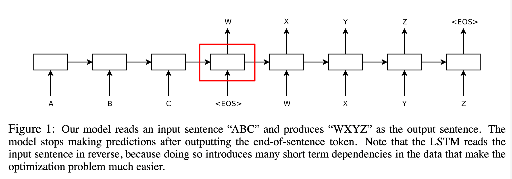
    

  

  <!-- 视频演示 -->
  

<video 
  src="media/ppt/media/2.mp4"
  autoplay loop muted playsinline
  style="width:auto; max-width:70%; height:auto;"
></video>
  

  <!-- Bottom row -->
  

    

    

    

      Sequence to Sequence Learning with 
      Neural Networks (<a href="https://arxiv.org/abs/1409.3215" style="color:#1a73e8;">Sutskever et al., 2014</a>)
    

  

</section>

---

<section class="ppt">
  
Translating a single sentence

  

  

    

Use the superscripts 𝑒 and 𝑑 where needed to distinguish the hidden states of the encoder and the decoder
  

  
<!-- 视频演示改为图片演示 -->

  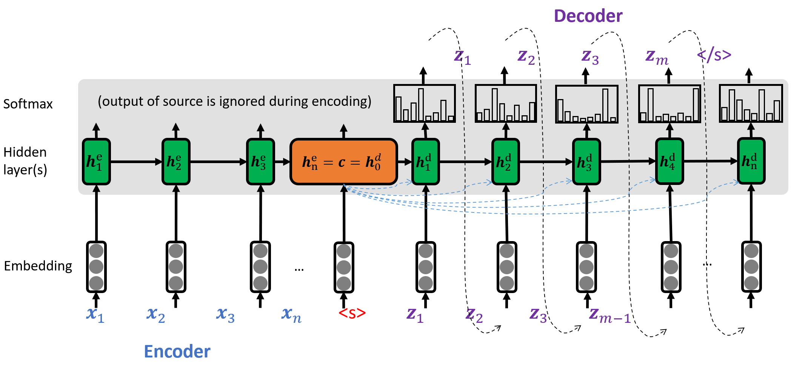

</section>

---

<section class="ppt">
  
Bottleneck of RNN-based Encoder-Decoder

  

  

    

Context is $c = h_n^e$, the hidden state of the last (𝑛-th) time step of the source text. This final hidden state is thus acting as a bottleneck
  

  
<!-- 视频演示改为图片演示 -->

  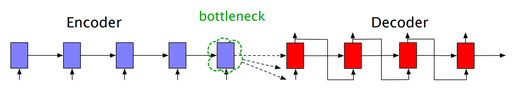

    

The <b>attention mechanism</b>, as in the vanilla encoder-decoder model, the context $c$ is a function of hidden states  

$$ c = f(h_1^e, h_2^e, \dots, h_n^e) $$
  

</section>

---

<section class="ppt">
  
Context vector \(c_i\)

  

  

    

      <ul style="margin:0 0 10px 0; padding-left:1.1em;">
        <li style="margin-bottom:10px;">
          \(\alpha_{ij}\): the proportional relevance of each encoder hidden state \(\boldsymbol{h}_j^e\) to the prior hidden decoder state \(\boldsymbol{h}_{i-1}^d\)
        </li>
      </ul>
      

        \(\alpha_{ij} = \text{softmax}\!\left(\text{score}(\boldsymbol{h}_{i-1}^d, \boldsymbol{h}_j^e)\right) \; \forall j \in e\)
      

      

        $$\alpha_{ij} = \frac{\exp\!\left(score\!\left(\boldsymbol{h}_{i-1}^d,\, \boldsymbol{h}_j^e\right)\right)}{\sum_k \exp\!\left(score\!\left(\boldsymbol{h}_{i-1}^d,\, \boldsymbol{h}_k^e\right)\right)}$$
      

      <ul style="margin:0 0 10px 0; padding-left:1.1em;">
        <li style="margin-bottom:10px;">
          Fixed-length context vector for the current decoder state by taking a weighted average over all the encoder hidden states
        </li>
      </ul>
      

        $$\boldsymbol{c}_i = \sum_j \alpha_{ij}\, \boldsymbol{h}_j^e$$
      

    

    

      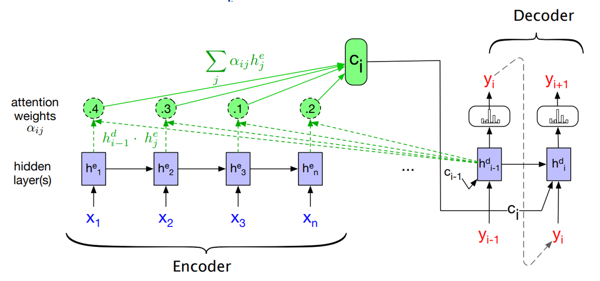
    

  

</section>

---

<section class="ppt">
  
Outline

  

  <ul class="outline-bullets big">
    <li class="muted">Encoder-decoder model</li>
    <li class="active">Attention mechanism</li>
    <li class="muted">Self-attention</li>
    <li class="muted">Transformer</li>
  </ul>
</section>

---

<section class="ppt">
  

  Attention mechanism 
  Intuition

  

  

    

<b>Time series prediction</b>
  

<li>Suppose we have a time series of data points (noisy)
  

  
<!-- 视频演示改为图片演示 -->

  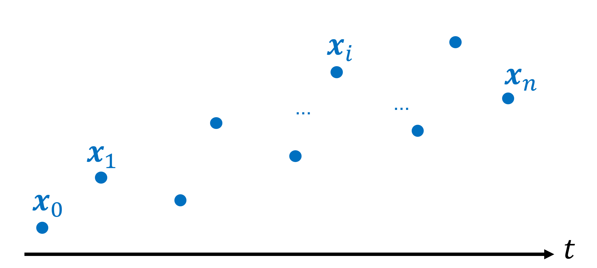

    

<li>Can we design a method so that we can reduce the noise in 𝒙_𝑖 so that output timeseries data look smooth?
  

  <a href="https://www.youtube.com/watch?v=yGTUuEx3GkA" style="color:#1a73e8;">
    Rasa Algorithm Whiteboard
  </a>

</section>

---

<section class="ppt">
  
Attention mechanism Intuition

  

  

    

      
<b>Time series prediction</b>

      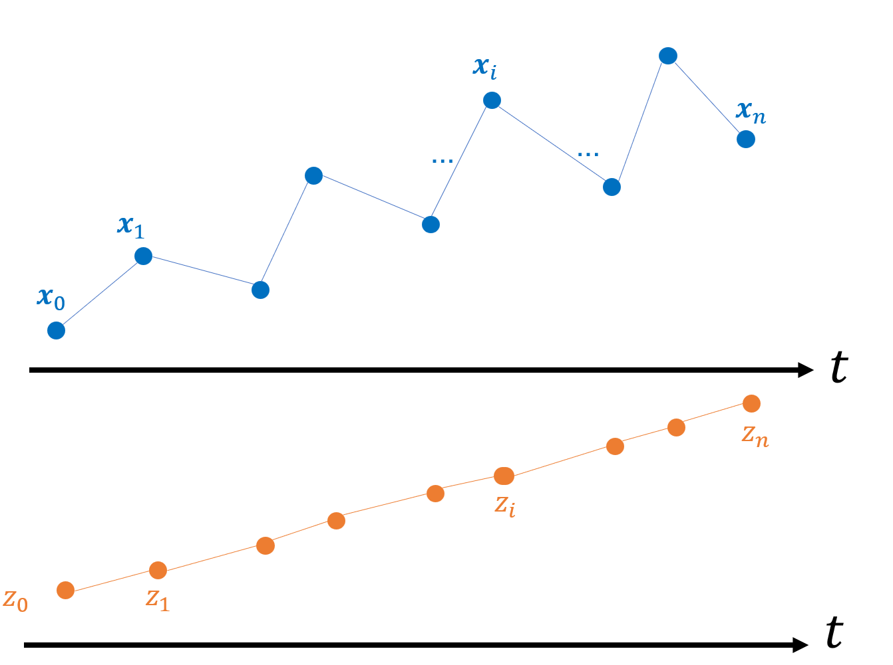
    

    

      <ul style="margin:0 0 6px 0; padding-left:1.1em;">
        <li style="margin-bottom:4px;">Time series data</li>
      </ul>
      

        $$\boldsymbol{x} = [x_0, x_1, x_2, \dots, x_i, \dots, x_n]$$
      

      <ul style="margin:0 0 14px 0; padding-left:2.2em;">
        <li style="margin-bottom:4px;">These data points are noisy</li>
      </ul>
      <ul style="margin:0 0 14px 0; padding-left:1.1em;">
        <li style="margin-bottom:4px;"><b>Task</b>: Reduce noise so that points have more context and more robust signal</li>
      </ul>
      <ul style="margin:0 0 6px 0; padding-left:1.1em;">
        <li style="margin-bottom:4px;"><b>Goal</b>: get fitting values</li>
      </ul>
      

        $$Z = [z_0, z_1, z_2, \dots, z_i, \dots, z_n]$$
      

    

  

  <a href="https://www.youtube.com/watch?v=yGTUuEx3GkA" style="color:#1a73e8;">
    Rasa Algorithm Whiteboard
  </a>

</section>

---

<section class="ppt">
  
Attention mechanism Intuition

  

  

    

      

        
<b>Time series prediction</b>

        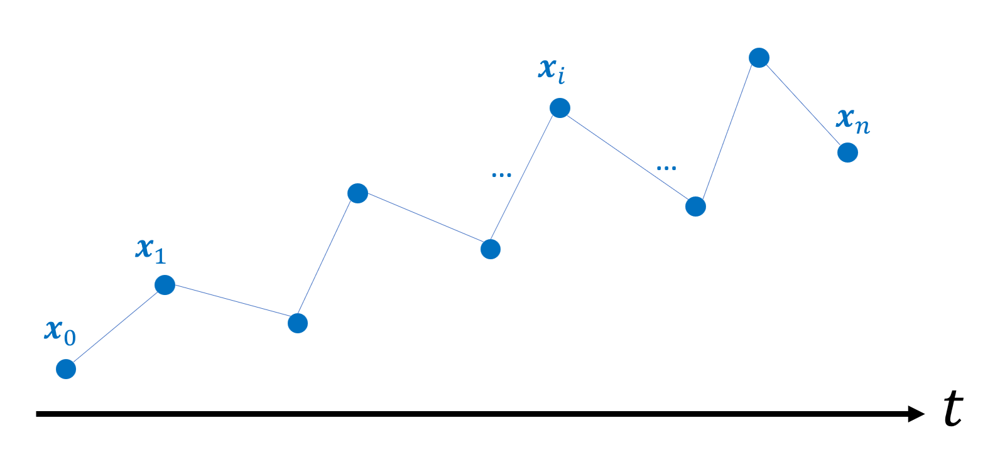
      

      

        <ul style="margin:0 0 8px 0; padding-left:1.1em;">
          <li style="margin-bottom:4px;">Time series noisy data:</li>
        </ul>
        

          $$\boldsymbol{x} = [x_0, x_1, x_2, \dots, x_i, \dots, x_n]$$
        

        <ul style="margin:0 0 8px 0; padding-left:1.1em;">
          <li style="margin-bottom:4px;">Time series true data:</li>
        </ul>
        

          $$\boldsymbol{z} = [z_0, z_1, z_2, \dots, z_i, \dots, z_n]$$
        

      

    

    

      <ul style="margin:0; padding-left:1.1em;">
        <li style="margin-bottom:10px;">Key observation: the true value \(y_i\) of each noisy point \(i\) depends on noisy data \(x_i\) itself and other data points</li>
        <li>Many methods we can choose, but try re-weighing</li>
      </ul>
    

  

  

    <a href="https://www.youtube.com/watch?v=yGTUuEx3GkA" style="color:#1a73e8;">Rasa Algorithm Whiteboard</a>
  

</section>

---

<section class="ppt">
  
Attention mechanism Intuition

  

  

    

      

        
<b>Time series prediction</b>

        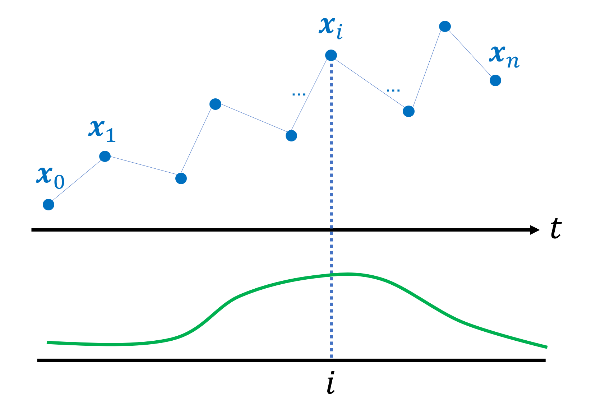
      

      

        <ul style="margin:0 0 18px 0; padding-left:1.1em;">
          <li>Time series data \(\boldsymbol{x} = [x_{0:n}]\)</li>
        </ul>
        <ul style="margin:0 0 6px 0; padding-left:1.1em;">
          <li><b>Re-weighing vector</b> for \(x_i\)</li>
        </ul>
        

          $$\boldsymbol{w}_i = [w_{0:n,i}]$$
        

        <ul style="margin:0 0 14px 0; padding-left:1.1em;">
          <li>Re-weighing vector \(\boldsymbol{w}_i\) has higher magnitudes near \(x_i\)</li>
        </ul>
        <ul style="margin:0; padding-left:1.1em;">
          <li>So, re-weighing vector is a kind of "Attention" of \(x_i\)</li>
        </ul>
      

    

  

  

    <a href="https://www.youtube.com/watch?v=yGTUuEx3GkA" style="color:#1a73e8;">Rasa Algorithm Whiteboard</a>
  

</section>

---

<section class="ppt">
  
Attention mechanism Intuition

  

  

    

      

        
<b>Time series prediction</b>

        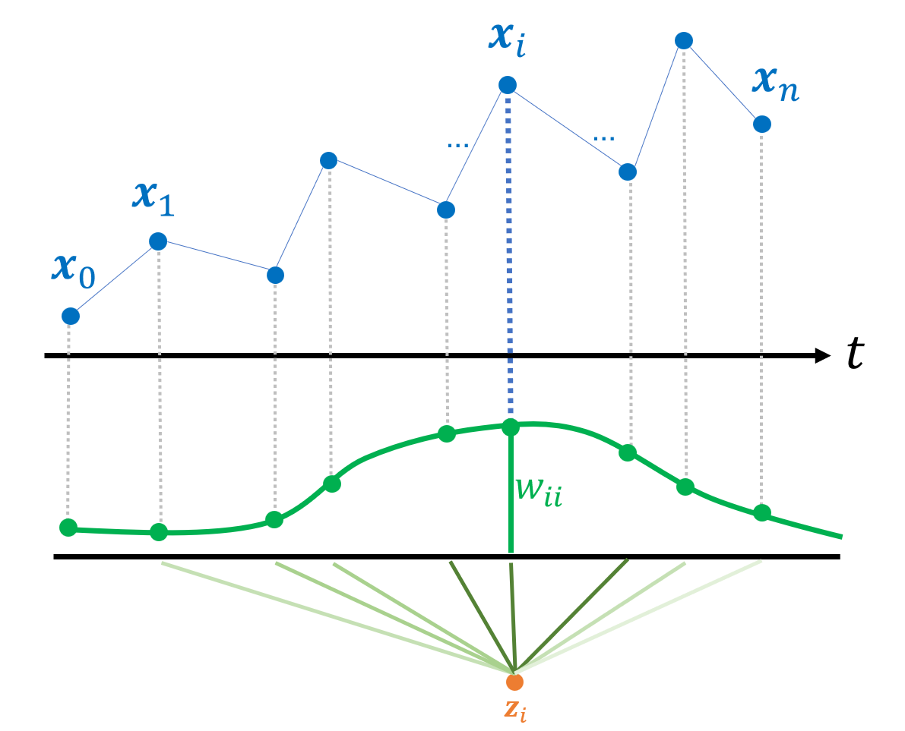
      

      

        <ul style="margin:0 0 20px 0; padding-left:1.1em;">
          <li style="color:red; font-weight:bold; font-size:40px; list-style-type:disc;">Idea of re-weighing</li>
        </ul>
        <ul style="margin:0 0 10px 0; padding-left:1.1em; font-size:36px;">
          <li>Time series data: \(\boldsymbol{x} = \) \([x_{0:n}]\)</li>
          <li>Re-weighing: \(\boldsymbol{w}_i = \) \([w_{0:n,i}]\)</li>
          <li>Each \(w_{ji}\): weight of point \(x_j\)</li>
        </ul>
  

    $$\color{#e59400}{z_i} = \color{#4caf50}{\boldsymbol{w}_i} \cdot \color{#1a73e8}{\boldsymbol{x}}$$
  

      

    

  

  

    <a href="https://www.youtube.com/watch?v=yGTUuEx3GkA" style="color:#1a73e8;">Rasa Algorithm Whiteboard</a>
  

</section>

---

<section class="ppt">
  
Attention mechanism Intuition

  

  

    

      

        
<b>Time series prediction</b>

        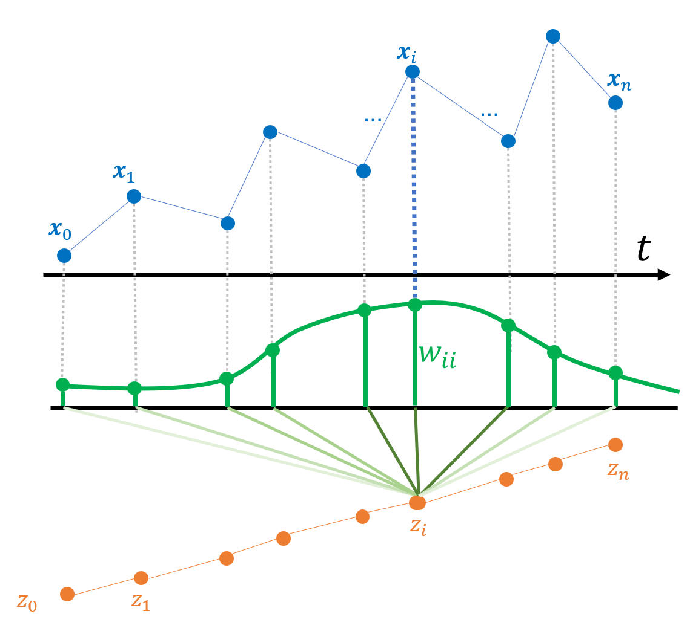
      

      

        <ul style="margin:0 0 24px 0; padding-left:1.1em;">
        <li style="color:red; font-weight:bold; font-size:40px;">Idea of re-weighing</li>
        </ul>
        

        <ul style="margin:0 0 0 0; padding-left:2em; font-size:28px; line-height:1.7;">
          <li style="margin-bottom:10px;">Time series data:</li>
        </ul>
        

          $$\boldsymbol{x} = [x_0, x_1, x_2, \dots, x_i, \dots, x_n]$$
        

        <ul style="margin:0 0 0 0; padding-left:2em; font-size:28px; line-height:1.7;">
          <li style="margin-bottom:2px;">Re-weighing vector</li>
        </ul>
        

          $$\boldsymbol{w}_i = [w_{0i}, w_{1i}, w_{2i}, \dots, w_{ii}, \dots, w_{ni}]$$
        

        <ul style="margin:0 0 0 0; padding-left:2em; font-size:28px; line-height:1.7;">
          <li style="margin-bottom:2px;">Each \(w_{ji}\): the weight of point \(x_j\)</li>
          <li style="margin-bottom:2px;">Fitting value</li>
        </ul>
        

          $$\color{#e59400}{z_i} = \color{#4caf50}{\boldsymbol{w}_i} \cdot \color{#1a73e8}{\boldsymbol{x}},\; \color{#e59400}{\boldsymbol{i}} \ \color{black}{from} \ \color{#e59400}{0\;1\;2} \ \color{black}{to} \ \color{#e59400}{n}$$
        

      

    

  

  

    <a href="https://www.youtube.com/watch?v=yGTUuEx3GkA" style="color:#1a73e8;">Rasa Algorithm Whiteboard</a>
  

</section>

---

<section class="ppt">
  
Attention mechanism Intuition

  

  

    

      

        
<b>Time series prediction</b>

        
      

      

        <!-- 将所有列表项放在同一个 <ul> 内，便于统一控制间距 -->
        <ul style="margin:0; padding-left:1.1em; list-style-type:disc;">
          <li style="color:red; font-weight:bold; font-size:40px; margin-bottom:30px;">Idea of re-weighing</li>
          <li style="margin-bottom:20px;">\(\boldsymbol{W}\) filters datapoints which are far away from \(x_i\) but amplifies datapoints that are close to \(x_i\).</li>
          <li style="margin-bottom:20px;">Re-weighing is to find such reasonable “context” matrix \(\boldsymbol{W}\) so that we can get better signals by using contexts of data points.</li>
          <li><b>How can we apply this re-weighing to text data ?</b></li>
        </ul>
      

    

  

  

    <a href="https://www.youtube.com/watch?v=yGTUuEx3GkA" style="color:#1a73e8;">Rasa Algorithm Whiteboard</a>
  

</section>

---

<section class="ppt">
  
Outline

  

  <ul class="outline-bullets big">
    <li class="muted">Encoder-decoder model</li>
    <li class="muted">Attention mechanism</li>
    <li class="activate">Self-attention</li>
    <li class="muted">Transformer</li>
  </ul>
</section>

---

<section class="ppt">
  
Get more context for text

  

  

    

      <ul style="margin:0 0 6px 0; padding-left:1.1em;">
        <li style="margin-bottom:6px;">Get a more context for: Noa can be <u>annoying</u> but she is a great cat</li>
        <li>Given the above, how can we get more and better context for these words, say annoying?</li>
      </ul>
    

    

      Words closer to annoying have more effects on the word annoying
    

    

      <svg viewBox="0 0 900 200" xmlns="http://www.w3.org/2000/svg" style="width:95%; max-width:860px;">
        
        <text x="60"  y="40" class="word">Noa</text>
        <text x="160" y="40" class="word">can</text>
        <text x="240" y="40" class="word">be</text>
        <text x="370" y="40" class="word-focus">annoying</text>
        <line x1="330" y1="46" x2="420" y2="46" stroke="#222" stroke-width="2.5"/>
        <text x="500" y="40" class="word">but</text>
        <text x="600" y="40" class="word">she</text>
        <text x="670" y="40" class="word">is</text>
        <text x="720" y="40" class="word">a</text>
        <text x="790" y="40" class="word">great</text>
        <text x="865" y="40" class="word">cat</text>
        <!-- 所有路径起点改为中心，终点改为外围词 -->
        <path d="M 370,48 Q 305,105 240,48" stroke="#3a5fa0" stroke-width="2.5" fill="none" marker-end="url(#arrowBlue)"/>
        <path d="M 370,48 Q 265,130 160,48" stroke="#6a8fc0" stroke-width="2" fill="none" marker-end="url(#arrowBlue2)"/>
        <path d="M 370,48 Q 435,105 500,48" stroke="#6a8fc0" stroke-width="2" fill="none" marker-end="url(#arrowBlue2)"/>
        <path d="M 370,48 Q 485,140 600,48" stroke="#9ab0d0" stroke-width="1.8" fill="none" marker-end="url(#arrowBlue3)"/>
        <path d="M 370,48 Q 520,155 670,48" stroke="#b0c4de" stroke-width="1.5" fill="none" marker-end="url(#arrowBlue4)"/>
        <path d="M 370,48 Q 215,175 60,48" stroke="#e53935" stroke-width="2.5" fill="none" marker-end="url(#arrowRed)"/>
        <path d="M 370,48 Q 617,175 865,48" stroke="#e53935" stroke-width="2.5" fill="none" marker-end="url(#arrowRed)"/>
        <defs>
          <marker id="arrowBlue"  markerWidth="8" markerHeight="8" refX="6" refY="3" orient="auto"><path d="M0,0 L0,6 L8,3 z" fill="#3a5fa0"/></marker>
          <marker id="arrowBlue2" markerWidth="8" markerHeight="8" refX="6" refY="3" orient="auto"><path d="M0,0 L0,6 L8,3 z" fill="#6a8fc0"/></marker>
          <marker id="arrowBlue3" markerWidth="8" markerHeight="8" refX="6" refY="3" orient="auto"><path d="M0,0 L0,6 L8,3 z" fill="#9ab0d0"/></marker>
          <marker id="arrowBlue4" markerWidth="8" markerHeight="8" refX="6" refY="3" orient="auto"><path d="M0,0 L0,6 L8,3 z" fill="#b0c4de"/></marker>
          <marker id="arrowRed"   markerWidth="8" markerHeight="8" refX="6" refY="3" orient="auto"><path d="M0,0 L0,6 L8,3 z" fill="#e53935"/></marker>
        </defs>
      </svg>
    

    

      But the intuition tells that proximity might not be the best thing in language. Relations between words have to do with linguistic meaning and structures.
    

  

  

    <a href="https://www.youtube.com/watch?v=yGTUuEx3GkA" style="color:#1a73e8;">Rasa Algorithm Whiteboard</a>
  

</section>

---

<section class="ppt">
  
Get more context for text

  

  

    

      <ul style="margin:0 0 8px 0; padding-left:1.1em;">
        <li>Get a more context for: Noa can be <u>annoying</u> but she is a great cat</li>
      </ul>
    

    

      Words closer to annoying have more effects on the word annoying
    

    

      Words Noa, is and cat are "closer" to she. So, we cannot blindly use proximity.
    

    

      <svg viewBox="0 0 1100 240" xmlns="http://www.w3.org/2000/svg" style="width:98%; max-width:980px;">
        <defs>
          <marker id="arrowGreen" markerWidth="8" markerHeight="8" refX="6" refY="3" orient="auto"><path d="M0,0 L0,6 L8,3 z" fill="#4caf50"/></marker>
          <marker id="arrowBlue1" markerWidth="8" markerHeight="8" refX="6" refY="3" orient="auto"><path d="M0,0 L0,6 L8,3 z" fill="#3a5fa0"/></marker>
          <marker id="arrowBlue2" markerWidth="8" markerHeight="8" refX="6" refY="3" orient="auto"><path d="M0,0 L0,6 L8,3 z" fill="#6a8fc0"/></marker>
          <marker id="arrowBlue3" markerWidth="8" markerHeight="8" refX="6" refY="3" orient="auto"><path d="M0,0 L0,6 L8,3 z" fill="#9ab0d0"/></marker>
          <marker id="arrowBlue4" markerWidth="8" markerHeight="8" refX="6" refY="3" orient="auto"><path d="M0,0 L0,6 L8,3 z" fill="#b8cce4"/></marker>
        </defs>
        <text x="80"  y="120" font-size="30" font-family="sans-serif" fill="#e59400" text-anchor="middle">Noa</text>
        <text x="190" y="120" font-size="30" font-family="sans-serif" fill="#e59400" text-anchor="middle">can</text>
        <text x="295" y="120" font-size="30" font-family="sans-serif" fill="#e59400" text-anchor="middle">be</text>
        <text x="445" y="120" font-size="30" font-family="sans-serif" fill="#e59400" text-anchor="middle" font-weight="bold">annoying</text>
        <line x1="400" y1="126" x2="495" y2="126" stroke="#222" stroke-width="2.5"/>
        <text x="580" y="120" font-size="30" font-family="sans-serif" fill="#e59400" text-anchor="middle">but</text>
        <text x="690" y="120" font-size="30" font-family="sans-serif" fill="#e59400" text-anchor="middle" font-weight="bold">she</text>
        <line x1="660" y1="126" x2="722" y2="126" stroke="#4caf50" stroke-width="2.5"/>
        <text x="780" y="120" font-size="30" font-family="sans-serif" fill="#e59400" text-anchor="middle">is</text>
        <text x="850" y="120" font-size="30" font-family="sans-serif" fill="#e59400" text-anchor="middle">a</text>
        <text x="940" y="120" font-size="30" font-family="sans-serif" fill="#e59400" text-anchor="middle">great</text>
        <text x="1040" y="120" font-size="30" font-family="sans-serif" fill="#e59400" text-anchor="middle" font-weight="bold">cat</text>
        <path d="M 680,105 Q 380,10 90,105" stroke="#4caf50" stroke-width="2.5" fill="none" marker-end="url(#arrowGreen)"/>
        <path d="M 700,105 Q 740,55 770,105" stroke="#4caf50" stroke-width="2.5" fill="none" marker-end="url(#arrowGreen)"/>
        <path d="M 710,105 Q 875,20 1030,105" stroke="#4caf50" stroke-width="2.5" fill="none" marker-end="url(#arrowGreen)"/>
        <path d="M 445,128 Q 370,185 308,128" stroke="#3a5fa0" stroke-width="2.5" fill="none" marker-end="url(#arrowBlue1)"/>
        <path d="M 445,128 Q 318,200 203,128" stroke="#6a8fc0" stroke-width="2" fill="none" marker-end="url(#arrowBlue2)"/>
        <path d="M 445,128 Q 512,185 567,128" stroke="#3a5fa0" stroke-width="2.5" fill="none" marker-end="url(#arrowBlue1)"/>
        <path d="M 445,128 Q 568,205 677,128" stroke="#6a8fc0" stroke-width="2" fill="none" marker-end="url(#arrowBlue2)"/>
        <path d="M 445,128 Q 262,215 93,128" stroke="#9ab0d0" stroke-width="1.8" fill="none" marker-end="url(#arrowBlue3)"/>
        <path d="M 445,128 Q 612,215 767,128" stroke="#9ab0d0" stroke-width="1.8" fill="none" marker-end="url(#arrowBlue3)"/>
      </svg>
    

  

  

    <a href="https://www.youtube.com/watch?v=yGTUuEx3GkA" style="color:#1a73e8;">Rasa Algorithm Whiteboard</a>
  

</section>

---

<section class="ppt">
  
Get more context for text

  

  

    

      <ul style="margin:0 0 8px 0; padding-left:1.1em;">
        <li>Get a more context for: Noa can be <u>annoying</u> but she is a great cat</li>
      </ul>
    

    

      Words Noa, is and cat are "closer" to she. So, we cannot blindly use proximity.
    

    

    Think of a way to do this automatically
    

  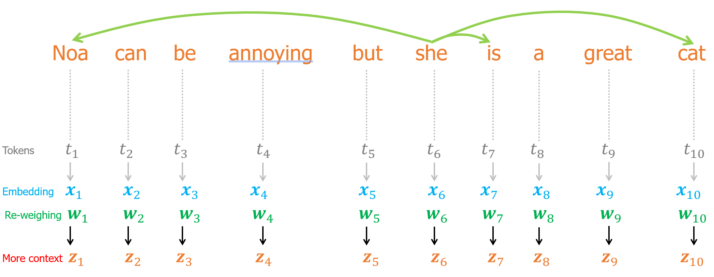

  

    <a href="https://www.youtube.com/watch?v=yGTUuEx3GkA" style="color:#1a73e8;">Rasa Algorithm Whiteboard</a>
  

</section>

---

<section class="ppt">
  
Review of embedding vectors

  

  

  <ul style="margin:0 0 4px 0; padding-left:1.1em;">
    <li>
      Embedding of the word "king": 
      \(\boldsymbol{v}_{\text{king}}\) = 
      
        <!-- 10 个方框 -->
        
        
        
        
        
        
        
        
        
        
      
      \(\in \mathbb{R}^d\)
    </li>
    <li>
      Embedding of the word "queen": 
      \(\boldsymbol{v}_{\text{queen}}\) = 
      
        <!-- 10 个方框，同上 -->
        
        
        
        
        
        
        
        
        
        
      
      \(\in \mathbb{R}^d\)
    </li>
    <li>Embeddings encode different "meanings"</li>
  </ul>

    

      

        <svg viewBox="0 0 580 320" xmlns="http://www.w3.org/2000/svg" style="width:100%; border:none;">
          <defs>
            <marker id="arrPurple" markerWidth="8" markerHeight="8" refX="6" refY="3" orient="auto"><path d="M0,0 L0,6 L8,3 z" fill="#8e44ad"/></marker>
            <marker id="arrNavy"   markerWidth="8" markerHeight="8" refX="6" refY="3" orient="auto"><path d="M0,0 L0,6 L8,3 z" fill="#1a2e6e"/></marker>
            <marker id="arrBlue"   markerWidth="8" markerHeight="8" refX="6" refY="3" orient="auto"><path d="M0,0 L0,6 L8,3 z" fill="#1a73e8"/></marker>
            <marker id="arrGreen"  markerWidth="8" markerHeight="8" refX="6" refY="3" orient="auto"><path d="M0,0 L0,6 L8,3 z" fill="#4caf50"/></marker>
          </defs>
          <text x="0" y="55" font-size="28" font-family="serif" fill="#4caf50" font-style="italic" font-weight="bold">x</text>
          <text x="18" y="62" font-size="18" font-family="serif" fill="#4caf50">king</text>
          <text x="60" y="55" font-size="28" font-family="sans-serif" fill="#333"> = </text>
          <rect x="88"  y="30" width="38" height="34" fill="white" stroke="#aaa" stroke-width="1.2"/>
          <rect x="126" y="30" width="38" height="34" fill="#8e44ad" stroke="#aaa" stroke-width="1.2"/>
          <rect x="164" y="30" width="38" height="34" fill="white" stroke="#aaa" stroke-width="1.2"/>
          <rect x="202" y="30" width="38" height="34" fill="#1a2e6e" stroke="#aaa" stroke-width="1.2"/>
          <rect x="240" y="30" width="38" height="34" fill="white" stroke="#aaa" stroke-width="1.2"/>
          <rect x="278" y="30" width="38" height="34" fill="#1a73e8" stroke="#aaa" stroke-width="1.2"/>
          <rect x="316" y="30" width="38" height="34" fill="white" stroke="#aaa" stroke-width="1.2"/>
          <rect x="354" y="30" width="38" height="34" fill="#29b6f6" stroke="#aaa" stroke-width="1.2"/>
          <rect x="392" y="30" width="38" height="34" fill="white" stroke="#aaa" stroke-width="1.2"/>
          <rect x="430" y="30" width="38" height="34" fill="#4caf50" stroke="#aaa" stroke-width="1.2"/>
          <text x="472" y="55" font-size="24" font-family="serif" fill="#333">∈ ℝ</text>
          <text x="520" y="45" font-size="16" font-family="serif" fill="#333">d</text>
          <text x="0" y="155" font-size="28" font-family="serif" fill="#1a73e8" font-style="italic" font-weight="bold">x</text>
          <text x="18" y="162" font-size="18" font-family="serif" fill="#1a73e8">queen</text>
          <text x="66" y="155" font-size="28" font-family="sans-serif" fill="#333"> = </text>
          <rect x="88"  y="130" width="38" height="34" fill="white" stroke="#aaa" stroke-width="1.2"/>
          <rect x="126" y="130" width="38" height="34" fill="#8e44ad" stroke="#aaa" stroke-width="1.2"/>
          <rect x="164" y="130" width="38" height="34" fill="white" stroke="#aaa" stroke-width="1.2"/>
          <rect x="202" y="130" width="38" height="34" fill="#1a2e6e" stroke="#aaa" stroke-width="1.2"/>
          <rect x="240" y="130" width="38" height="34" fill="white" stroke="#aaa" stroke-width="1.2"/>
          <rect x="278" y="130" width="38" height="34" fill="#1a73e8" stroke="#aaa" stroke-width="1.2"/>
          <rect x="316" y="130" width="38" height="34" fill="white" stroke="#aaa" stroke-width="1.2"/>
          <rect x="354" y="130" width="38" height="34" fill="#29b6f6" stroke="#aaa" stroke-width="1.2"/>
          <rect x="392" y="130" width="38" height="34" fill="white" stroke="#aaa" stroke-width="1.2"/>
          <rect x="430" y="130" width="38" height="34" fill="#4caf50" stroke="#aaa" stroke-width="1.2"/>
          <text x="472" y="155" font-size="24" font-family="serif" fill="#333">∈ ℝ</text>
          <text x="520" y="145" font-size="16" font-family="serif" fill="#333">d</text>
          <line x1="145" y1="64" x2="145" y2="130" stroke="#8e44ad" stroke-width="1.8" stroke-dasharray="4,3"/>
          <line x1="221" y1="64" x2="221" y2="130" stroke="#1a2e6e" stroke-width="1.8" stroke-dasharray="4,3"/>
          <line x1="297" y1="64" x2="297" y2="130" stroke="#1a73e8" stroke-width="1.8" stroke-dasharray="4,3"/>
          <line x1="373" y1="64" x2="373" y2="130" stroke="#29b6f6" stroke-width="1.8" stroke-dasharray="4,3"/>
          <line x1="449" y1="64" x2="449" y2="130" stroke="#4caf50" stroke-width="1.8" stroke-dasharray="4,3"/>
          <path d="M 145,175 Q 100,210 72,230" stroke="#8e44ad" stroke-width="2" fill="none" marker-end="url(#arrPurple)"/>
          <text x="0" y="250" font-size="22" font-family="sans-serif" fill="#8e44ad">Family</text>
          <path d="M 221,175 Q 200,220 175,240" stroke="#1a2e6e" stroke-width="2" fill="none" marker-end="url(#arrNavy)"/>
          <text x="100" y="270" font-size="22" font-family="sans-serif" fill="#1a2e6e">Royalty</text>
          <path d="M 298,175 Q 265,215 262,245" stroke="#1a73e8" stroke-width="2" fill="none" marker-end="url(#arrNavy)"/>
          <text x="245" y="270" font-size="22" font-family="sans-serif" fill="#1a73e8">Power</text>
          <path d="M 375,175 Q 355,180 360,228" stroke="#1a73e8" stroke-width="2" fill="none" marker-end="url(#arrBlue)"/>
          <text x="330" y="255" font-size="22" font-family="sans-serif" fill="#1a73e8">Gender</text>
          <path d="M 451,175 Q 440,205 468,222" stroke="#4caf50" stroke-width="2" fill="none" marker-end="url(#arrGreen)"/>
          <text x="435" y="250" font-size="22" font-family="sans-serif" fill="#4caf50">Sentiment</text>
          <text x="0" y="310" font-size="30" font-family="sans-serif" fill="red" font-weight="bold">Idea of re-weighing</text>
        </svg>
        

          \(\boldsymbol{W}_{\text{king,queen}} \propto \) \(\boldsymbol{x}_{\text{king}}\) \(\cdot\) \(\boldsymbol{x}_{\text{queen}}\)
        

      

      

        

          

            
Son

            
Daughter

            
Cousin

            
Land

            
Country

            
Army

            
Own

            
Strong relation

          

          

            
Dog

            
Cat

            
Running

            
Swimming

            
Help

            
Nurse

            
Computer

            
Weak relation

          

        

      

    

  

  

    <a href="https://www.youtube.com/watch?v=yGTUuEx3GkA" style="color:#1a73e8;">Rasa Algorithm Whiteboard</a>
  

</section>

---

<section class="ppt">
  
Explore re-weighing via embedding

  

  

    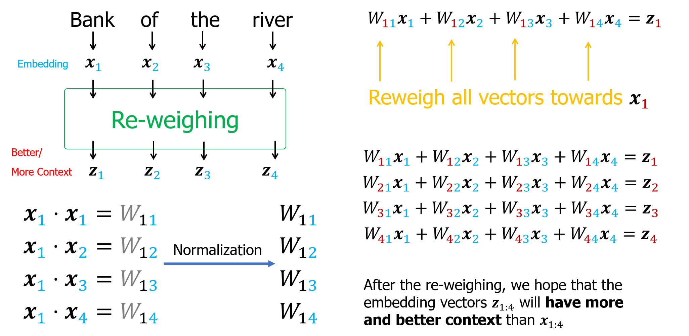
  

  <!-- 右上角链接保持不变 -->
  

    <a href="https://www.youtube.com/watch?v=yGTUuEx3GkA" style="color:#1a73e8;">Rasa Algorithm Whiteboard</a>
  

</section>

---

<section class="ppt">
  
Explore re-weighing via embedding

  

  

    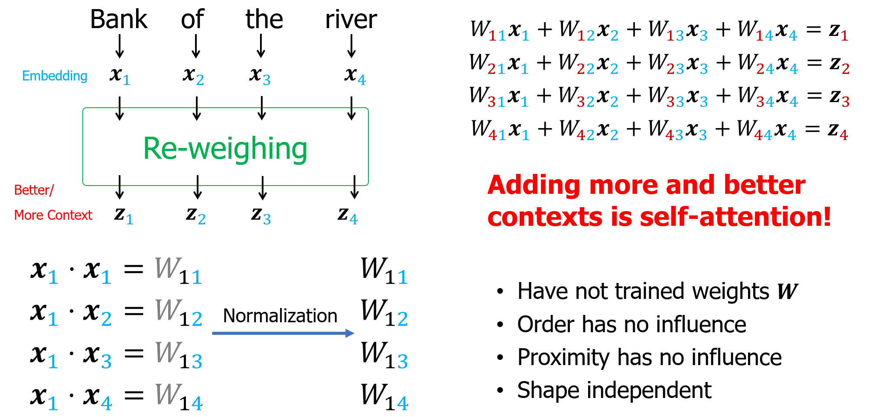
  

  <!-- 右上角链接保持不变 -->
  

    <a href="https://www.youtube.com/watch?v=yGTUuEx3GkA" style="color:#1a73e8;">Rasa Algorithm Whiteboard</a>
  

</section>

---

<section class="ppt">
  
Self-Attention

  

  

    

      

        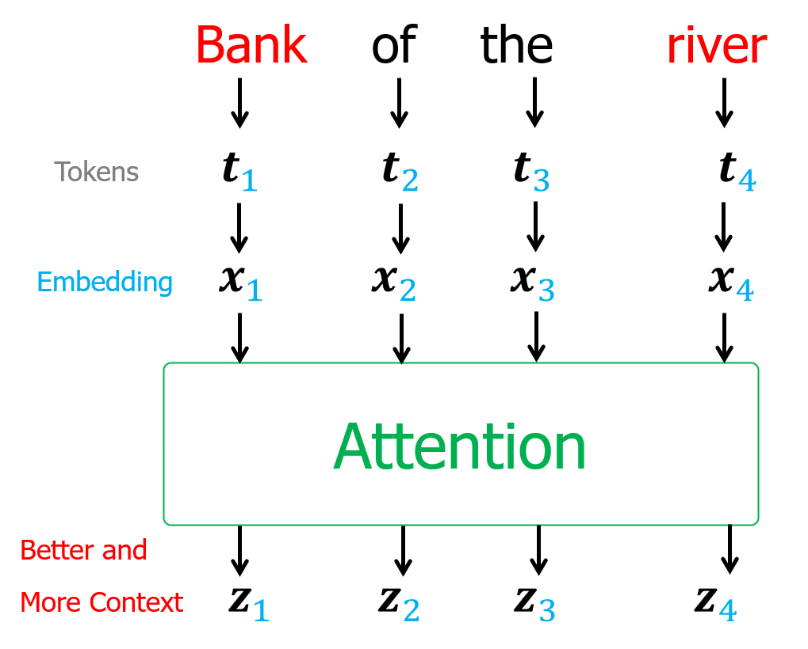
      

      

        <!-- 将所有列表项放在同一个 <ul> 内，便于统一控制间距 -->
        <ul style="margin:0; padding-left:1.1em; list-style-type:disc;">
          <li style="margin-bottom:20px;">Because the word 'river' is here, bank shouldn't refer to money but should refer to the bank of the river, as in the water bank. 
          </li>
            <li style="margin-bottom:20px;">
            The hope is that this <b> attention mechanism</b> will be able to correct for that, such that embeddings that come out will have that extra bit of context.
            </li>
        </ul>
      

    

  

  

    <a href="https://www.youtube.com/watch?v=tIvKXrEDMhk" style="color:#1a73e8;">Rasa Algorithm Whiteboard 2</a>
  

</section>

---

<section class="ppt">
  
Self-Attention

  

  

    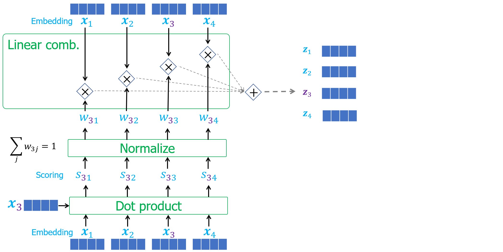
    

      Hope that this new \(\boldsymbol{y}_3\) has more and better context than embedding \(\boldsymbol{v}_3\).
    

    

      Similarly, hope that \(\boldsymbol{z}_1, \boldsymbol{z}_2, \boldsymbol{z}_3, \boldsymbol{z}_4\) have more and better context than \(\boldsymbol{x}_1, \boldsymbol{x}_2, \boldsymbol{x}_3, \boldsymbol{x}_4\).
    

    

      Calculate the importance of these embeddings with respect to current embedding \(\boldsymbol{x}_3\). A good way is to use softmax normalization
    

    

      Given "Bank of the river", consider embedding of "the" \(\boldsymbol{x}_3\). The dot product of this embedding and other embeddings gives us <b>scores</b>
    

  

  

    <a href="https://www.youtube.com/watch?v=yGTUuEx3GkA" style="color:#1a73e8;">Rasa Algorithm Whiteboard 2</a>
  

</section>

---

<section class="ppt">
  

  Self-Attention 
  Whole block

  

  

    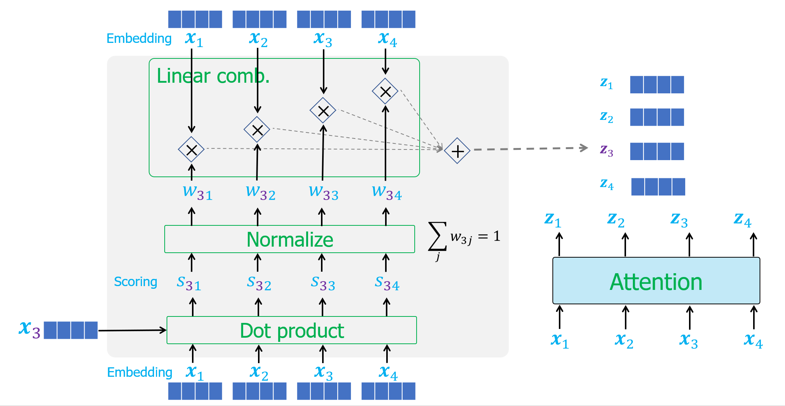
    

       No weights for model to train. How can we introduce weights?
      
    

  

  

    <a href="https://www.youtube.com/watch?v=yGTUuEx3GkA" style="color:#1a73e8;">Rasa Algorithm Whiteboard 2</a>
  

</section>

---

<section class="ppt">
  

  Self-Attention 
  Whole block

  

  

    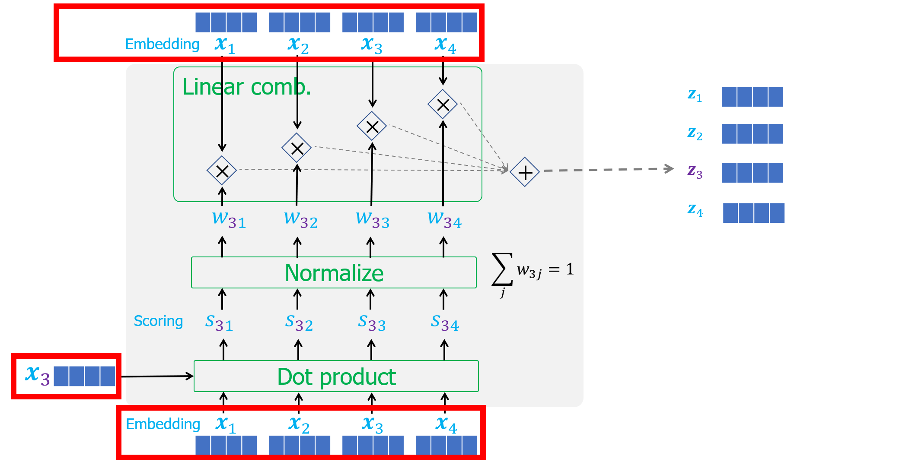
    

       Key observation:
       \(\boldsymbol{x}_3\) has been used in three places
    

  

  

    <a href="https://www.youtube.com/watch?v=yGTUuEx3GkA" style="color:#1a73e8;">Rasa Algorithm Whiteboard 2</a>
  

</section>

---

<section class="ppt">
  

  Self-Attention 
  Adding parameters

  

  

    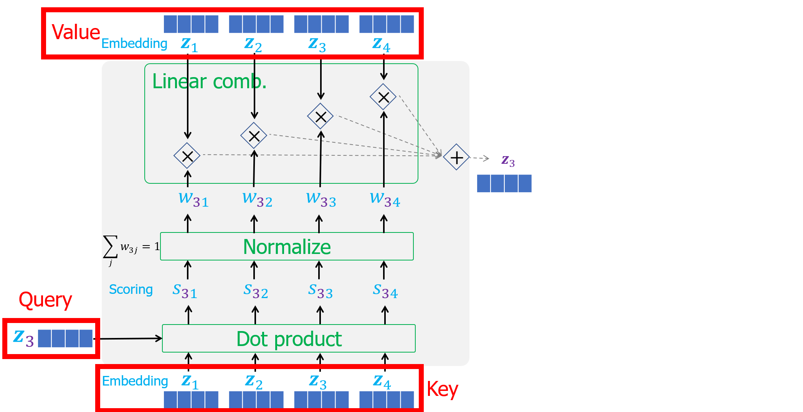
    

       <li> Query:</li>  treat vector \(\boldsymbol{x}_3\) as a query and ask this block to get more context for \(\boldsymbol{x}_3\)
    

    

       <li> Key:</li>  block will search all contexts. At this moment these \(\boldsymbol{x}_i\) are keys so that we can get scores
    

    

       <li> Value:</li>  Finally, we obtain some values of this query
    

  

  

    <a href="https://www.youtube.com/watch?v=yGTUuEx3GkA" style="color:#1a73e8;">Rasa Algorithm Whiteboard 2</a>
  

</section>

---

<section class="ppt">
  
Self-Attention Key, Value, Query

  

  

    

      

        <ul style="margin:0; padding-left:1.1em;">
          <li>A Python dictionary d = {'a': 1, 'b': 2, 'c': 3}</li>
          <li><b>Keys</b> = {'a', 'b', 'c'}</li>
          <li><b>Values</b> = {1, 2, 3}</li>
          <li>A <b>query</b> d['b'] = 3</li>
        </ul>
      

      

        

          Key
          Value
        

        

          a
          1
        

        

          b
          2
        

        

          c
          3
        

      

    

    

      <ul style="margin:0; padding-left:1.1em;">
        <li>Intuition: Think of our attention mechanism as a softened version of a dictionary where the key, query, and value are all vectors of the same size</li>
      </ul>
    

  

  

    <a href="https://www.youtube.com/watch?v=yGTUuEx3GkA" style="color:#1a73e8;">Rasa Algorithm Whiteboard 2</a>
  

</section>

---

<section class="ppt">
  

  Self-Attention 

  

  

    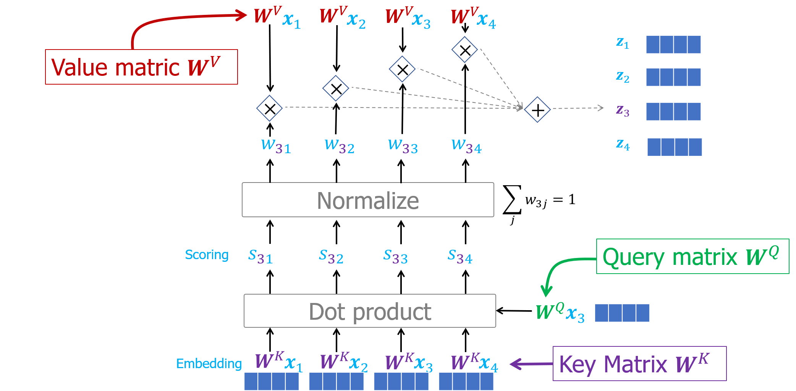
    

       \(\boldsymbol{W}^Q\)  
      ,  \(\boldsymbol{W}^K\) ,  \(\boldsymbol{W}^V\)  are matrices that can be trained!
    

  We will write 
  \( \boldsymbol{Q} = \boldsymbol{X} \boldsymbol{W}^Q \)
  \( \boldsymbol{K} = \boldsymbol{X} \boldsymbol{W}^K \)
  \( \boldsymbol{V} = \boldsymbol{X} \boldsymbol{W}^V \)

  

  

    <a href="https://www.youtube.com/watch?v=yGTUuEx3GkA" style="color:#1a73e8;">Rasa Algorithm Whiteboard 2</a>
  

</section>

---

<section class="ppt">
  
Self-Attention A single block

  

  

    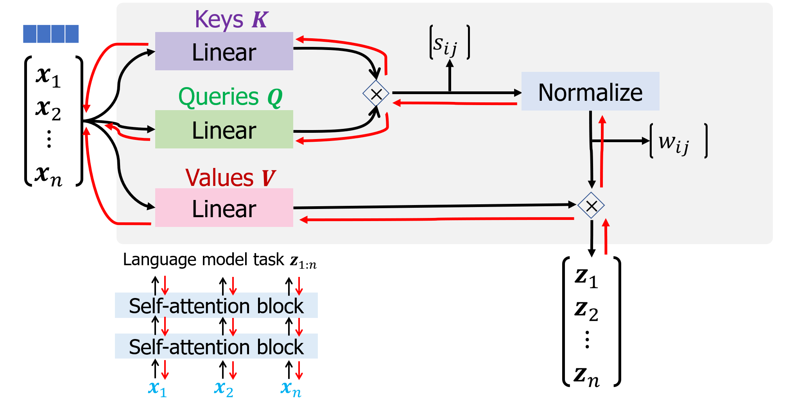
    

      Back propagation for updating \(\boldsymbol{K}\), \(\boldsymbol{Q}\), \(\boldsymbol{V}\)  
    

  More and better contextualized embedding

  

  

    <a href="https://www.youtube.com/watch?v=yGTUuEx3GkA" style="color:#1a73e8;">Rasa Algorithm Whiteboard 2</a>
  

</section>

---

<section class="ppt">
  
Self-Attention Is one self-attention enough?

  

  

    

      <ul style="margin:0 0 10px 0; padding-left:1.1em;">
        <li>Take the sentence: "I gave my dog Charlie some food."</li>
        <li>Where should the attention of "gave" go?</li>
      </ul>
    

    

      <svg viewBox="0 0 1060 290" xmlns="http://www.w3.org/2000/svg" style="width:100%;">
        <defs>
          <marker id="sa-arrGreen" markerWidth="10" markerHeight="10" refX="8" refY="4" orient="auto"><path d="M0,0 L0,8 L10,4 z" fill="#4caf50"/></marker>
          <marker id="sa-arrRed"   markerWidth="10" markerHeight="10" refX="8" refY="4" orient="auto"><path d="M0,0 L0,8 L10,4 z" fill="#c0392b"/></marker>
          <marker id="sa-arrBlue"  markerWidth="10" markerHeight="10" refX="8" refY="4" orient="auto"><path d="M0,0 L0,8 L10,4 z" fill="#1a73e8"/></marker>
        </defs>
        <line x1="315" y1="15" x2="315" y2="68" stroke="#1a73e8" stroke-width="2.8" marker-end="url(#sa-arrBlue)"/>
        <text x="175"  y="108" font-size="36" font-family="sans-serif" fill="#333"    text-anchor="middle">I</text>
        <text x="315"  y="108" font-size="36" font-family="sans-serif" fill="red"     text-anchor="middle" font-weight="bold">gave</text>
        <text x="455"  y="108" font-size="36" font-family="sans-serif" fill="#333"    text-anchor="middle">my</text>
        <text x="590"  y="108" font-size="36" font-family="sans-serif" fill="#333"    text-anchor="middle">dog</text>
        <text x="730"  y="108" font-size="36" font-family="sans-serif" fill="#333"    text-anchor="middle">Charlie</text>
        <text x="880"  y="108" font-size="36" font-family="sans-serif" fill="#333"    text-anchor="middle">some</text>
        <text x="1010" y="108" font-size="36" font-family="sans-serif" fill="#333"    text-anchor="middle">food.</text>
        <path d="M 295,118 Q 230,185 185,128" stroke="#4caf50" stroke-width="2.8" fill="none" marker-end="url(#sa-arrGreen)"/>
        <path d="M 335,118 Q 530,220 720,128" stroke="#4caf50" stroke-width="2.8" fill="none" marker-end="url(#sa-arrGreen)"/>
        <path d="M 330,118 Q 670,265 1000,128" stroke="#c0392b" stroke-width="2.8" fill="none" marker-end="url(#sa-arrRed)"/>
      </svg>
    

    

      

        
Who is doing the giving?

        
Who am I giving it to?

        
What am I giving?

      

      

        For a single attention, do we have enough parameters to capture these relations?
      

    

  

</section>

---

<section class="ppt">
  
Multi-attention

  

  

    

      <ul style="margin:0 0 10px 0; padding-left:1.1em;">
        <li>Take the sentence: "I gave my dog Charlie some food."</li>
        <li>Where should the attention of "gave" go?</li>
      </ul>
    

    

      <svg viewBox="0 0 1060 310" xmlns="http://www.w3.org/2000/svg" style="width:100%;">
        <defs>
          <marker id="ma-arrGreen" markerWidth="10" markerHeight="10" refX="8" refY="4" orient="auto"><path d="M0,0 L0,8 L10,4 z" fill="#4caf50"/></marker>
          <marker id="ma-arrRed"   markerWidth="10" markerHeight="10" refX="8" refY="4" orient="auto"><path d="M0,0 L0,8 L10,4 z" fill="#c0392b"/></marker>
          <marker id="ma-arrBlue"  markerWidth="10" markerHeight="10" refX="8" refY="4" orient="auto"><path d="M0,0 L0,8 L10,4 z" fill="#1a73e8"/></marker>
        </defs>
        <line x1="315" y1="15" x2="315" y2="68" stroke="#1a73e8" stroke-width="2.8" marker-end="url(#ma-arrBlue)"/>
        <text x="175"  y="108" font-size="36" font-family="sans-serif" fill="#333"   text-anchor="middle">I</text>
        <text x="315"  y="108" font-size="36" font-family="sans-serif" fill="red"    text-anchor="middle" font-weight="bold">gave</text>
        <text x="455"  y="108" font-size="36" font-family="sans-serif" fill="#333"   text-anchor="middle">my</text>
        <text x="590"  y="108" font-size="36" font-family="sans-serif" fill="#333"   text-anchor="middle">dog</text>
        <text x="730"  y="108" font-size="36" font-family="sans-serif" fill="#333"   text-anchor="middle">Charlie</text>
        <text x="880"  y="108" font-size="36" font-family="sans-serif" fill="#333"   text-anchor="middle">some</text>
        <text x="1010" y="108" font-size="36" font-family="sans-serif" fill="#333"   text-anchor="middle">food.</text>
        <path d="M 295,118 Q 230,185 185,128" stroke="#4caf50" stroke-width="2.8" fill="none" marker-end="url(#ma-arrGreen)"/>
        <text x="118" y="170" font-size="22" font-family="sans-serif" fill="#4caf50" text-anchor="middle">Attention</text>
        <text x="118" y="194" font-size="22" font-family="sans-serif" fill="#4caf50" text-anchor="middle">mechanism 1</text>
        <path d="M 335,118 Q 530,220 720,128" stroke="#4caf50" stroke-width="2.8" fill="none" marker-end="url(#ma-arrGreen)"/>
        <text x="520" y="135" font-size="22" font-family="sans-serif" fill="#4caf50" text-anchor="middle">Attention</text>
        <text x="520" y="159" font-size="22" font-family="sans-serif" fill="#4caf50" text-anchor="middle">mechanism 2</text>
        <path d="M 330,118 Q 670,275 1000,128" stroke="#c0392b" stroke-width="2.8" fill="none" marker-end="url(#ma-arrRed)"/>
        <text x="760" y="215" font-size="22" font-family="sans-serif" fill="#c0392b" text-anchor="middle">Attention</text>
        <text x="760" y="239" font-size="22" font-family="sans-serif" fill="#c0392b" text-anchor="middle">mechanism 3</text>
      </svg>
    

    

      

        
Who is doing the giving?

        
Who am I giving it to?

        
What am I giving?

      

      

        
For a single attention, do we have enough parameters to capture these relations?

        
We can use Multiple attentions!

      

    

  

</section>

---

<section class="ppt">
  
Multi-attention  Multi-head attention

  

  

    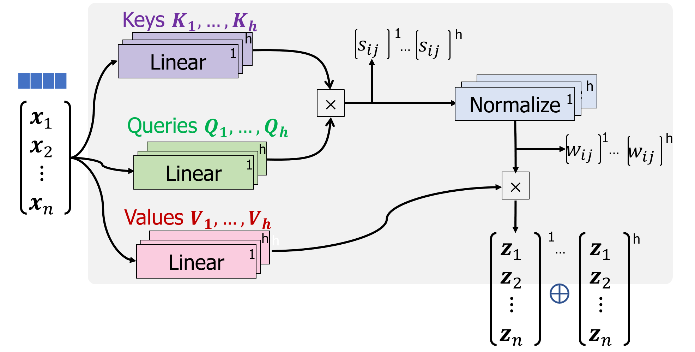

  More and better contextualized embedding

  

</section>

---

<section class="ppt">
  
Multi-head attention with layers

  

  

    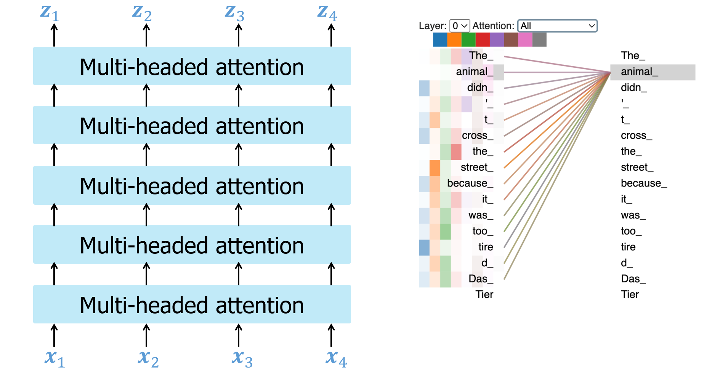
  

    
  

  

</section>

---

<section class="ppt">
  
Quick recap of self-attention

  

    

      <ul style="margin:0 0 10px 0; padding-left:1.1em;">
        <li><b>Goal:</b> Capture contextual relationships between words in a sequence for various tasks. Components: <b>Queries (𝑸), Keys (𝑲), and Values (𝑽)</b> vectors for each word
        </li>
      </ul>
      

      

      <ul style="margin:0 0 10px 0; padding-left:3em;">
        <li>Transform each word into Query, Key, and Value vectors</li>
        <li>Calculate dot products between the Query vector and Key vectors</li>
        <li>Normalize dot products using softmax to get scores (weights)</li>
        <li>Compute weighted sum of Value vectors to create a new representation</li>
      </ul>
    

    

      <ul style="margin:0 0 10px 0; padding-left:1.1em;">
        <li><b>Result:</b> Output sequence representation encodes contextual information about its relationship with other words in the input
        </li>
      </ul>
      

</section>

---

<section class="ppt">
  
Outline

  

  <ul class="outline-bullets big">
    <li class="muted">Encoder-decoder model</li>
    <li class="muted">Attention mechanism</li>
    <li class="muted">Self-attention</li>
    <li class="activate">Transformer</li>
  </ul>
</section>

---

<section class="ppt">
  
Transformer

  

  

    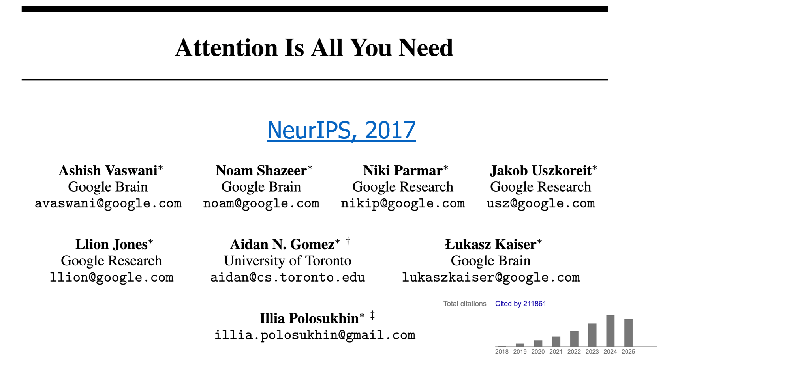
  

</section>

---

<section class="ppt">
  
Transformers Two building blocks

  

  

    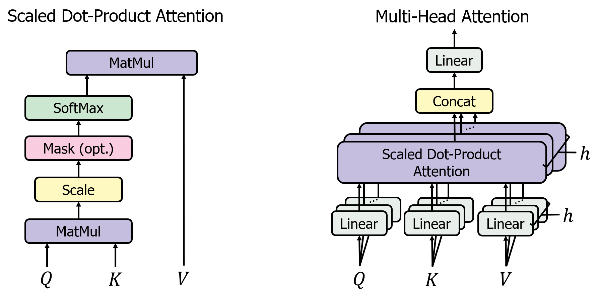
  

</section>

---

<section class="ppt">
  
Transformer Model architecture

  

  

    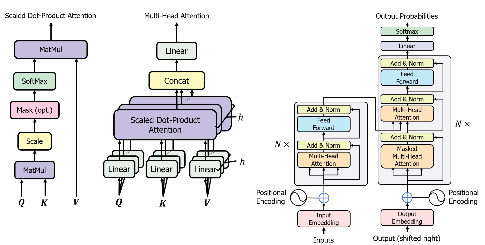
  

</section>

---

<section class="ppt">
  
Transformer Model architecture

  

  

    

      

        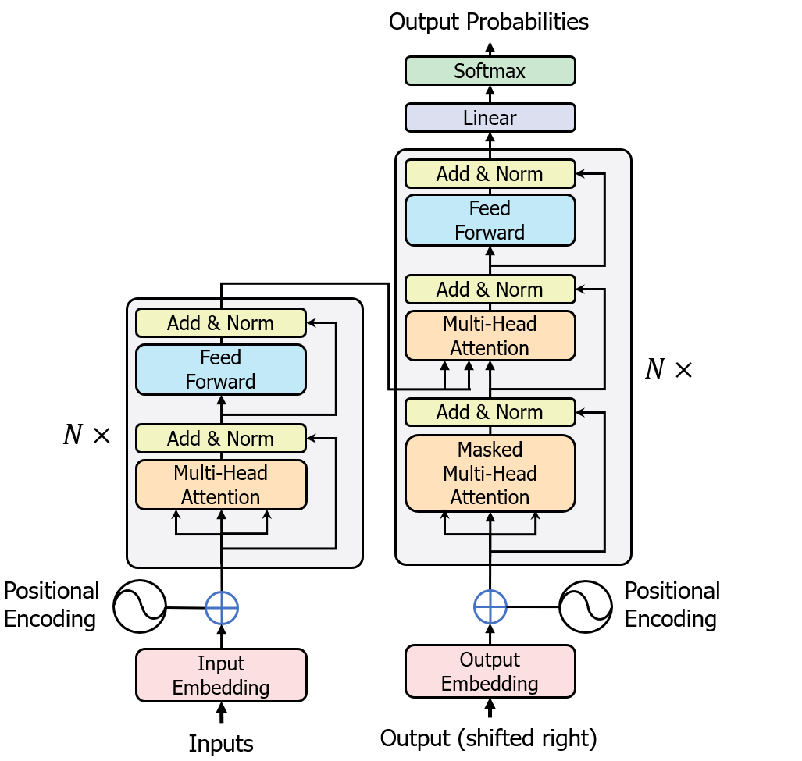
      

      

        <!-- 将所有列表项放在同一个 <ul> 内，便于统一控制间距 -->
        <ul style="margin:0; padding-left:1.1em; list-style-type:disc;">
 <b>1. Inputs 
1. Positional encoding 
2. Input/Output embedding 
3. Multi-Head Attention 
4. Add & Norm 
5. Feed Forward 
6. Linear 
7. Softmax 
8. 𝑵
        </ul>
      

    

  

  

    <a href="https://www.youtube.com/watch?v=tIvKXrEDMhk" style="color:#1a73e8;">Rasa Algorithm Whiteboard 2</a>
  

</section>

---

<section class="ppt">
  

  Transformer
  Input

  

<li>Transformers typically take sequences of token embeddings as input, which can be  words, subwords, or even characters. These embeddings are obtained from a pre-trained embedding model
  

  
<!-- 视频演示改为图片演示 -->

  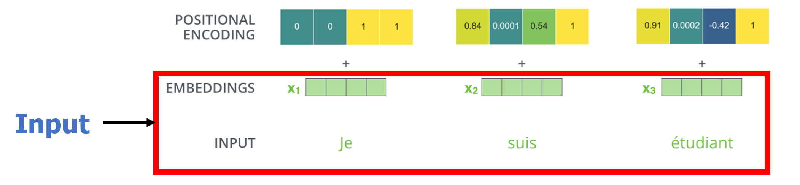

<li>In terms of MT, how should we process the raw text to tokens?
  

</section>

---

<section class="ppt">
  
Transformer Input (BPE)

  

  

    <ul style="padding-left: 1.2em;">
      <li>
        Instead of
        <ul style="padding-left: 1.2em;">
          <li>white-space segmentation (words tokenization)</li>
          <li>single-character segmentation (character tokenization)</li>
        </ul>
      </li>
      <li style="margin-bottom: 1.2em;"><strong>Use the data</strong> to tell us how to tokenize</li>
      <li style="margin-top: 1.2em;"><strong>Subword tokenization</strong> (because tokens can be parts of words as well as whole words)</li>
    </ul>
  

</section>

---

<section class="ppt">
  
Transformer Input (BPE)

  

  

    <ul style="padding-left: 1.2em;">
      <li style="margin-bottom: 16px;">
        Three common algorithms of subword tokenization:
        <ul style="padding-left: 1.2em; margin-top: 8px;">
          <li style="margin-bottom: 6px;"><strong>Byte-Pair Encoding (BPE)</strong> (Sennrich et al., 2016)</li>
          <li style="margin-bottom: 6px;"><strong>Unigram language modeling tokenization</strong> (Kudo, 2018)</li>
          <li style="margin-bottom: 6px;"><strong>WordPiece</strong> (Schuster and Nakajima, 2012)</li>
        </ul>
      </li>
      <li style="margin-bottom: 16px;">
        All have 2 parts:
        <ul style="padding-left: 1.2em; margin-top: 8px;">
          <li style="margin-bottom: 6px;">A token <strong>learner</strong> that takes a raw training corpus and induces a vocabulary (a set of tokens)</li>
          <li style="margin-bottom: 6px;">A token <strong>segmenter</strong> that takes a raw test sentence and tokenizes it according to that vocabulary</li>
        </ul>
      </li>
    </ul>
  

</section>

---

<section class="ppt">
  
Transformer Input (BPE)

  

  

    
Byte Pair Encoding (BPE) token learner

    <ul style="padding-left: 1.2em;">
      <li style="margin-bottom: 12px;">
        Let vocabulary be the set of all individual characters
         
        
          \( \{A, B, C, D, \dots, a, b, c, d, \dots\} \)
        
      </li>
      <li style="margin-bottom: 12px;">
        Repeat:
        <ul style="padding-left: 1.2em; margin-top: 8px;">
          <li style="margin-bottom: 6px;">Choose the two symbols that are most frequently adjacent in the training corpus (say 'A', 'B')</li>
          <li style="margin-bottom: 6px;">Add a new merged symbol 'AB' to the vocabulary</li>
          <li style="margin-bottom: 6px;">Replace every adjacent 'A' 'B' in the corpus with 'AB'</li>
        </ul>
      </li>
      <li style="margin-bottom: 12px;">
        Until \( k \) merges have been done
      </li>
    </ul>
  

</section>

---

<section class="ppt">
  
Transformer Input (BPE)

  

  

    
BPE token learner

    <ul style="padding-left: 1.2em; margin-bottom: 20px;">
      <li style="margin-bottom: 10px;">
        Original (very fascinating 🙄) corpus:
        

          low low low low low lowest lowest newer newer newer newer newer newer wider wider wider new new
        

      </li>
      <li style="margin-bottom: 5px;">
        Add end-of-word tokens, resulting in this vocabulary:
      </li>
    </ul>
    

      <!-- 左侧：Vocabulary -->
      

        
Vocabulary

        

          _,&thinsp;d,&thinsp;e,&thinsp;i,&thinsp;l,&thinsp;n,&thinsp;o,&thinsp;r,&thinsp;s,&thinsp;t,&thinsp;w
        

      

      <!-- 右侧：Corpus representation -->
      

        
Corpus representation

        

          
5 l o w _

          
2 l o w e s t _

          
6 n e w e r _

          
3 w i d e r _

          
2 n e w _

        

      

    

  

</section>

---

<section class="ppt">
  

    Transformer 
    Input (BPE)
  

  

  

    <!-- 左侧内容 -->
    

      
<li>BPE token learner</li>

      
Vocabulary

      

        _,&thinsp;d,&thinsp;e,&thinsp;i,&thinsp;l,&thinsp;n,&thinsp;o,&thinsp;r,&thinsp;s,&thinsp;t,&thinsp;w
      

      

        Merge e r  to er
      

      
Vocabulary

      

        _,&thinsp;d,&thinsp;e,&thinsp;i,&thinsp;l,&thinsp;n,&thinsp;o,&thinsp;r,&thinsp;s,&thinsp;t,&thinsp;w,&thinsp;er
      

    

    

      
Corpus representation

      

        
5 l o w _

        
2 l o w e s t _

        
6 n e w e r _

        
3 w i d e r _

        
2 n e w _

      

      
Corpus representation

      

        
5 l o w _

        
2 l o w e s t _

        
6 n e w er _

        
3 w i d er _

        
2 n e w _

      

    

  

</section>

---

<section class="ppt">
  

    Transformer 
    Input (BPE)
  

  

  

    <!-- 左侧内容 -->
    

      
<li>BPE token learner</li>

      
Vocabulary

      

        _,&thinsp;d,&thinsp;e,&thinsp;i,&thinsp;l,&thinsp;n,&thinsp;o,&thinsp;r,&thinsp;s,&thinsp;t,&thinsp;w,&thinsp;er
      

      

        Merge er _  to er_
      

      
Vocabulary

      

        _,&thinsp;d,&thinsp;e,&thinsp;i,&thinsp;l,&thinsp;n,&thinsp;o,&thinsp;r,&thinsp;s,&thinsp;t,&thinsp;w,&thinsp;er,&thinsp;er_
      

    

    

      
Corpus representation

      

        
5 l o w _

        
2 l o w e s t _

        
6 n e w er _

        
3 w i d er _

        
2 n e w _

      

      
Corpus representation

      

        
5 l o w _

        
2 l o w e s t _

        
6 n e w er_

        
3 w i d er_

        
2 n e w _

      

    

  

</section>

---

<section class="ppt">
  
Transformer Input (BPE)

  

  

    
<li>BPE token learner</li>

    
<li>The next merges are:</li>

    <!-- 左右两列布局 -->
    

      <!-- 左侧：Merge 列表 -->
      

        
Merge

        <ul style="font-weight: bold; margin: 0; font-size: 32px;list-style-type: none;">
          <li style="margin-bottom: 6px;">(ne, w)</li>
          <li style="margin-bottom: 6px;">(l, o)</li>
          <li style="margin-bottom: 6px;">(lo, w)</li>
          <li style="margin-bottom: 6px;">(new, er_)</li>
          <li style="margin-bottom: 6px;">(low, er_)</li>
        </ul>
      

      <!-- 右侧：Current Vocabulary 列表 -->
      

        
Current Vocabulary

        

          _, d, e, i, l, n, o, r, s, t, w, er, er_, ne, new 
          _, d, e, i, l, n, o, r, s, t, h, w, er, er_, ne, new, lo 
          _, d, e, i, l, n, o, r, s, t, w, er, er_, ne, new, low 
          _, d, e, i, l, n, o, r, s, t_ 
          _, d, e, i, l, n, o, r, s, t, w, er, er_, ne, new, low, newer_ 
          _, d, e, i, l, n, o, r, s, t, w, er, er_, ne, new, low, newer_, low_
        

      

    

  

</section>

---

<section class="ppt">
  
Transformer Input (BPE)

  

  

    
<li>BPE token <strong>segmenter</strong> algorithm</li>

    
On the test data, run each merge learned from the training data:

    <ul style="padding-left: 1.8em; margin-bottom: 16px;">
      <li style="margin-bottom: 6px;">Greedily</li>
      <li style="margin-bottom: 6px;">In the order we learned them</li>
      <li style="margin-bottom: 6px;">(test frequencies don't play a role)</li>
    </ul>
    

      So: merge every e r to er, then merge e r _ to er_, etc.
    

    
<li>Result:</li>

    <ul style="padding-left: 1.8em;">
      <li style="margin-bottom: 8px;">Test set "n e w e r _" would be tokenized as a full word</li>
      <li style="margin-bottom: 8px;">Test set "l o w e r _" would be two tokens: "low er_"</li>
    </ul>
  

</section>

---

<section class="ppt">
  

    Transformer 
    Model architecture
  

  

  

    

      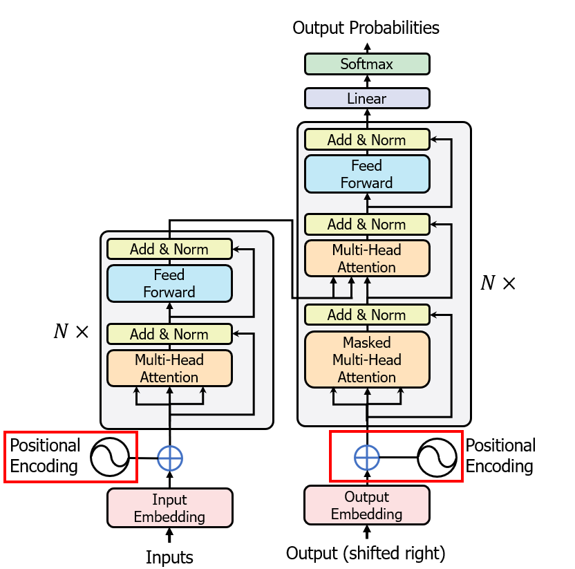
    

    

      
1. Inputs

      
2. Positional encoding

      
3. Input/Output embedding

      
4. Multi-Head Attention

      
5. Add & Norm

      
6. Feed Forward

      
7. Linear

      
8. Softmax

      
9. \(N\)

    

  

</section>

---

<section class="ppt">
  

    Transformer 
    Positional encoding
  

  

  

    

      <ul style="list-style: disc; padding-left: 1.1em; font-size: 32px; line-height: 1.4; margin-bottom: 5px;">
        <li>Use sine and cosine functions of different frequencies:</li>
      </ul>
    

      \[
      PE(pos, 2i) = \sin\left(\frac{pos}{10000^{2i/d_{\text{model}}}}\right)
      \]
      \[
      PE(pos, 2i+1) = \cos\left(\frac{pos}{10000^{2i/d_{\text{model}}}}\right)
      \]
    

      

        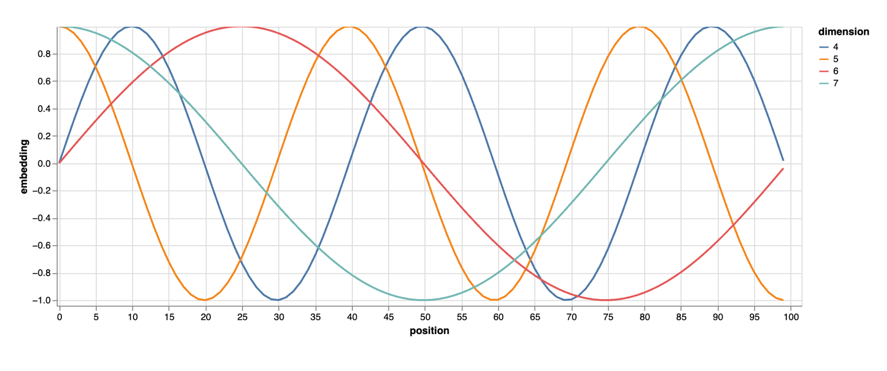
      

    

    

      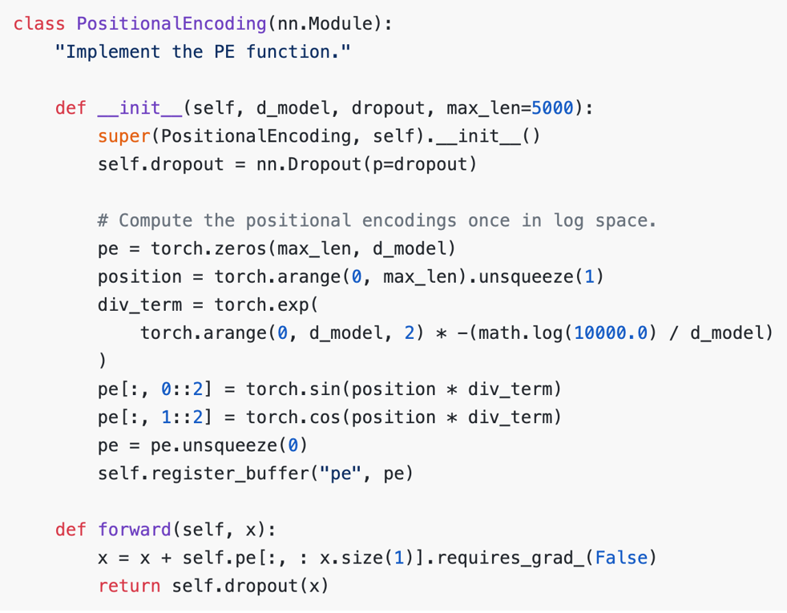
    

  

</section>

---

<section class="ppt">
  

    Transformer 
    Model architecture
  

  

  

    

      <ul style="list-style: disc; padding-left: 1.1em; font-size: 35px; line-height: 1.4; margin-bottom: 5px;">
        <li style="margin-bottom: 30px;">How this combination of sines and cosines could ever represent a position/order?</li>
        <li style="margin-bottom: 30px;">It is actually quite simple, suppose you want to represent a number in binary format, how will that be?</li>
        <li style="margin-bottom: 30px;">You can spot the rate of change between different bits. The lowest bit is alternating on every number, the second-lowest bit is rotating on every two numbers, and so on.</li>
      </ul>
    

    

        

          0:&ensp;0 0 0 0&thinsp;8 :&ensp;1 0 0 0 
          1:&ensp;0 0 0 1&thinsp;9 :&ensp;1 0 0 1 
          2:&ensp;0 0 1 0&thinsp;10:&ensp;1 0 1 0 
          3:&ensp;0 0 1 1&thinsp;11:&ensp;1 0 1 1 
          4:&ensp;0 1 0 0&thinsp;12:&ensp;1 1 0 0 
          5:&ensp;0 1 0 1&thinsp;13:&ensp;1 1 0 1 
          6:&ensp;0 1 1 0&thinsp;14:&ensp;1 1 1 0 
          7:&ensp;0 1 1 1&thinsp;15:&ensp;1 1 1 1 
        

      

  

</section>

---

<section class="ppt">
  
Transformer Positional encoding

  

  

    <!-- 左侧文字和公式 -->
    

      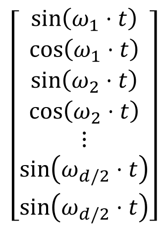
      

      \( \omega_k = \frac{1}{10000^{2k/d}} \)
      

      
\( t \) is position index

    

    <!-- 右侧图片 -->
    

      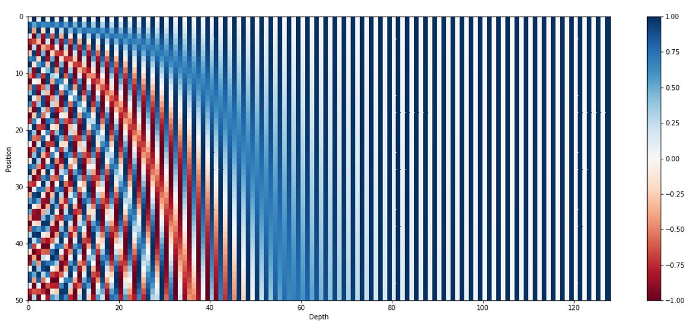
    

  

</section>

---

<section class="ppt">
  
Transformer Positional encoding

  

  

    <!-- 左侧内容 -->
    

      

        • Is Positional Encoding necessary?
        <em>Transformer Language Models without Positional Encodings Still Learn Positional Information</em>
      

      <!-- 论文图片 -->
      

        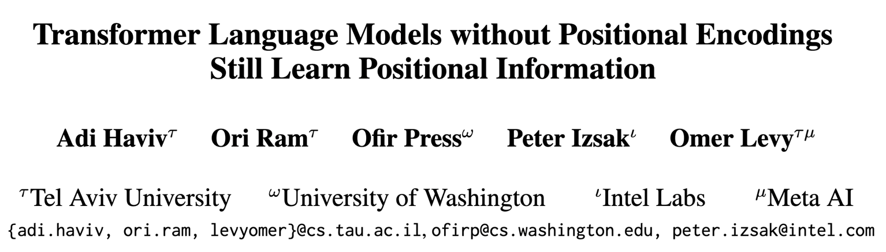
      

      <!-- 作者信息 -->
      

        <a href="https://github.com/adihaviv/NoPos" style="color: #1a73e8; margin-left: 240px;">https://github.com/adihaviv/NoPos</a>
      

      <!-- 方法列表 -->
      

        
• <strong>Learned</strong>: Used by MLMs, GPT-3

        
• <strong>Sinusoidal</strong>: Used by Transformer

        
• <strong>ALiBi</strong>: Linear Biases (Press et al., 2022, ICLR)

        
• <strong>NoPos</strong>: Without Positional encoding information

      

      
RoPE&emsp;<a href="https://arxiv.org/pdf/2104.09864" target="_blank">RoFormer: Enhanced Transformer with Rotary Position Embedding</a>

    

    <!-- 右侧图片 -->
    

      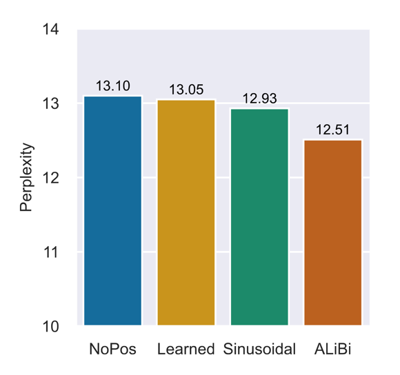
    

  

</section>

---

<section class="ppt">
  

    Transformer 
    Model architecture
  

  

  

    

      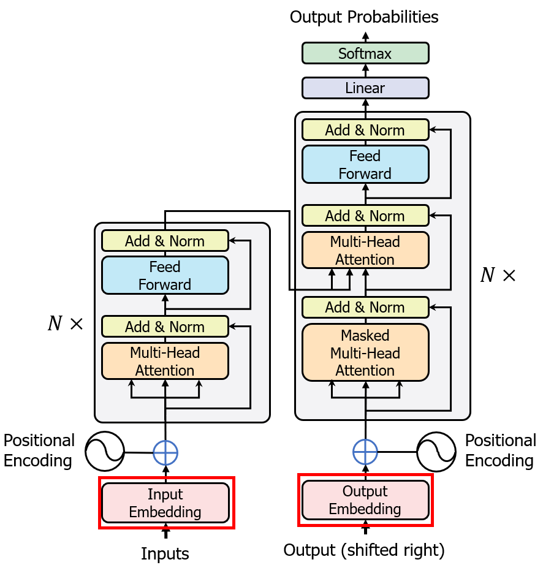
    

    

      
1. Inputs

      
2. Positional encoding

      
3. Input/Output embedding

      
4. Multi-Head Attention

      
5. Add & Norm

      
6. Feed Forward

      
7. Linear

      
8. Softmax

      
9. \(N\)

    

  

</section>

---

<section class="ppt">
  
Transformer Input Embedding

  

  

    <!-- 左侧文字内容 -->
    

      <li style="margin-bottom: 16px;">We have static embeddings</li>
      <ul style="padding-left: 1.5em; margin-bottom: 24px;">
        <li>word2vec/GloVe/fastText</li>
      </ul>
    

    <!-- 右侧代码图片 -->
    

      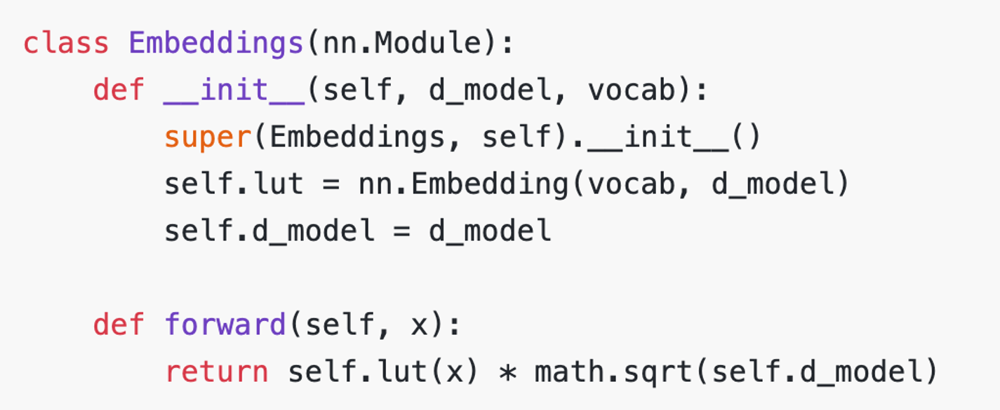
    

  

  

    <li>Ways to have embeddings</li>
    <li style="font-size: 30px; margin-left: 60px;">initialize it with pre-trained embeddings and keep it fixed</li>
    <li style="font-size: 30px; margin-left: 60px;">initialize it randomly, or with pre-trained embeddings, but keep it trainable. Word embeddings will get refined and modified throughout training</li>
    <li style="margin-top: 20px;">The Transformer uses a random initialization of the weight matrix and refines these weights during training</li>
  

</section>

---

<section class="ppt">
  
Transformer Input Output Embedding

  

  

    

    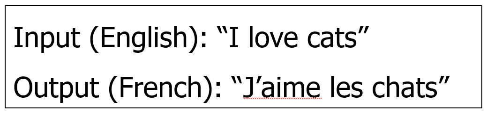
    

    

      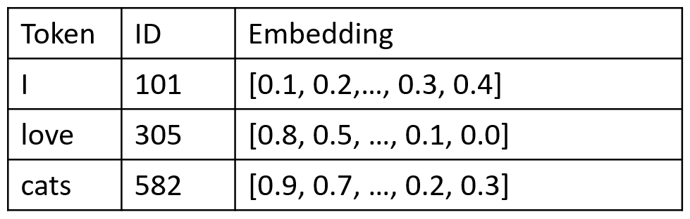
    

  

  
During training, the decoder doesn’t generate tokens from scratch; it’s given the previous gold tokens (a process called teacher forcing). So at step t, it’s trying to predict the next word given all the previous ones.

  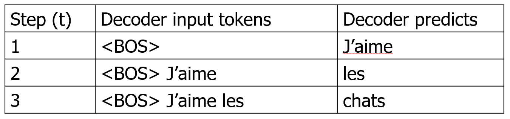
</section>

---

<section class="ppt">
  

    Transformer 
    Model architecture
  

  

  

    

      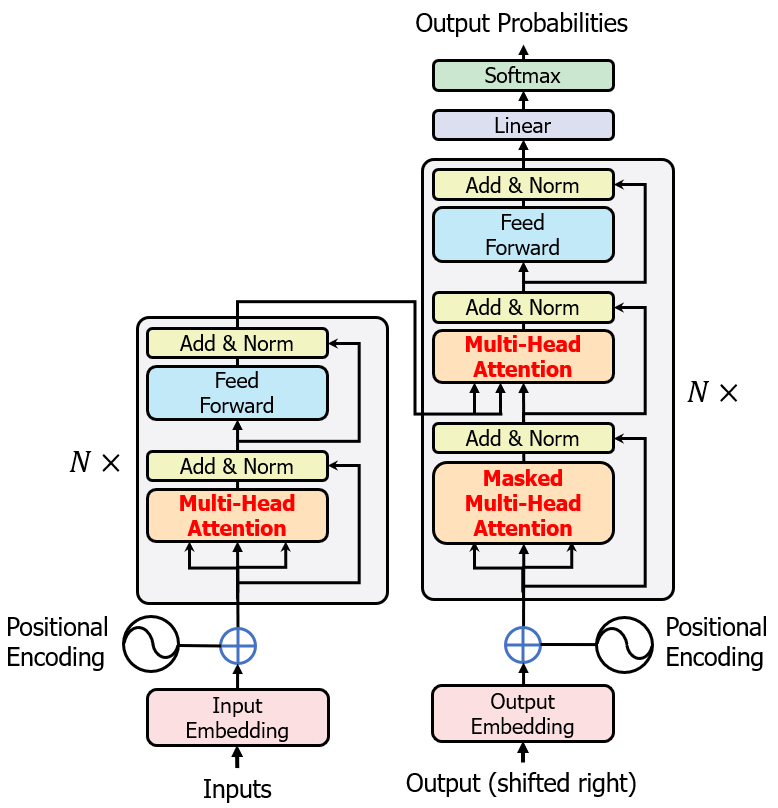
    

    

      
1. Inputs

      
2. Positional encoding

      
3. Input/Output embedding

      
4. Multi-Head Attention

      
5. Add & Norm

      
6. Feed Forward

      
7. Linear

      
8. Softmax

      
9. \(N\)

    

  

</section>

---

<section class="ppt">
  
Transformer Multi-head Attention

  

  
  <!-- 左右布局：左侧图片，右侧文字内容 -->
  

    <!-- 左侧：Scaled Dot-Product Attention 图示 -->
    

      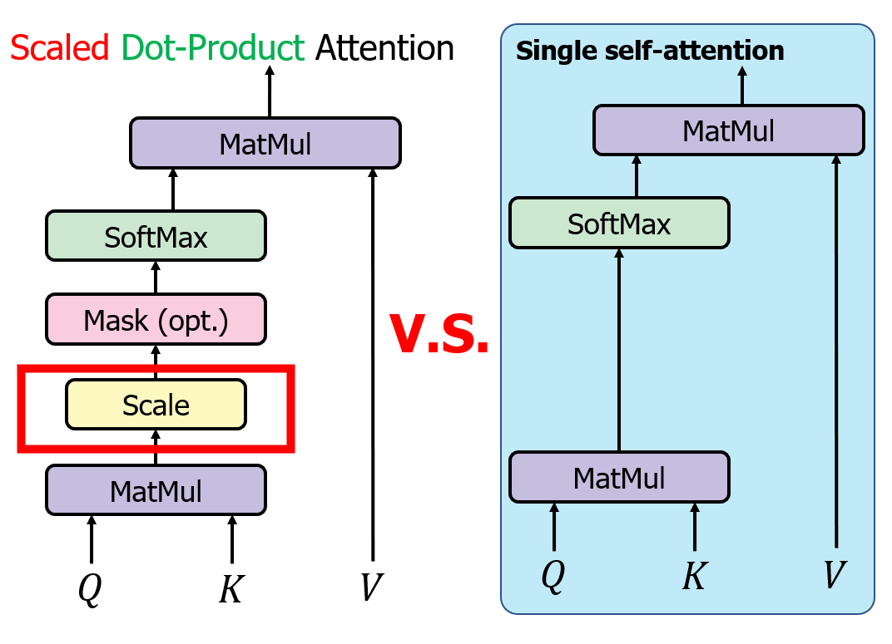
    

    <!-- 右侧：公式与解释文字 -->
    

      <li style="margin-bottom: 20px; margin-left: 50px;">
        What is the scale in scaled dot-product attention?
      </li>
      

        \[
        \text{Attention}(Q, K, V) = \text{softmax}\left(\frac{QK^\top}{\color[rgb]{0.898,0.714,0.212}{\sqrt{d_k}}}\right)\cdot V
        \]
      

      <li style="margin-left: 50px;">
        Assume that \( u \) and \( v \) are \( d_k \)-dimensional vectors whose components are independent random variables with mean 0 and variance 1.
      </li>
      <li style="margin-left: 50px; margin-top: 20px;">
        Their dot product,
        \(
        u \cdot v = \sum_{i=1}^{d_k} u_i \cdot v_i
        \)
        has mean 0 and variance \( d_k \). <strong>Since we would prefer these values to have variance 1, we divide by \(\sqrt{d_k}\).</strong>
      </li>
    

  

</section>

---

<section class="ppt">
  
Transformer Multi-head Attention

  

  

    

      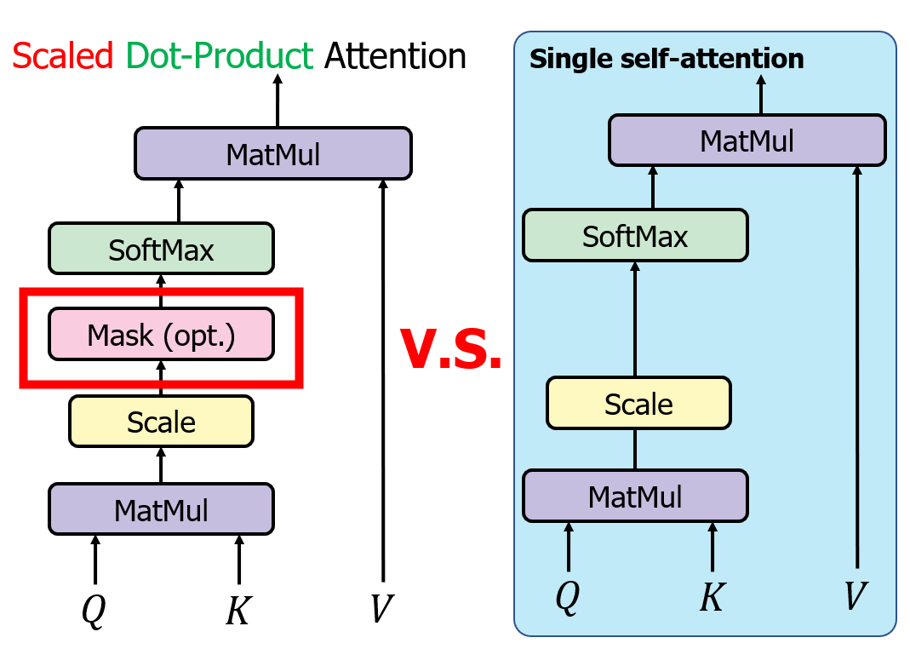
    

    

        

          <li style="margin-bottom: 12px;"><strong>What is the Mask (opt.) in scaled dot-product attention?</strong></li>
          <li>To prevent positions from attending to subsequent positions. Ensure that the predictions for position \( i \) can depend only on known outputs at positions less than \( i \).</li>
        

        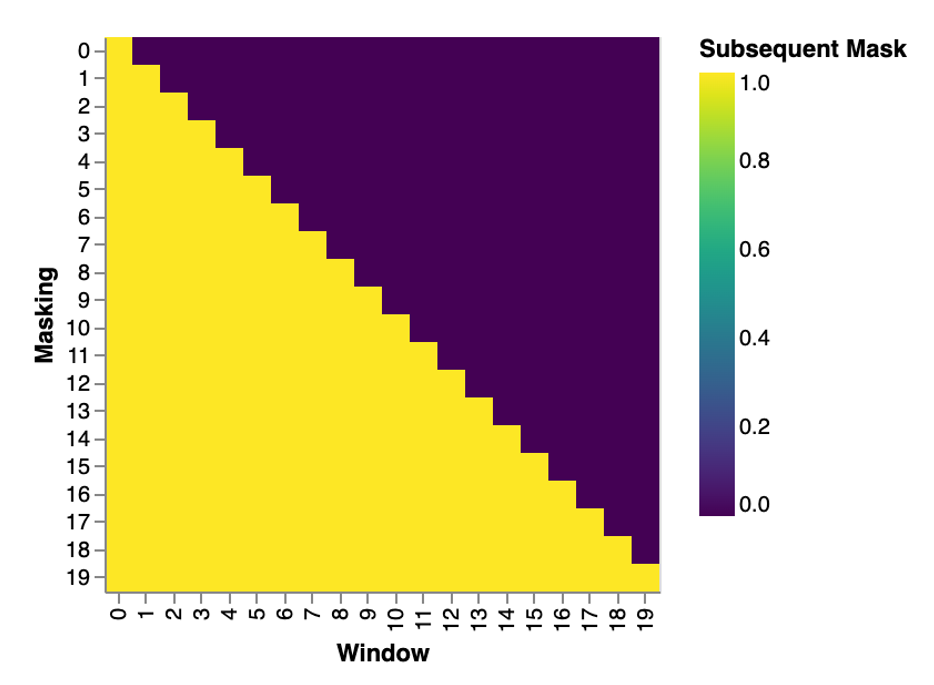
    

  

</section>

---

<section class="ppt">
  
Transformer Multi-head Attention

  

  
Attention Visualizations

  

    <!-- 图片 -->
    

      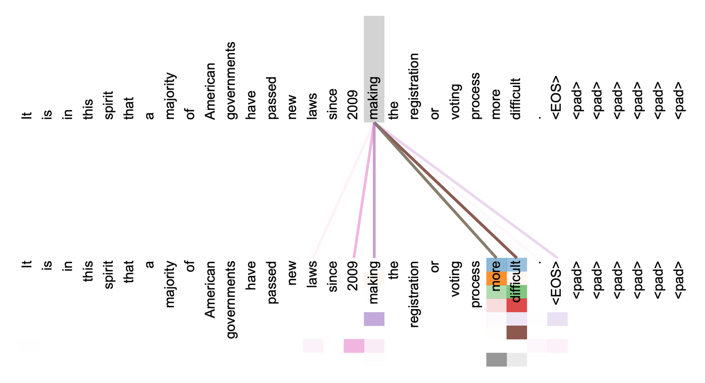
    

    

      

        An example of the attention mechanism following long-distance dependencies in the encoder self-attention in layer 5 of 6. Many of the attention heads attend to a distant dependency of the verb ‘making’, completing the phrase ‘making…more difficult’. Attentions here shown only for the word ‘making’. Different colors represent different heads. Best viewed in color.
      

    

  

</section>

---

<section class="ppt">
  
Transformer Multi-head Attention

  

  

    

      
Attention Visualizations

      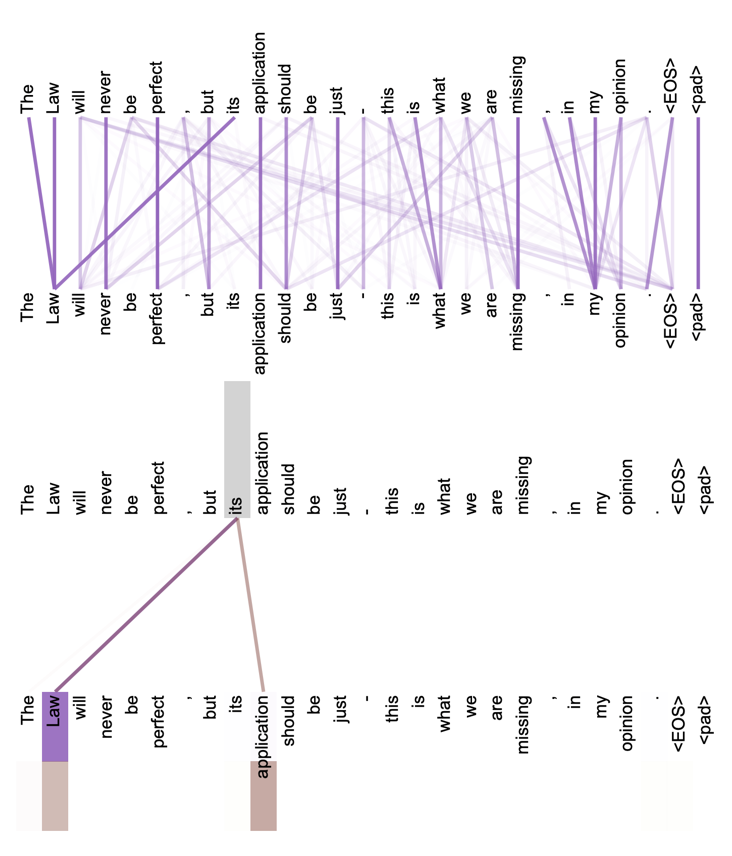
    

    

      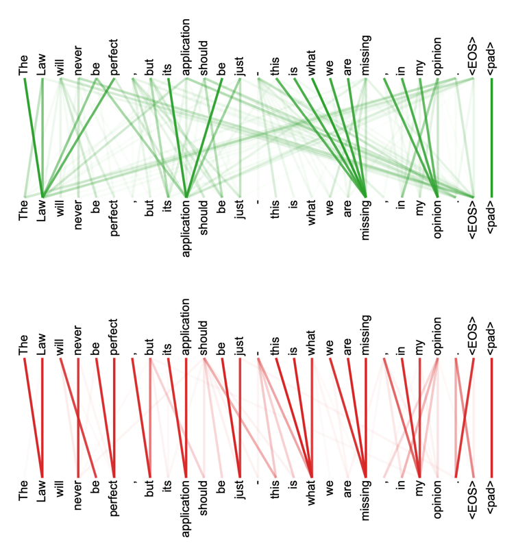
        
Many of the attention heads exhibit behavior that seems related to the structure of the sentence. We give two such examples above, from two different heads from the encoder self-attention at layer 5 of 6. The heads clearly learned to perform different tasks.
        

    

  

</section>

---

<section class="ppt">
  
Transformer Multi-head Attention

  

  

  
Is multi-head attention useful?

  
Even if models have been trained using multiple heads, in practice, a large percentage of attention heads can be removed at test time without significantly impacting performance. In fact, some layers can even be reduced to a single head
  .

  

  <!-- 大表格图片 -->
  

    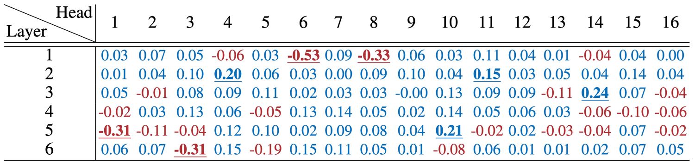
  

  

    

      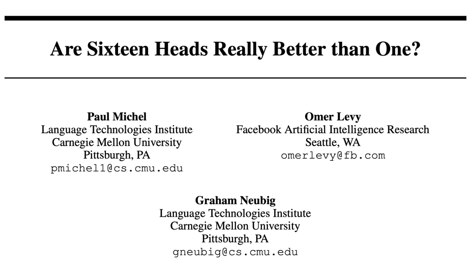
      <a href="https://arxiv.org/abs/1905.10650" target="_blank" style="font-size: 30px; margin-left: 130px; margin-top: -30px;">NeurIPS, 2019</a>
    

    

      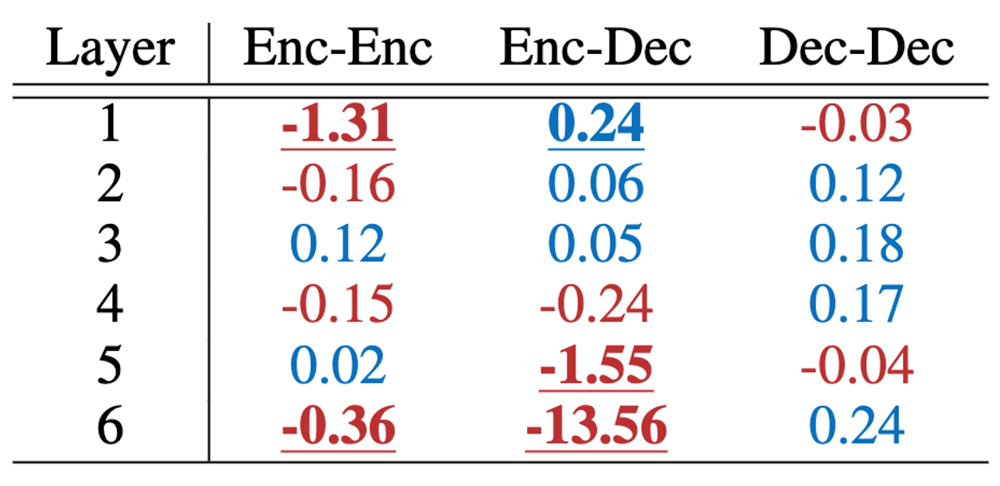
      
<strong>Table 2:</strong> Best delta BLEU by layer when only one head is kept in the WMT model. Underlined numbers indicate that the change is statistically significant with \( p < 0.01 \).

    

    

      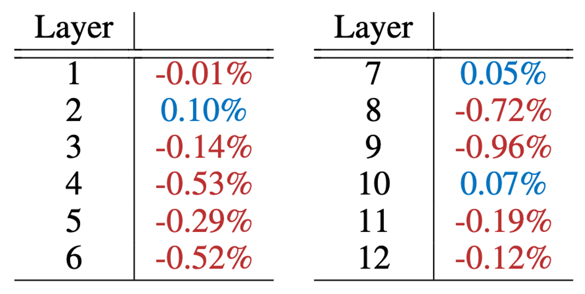
      
<strong>Table 3:</strong> Best delta accuracy by layer when only one head is kept in the BERT model. None of these results are statistically significant with \( p < 0.01 \).

    

  

  

</section>

---

<section class="ppt">
  

    Transformer 
    Model architecture
  

  

  

    

      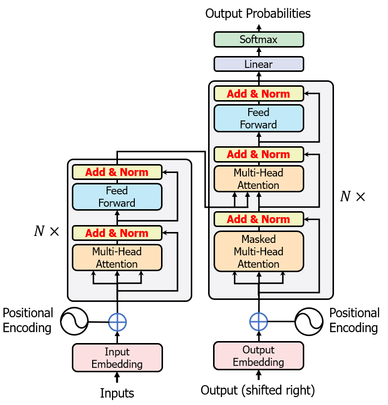
    

    

      
1. Inputs

      
2. Positional encoding

      
3. Input/Output embedding

      
4. Multi-Head Attention

      
5. Add & Norm

      
6. Feed Forward

      
7. Linear

      
8. Softmax

      
9. \( N \)

    

  

</section>

---

<section class="ppt">
  
Transformer Add & Norm

  

  

    

      <li style="font-size: 40px; margin-left: 30px; line-height: 1.2; margin-top: 50px; margin-right: 100px;">Add & Norm improves training, without making changes to the core of the model.</li>
      <li style="font-size: 40px; margin-left: 30px; margin-top: 20px; margin-right: 100px;">It has two steps:</li>
      <li style="font-size: 30px; margin-left: 60px; margin-top: 20px; margin-right: 100px;">The <strong>add step</strong> is a residual connection, the technique proposed in Deep Residual Learning for Image Recognition, CVPR, 2015. It means that we take sum together the output of a layer with the input. It is one of the solutions for vanishing gradient problem.</li>
    

    

      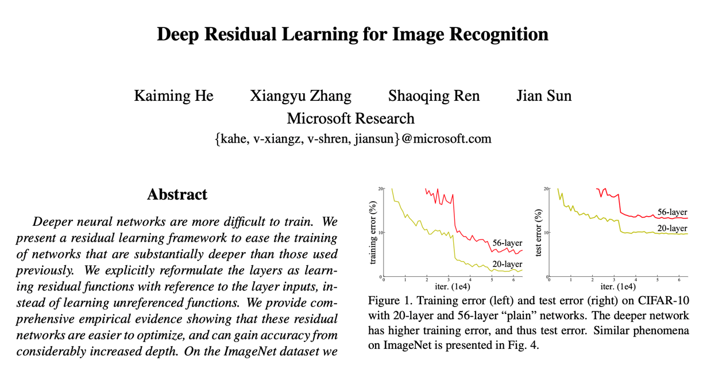
      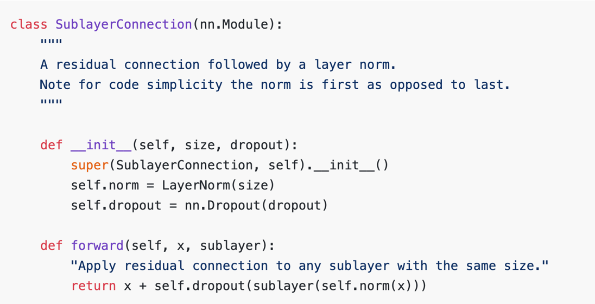
    

  

</section>

---

<section class="ppt">
  
Transformer Add & Norm

  

  

    

      <li style="font-size: 40px; margin-left: 30px; line-height: 1.2; margin-top: 50px; margin-right: 100px;">Add & Norm improves training, without making changes to the core of the model.</li>
      <li style="font-size: 40px; margin-left: 30px; margin-top: 20px; margin-right: 100px;">It has two steps:</li>
      <li style="font-size: 30px; margin-left: 60px; margin-top: 20px; margin-right: 100px;">The <strong>norm step</strong> is about layer normalization (Ba et al, 2016), it is another way of normalization. It is one of the many computational tricks to make life easier for training the model, hence improve the performance and training time.
      </li>
    

    

      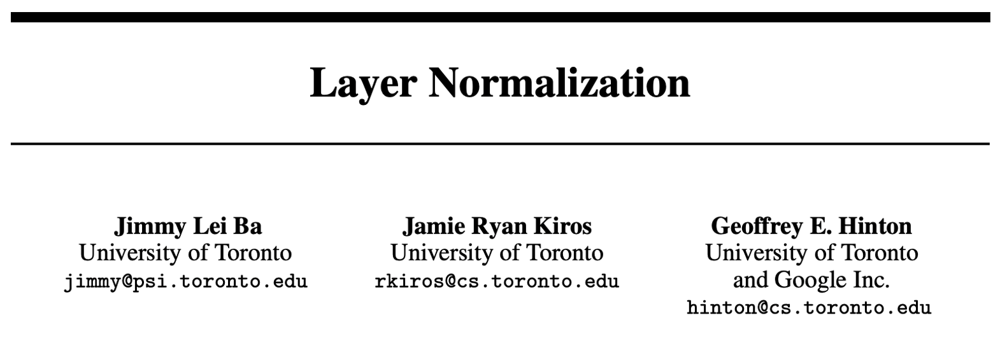
      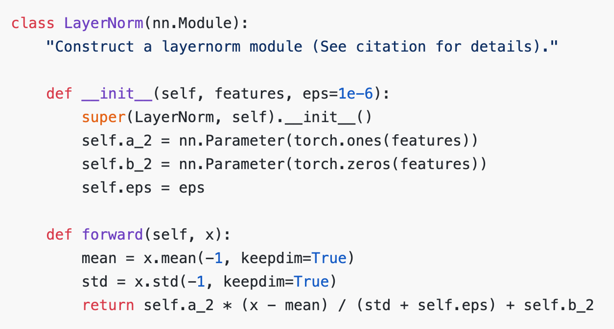
    

  

</section>

---

<section class="ppt">
  

    Transformer 
    Model architecture
  

  

  

    

      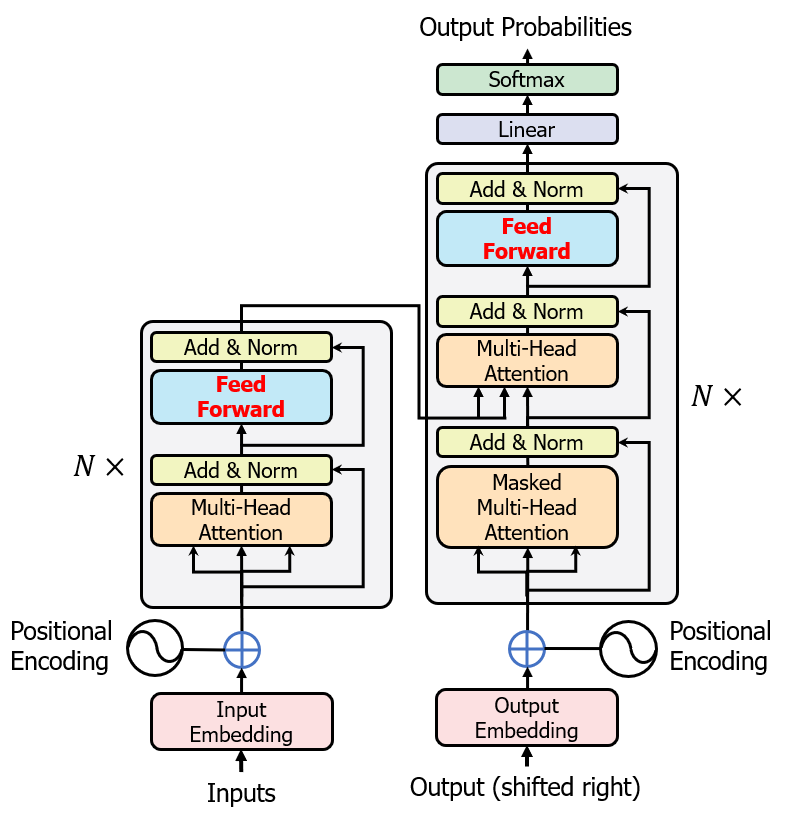
    

    

      
1. Inputs

      
2. Positional encoding

      
3. Input/Output embedding

      
4. Multi-Head Attention

      
5. Add & Norm

      
6. Feed Forward

      
7. Linear

      
8. Softmax

      
9. \( N \)

    

  

</section>

---

<section class="ppt">
  
Transformer Feed forward

  

  

    

      <li style="font-size: 40px; margin-left: 30px; line-height: 1.1; margin-top: 50px; margin-right: 100px; margin-bottom: 60px; line-height: 1.2;">Each of the layers in our encoder and decoder contains a fully connected feed-forward network, which is applied to each position separately and identically. This consists of two linear transformations with a ReLU activation in between.</li>
      

      \[
        FFN(x)=\text{max}(0,xW_1+b_1)W_2+b_2
      \]
      

    

    

      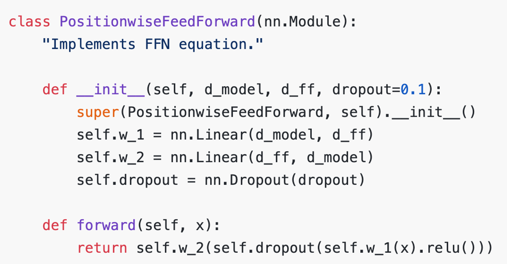
    

  

</section>

---

<section class="ppt">
  

    Transformer 
    Model architecture
  

  

  

    

      
    

    

      
1. Inputs

      
2. Positional encoding

      
3. Input/Output embedding

      
4. Multi-Head Attention

      
5. Add & Norm

      
6. Feed Forward

      
7. Linear

      
8. Softmax

      
9. \( N \)

    

  

</section>

---

<section class="ppt">
  

    Transformer 
    Model architecture
  

  

  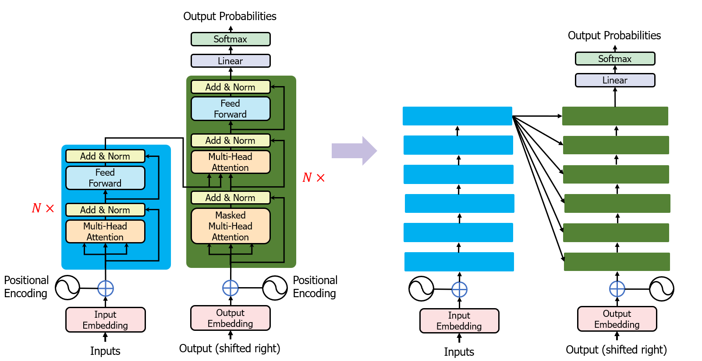
</section>

---

<section class="ppt">
  
Transformer Two MT tasks

  

  

      <li style="margin-left: 30px;">Machine translation</li>
      <li style="font-size: 37px; margin-left: 60px; line-height: 1; margin-top: 30px;"><strong>English-German:</strong> trained on the standard WMT 2014 English-German dataset consisting of about 4.5 million sentence pairs. Sentences were encoded using byte-pair encoding, which has a shared source target vocabulary of about 37000 tokens.</li>
      <li style="font-size: 37px; margin-left: 60px; line-height: 1; margin-top: 25px;"><strong>English-French:</strong> we used the significantly larger WMT 2014 English-French dataset consisting of 36M sentences and split tokens into a 32000 word-piece vocabulary.</li>
      <li style="margin-left: 30px; margin-top: 30px;">Sentence pairs were batched together by approximate sequence length. Each training batch contained a set of sentence pairs containing approximately 25000 source tokens and 25000 target tokens.</li>
    

</section>

---

<section class="ppt">
  
Illustrated Transformer via MT

  

  

    <li style="margin-left: 30px;">
The encoding component is a stack of six encoders. 

    
The decoding component is a stack of six decoders.

    </li>
  

  

    

      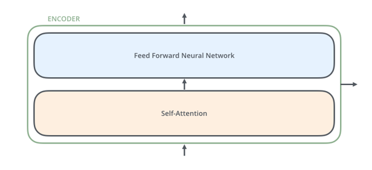
      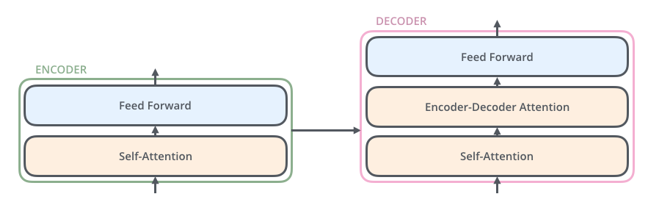
    

    

      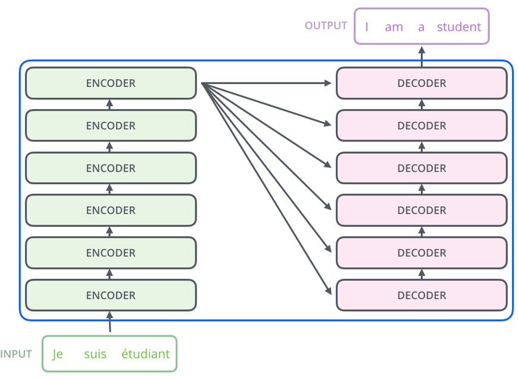
    

  

</section>

---

<section class="ppt">
  

    Transformer  
    Two MT tasks
  

  

  

    

      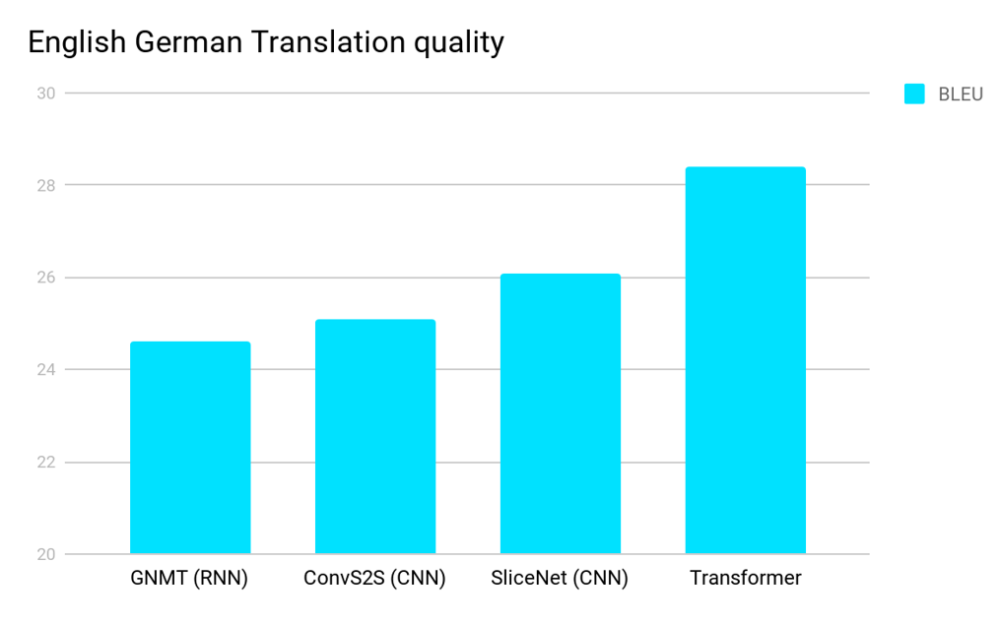
      
BLEU scores (higher is better) of single models on the standard WMT newstest2014 English to German translation benchmark.

    

    

      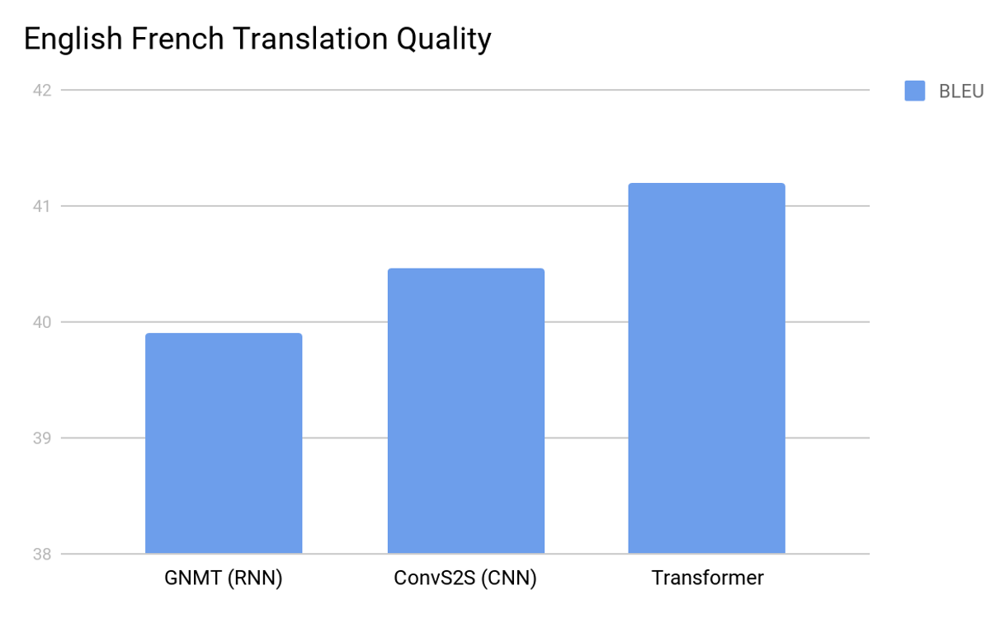
      
BLEU scores (higher is better) of single models on the standard WMT newstest2014 English to French translation benchmark.

    

  

</section>

---

<section class="ppt">
  

    Transformer  
    Results
  

  

  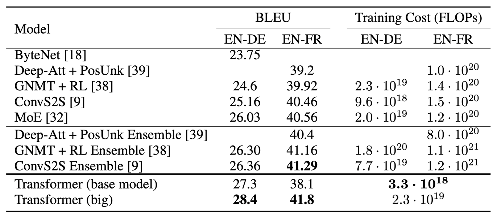
  

  <li style="font-size: 35px; margin-left: 80px; margin-top: -15px; margin-right: 80px;">Compared with ConS2S, Transformer big not only provides better BLEU of EN-FR but also with 50 times faster.</li>
  

</section>

---

<section class="ppt">
  

    Transformer  
    Model parameters
  

  

  

    

      <li style="margin-top: 10px;">\(N\): number of encoder and decoder layers</li>
      <li style="margin-top: 10px;">\(d_{\text{model}}\)dimension of outputs of sub-layers and embedding layers</li>
      <li style="margin-top: 10px;">\(d_{ff}\)dimension of inner layer</li>
      <li style="margin-top: 10px;">\(h\)number of heads in multi-head attention layer</li>
      <li style="margin-top: 10px;">\(d_k\)dimension of queries and keys</li>
      <li style="margin-top: 10px;">\(d_v\)dimension of values</li>
      <li style="margin-top: 10px;">\(P_{\text{drop}}\)dropout rate</li>
      <li style="margin-top: 10px;">\(\epsilon_{\text{ls}}\)Label smoothing value</li>
    

    

      

      \[
        d_k=d_v=\dfrac{d_{\text{model}}}{h}=64
      \]
      
<strong>Transformer base</strong>

      
\(N\)=6&ensp;\(d_{\text{model}}\)=512&ensp;\(d_{ff}\)=2048&ensp;\(h\)=8&ensp;\(d_k\)=64&ensp;\(d_v\)=64&ensp;\(P_{\text{drop}}\)=0.1&ensp;\(\epsilon_{\text{ls}}\)=0.1

      
<strong>Transformer big</strong>

      
\(N\)=6&ensp;\(d_{\text{model}}\)=1024&ensp;\(d_{ff}\)=4096&ensp;\(h\)=16&ensp;\(d_k\)=64&ensp;\(d_v\)=64&ensp;\(P_{\text{drop}}\)=0.3&ensp;\(\epsilon_{\text{ls}}\)=0.1

      

    

  

</section>

---

<section class="ppt">
  
Quiz (15 minutes)

  

  

      <li style="font-size: 40px; margin-left: 30px;">Consider a Transformer-based model, which contains only the encoder block of the original transformer architecture. Specifically,</li>
      <li style="margin-left: 60px; margin-top: 20px;">Number of layers: \(N\)=12</li>
      <li style="margin-left: 60px; margin-top: 20px;">Model dimension (embedding dimension): \(d\)=768</li>
      <li style="margin-left: 60px; margin-top: 20px;">Number of heads: \(H\)=12</li>
      <li style="margin-left: 60px; margin-top: 20px;">Vocabulary size: \(V\)=30522</li>
      <li style="margin-left: 60px; margin-top: 20px;">Attention dimension \(k\) is set to: \(k\)=\(d/h\)</li>
      <li style="margin-left: 60px; margin-top: 20px;">FFN dimension is set to: \(m=4\cdot d\)</li>
      <li style="font-size: 40px; margin-left: 30px;">Question: How many parameters in this model?</li>
    

</section>

---

<section class="ppt">
  

    Transformer 
    Results
  

  

  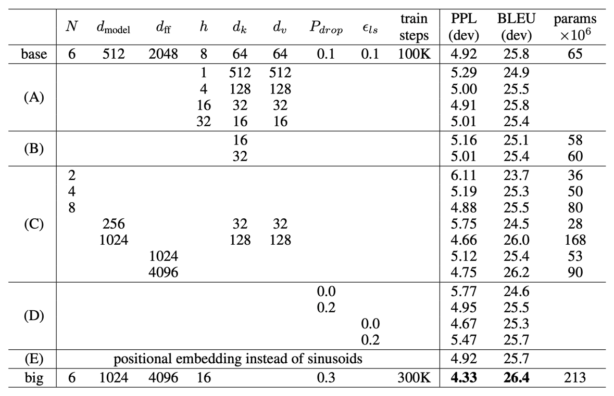
</section>

---

<section class="ppt">
  

    Transformer 
    English Constituency Parsing
  

  

  

    <li>To evaluate if the Transformer can generalize to other tasks we performed experiments on English constituency parsing.</li>
  

  

    

      

        <li>We trained a 4-layer transformer on the Wall Street Journal (WSJ) portion of the Penn Treebank, about 40K training sentences.</li>
      

    

    

      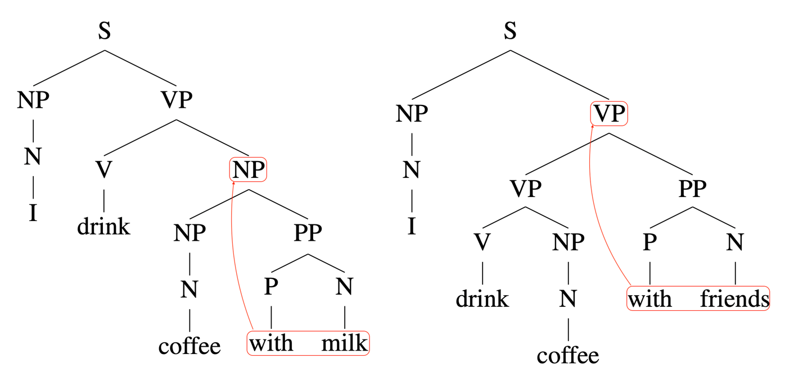
    

  

</section>

---

<section class="ppt">
  

    Transformer 
    English Constituency Parsing
  

  

  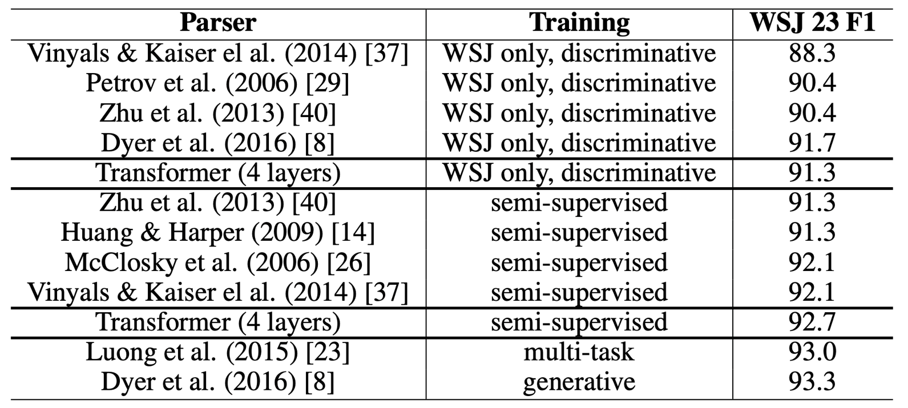
</section>

---

<section class="ppt">
  

    Improving on quadratic self-attention cost 
  

  

  
For one, we replace dot-product attention by one that uses locality-sensitive hashing, changing its complexity from \(O(n^2)\) to \(O(n\log⁡n)\), where \(n\) is the length of the sequence. Furthermore, we use reversible residual layers instead of the standard residuals, which allows storing activations only once in the training process instead of L times, where L is the number of layers.

  

    

      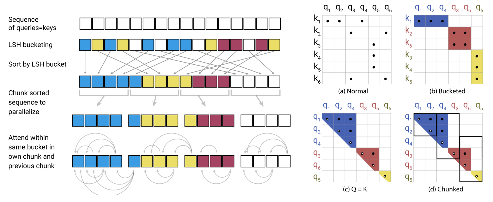
    

    

      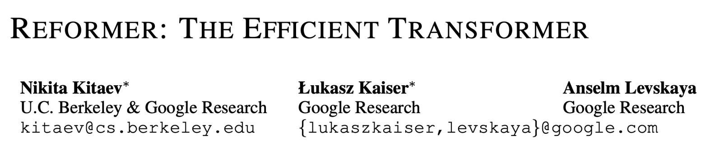
    

  

</section>

---

<section class="ppt">
  

    Improving on quadratic self-attention cost 
  

  

  
In this paper, we demonstrate that the self-attention mechanism can be approximated by a low-rank matrix. We further exploit this finding to propose a new self-attention mechanism, which reduces the overall self-attention complexity from \(O(n^2)\) to \(O(n^1)\) in both time and space.
  

  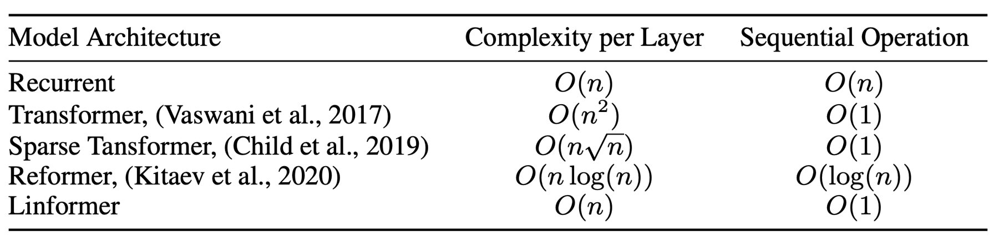
  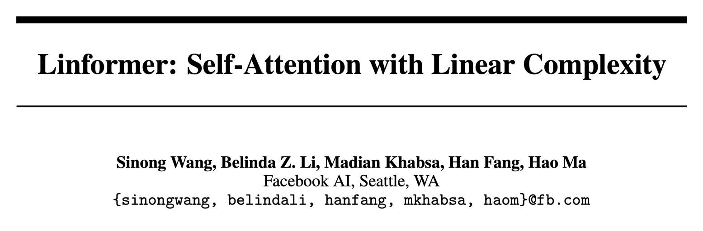
</section>

---

<section class="ppt">
  

    Do Transformer Modifications Transfer? 
  

  

  

    

      <li style="margin-right: 300px;">“Surprisingly, we find that most modifications do not meaningfully improve performance.”</li>
    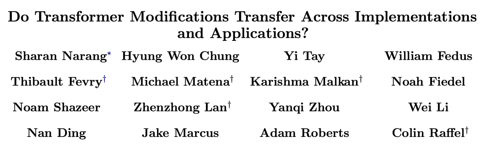
    
<a style="font-size: 25px; margin-left: 160px; margin-top: 30px;" href="https://arxiv.org/pdf/2102.11972" target="_blank">EMNLP,2021</a>

    

    

      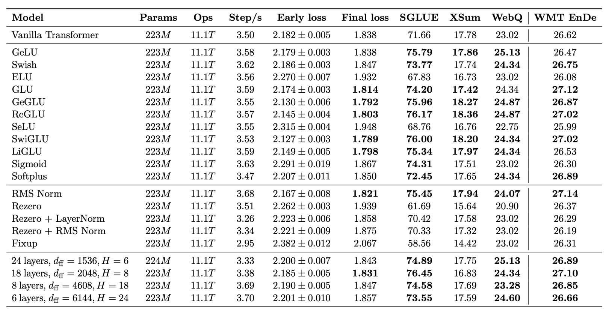
    

  

</section>

---

<section class="ppt">
  
Compared with RNNs

  

  

    <!-- 左侧：Challenges with RNNs -->
    

      
Challenges with RNNs

      <ul style="font-size: 35px; line-height: 1.5; margin: 0; padding-left: 1.2em;">
        <li style="margin-bottom: 12px;">Long range dependencies</li>
        <li style="margin-bottom: 12px;">Gradient vanishing and explosion</li>
        <li style="margin-bottom: 12px;">Large # of training steps</li>
        <li style="margin-bottom: 12px;">Recurrence prevents parallel computation</li>
      </ul>
    

    <!-- 右侧：Transformer Networks -->
    

      
Transformer Networks

      <ul style="font-size: 35px; line-height: 1.5; margin: 0; padding-left: 1.2em;">
        <li style="margin-bottom: 12px;">Facilitate long range dependencies</li>
        <li style="margin-bottom: 12px;">No gradient vanishing and explosion</li>
        <li style="margin-bottom: 12px;">Fewer training steps</li>
        <li style="margin-bottom: 12px;">No recurrence that facilitate parallel computation</li>
      </ul>
    

  

</section>

---

<section class="ppt">
  

    Useful Resources 
  

  

  

    <div?>Materials used in this lecture are mainly from online, I list as follows:

    <li style="font-size: 25px; margin-left: 30px;">Annotated-transformer with code: <a style="font-size: 22px; " href="http://nlp.seas.harvard.edu/annotated-transformer/" target="_blank">http://nlp.seas.harvard.edu/annotated-transformer/ </a></li>
    <li style="font-size: 25px; margin-left: 30px;">Great articles made by Jay Alammar</li>
    <li style="font-size: 25px; margin-left: 60px;">Encoder and decoder: <a style="font-size: 22px;" href="https://jalammar.github.io/visualizing-neural-machine-translation-mechanics-of-seq2seq-models-with-attention/" target="_blank">https://jalammar.github.io/visualizing-neural-machine-translation-mechanics-of-seq2seq-models-with-attention/ </a></li>
    <li style="font-size: 25px; margin-left: 60px;">The Illustrated Transformer: <a style="font-size: 22px;" href="https://jalammar.github.io/illustrated-transformer/" target="_blank">https://jalammar.github.io/illustrated-transformer/ </a></li>
    <li style="font-size: 25px; margin-left: 30px;">A series great video by Rasa </li>
    <li style="font-size: 25px; margin-left: 60px;">1 Self-attention: <a style="font-size: 22px;" href="https://www.youtube.com/watch?v=yGTUuEx3GkA" target="_blank">https://www.youtube.com/watch?v=yGTUuEx3GkA </a></li>
    <li style="font-size: 25px; margin-left: 60px;">2 Keys, Values, and Queries: <a style="font-size: 22px;" href="https://www.youtube.com/watch?v=tIvKXrEDMhk" target="_blank">https://www.youtube.com/watch?v=tIvKXrEDMhk </a></li>
    <li style="font-size: 25px; margin-left: 60px;">3 Multi-head attention: <a style="font-size: 22px;" href="https://www.youtube.com/watch?v=23XUv0T9L5c" target="_blank">https://www.youtube.com/watch?v=23XUv0T9L5c </a></li>
    <li style="font-size: 25px; margin-left: 60px;">4 Transformer architecture: <a style="font-size: 22px;" href="https://www.youtube.com/watch?v=EXNBy8G43MM" target="_blank">https://www.youtube.com/watch?v=EXNBy8G43MM </a></li>
    <li style="font-size: 25px; margin-left: 30px;"><a style="font-size: 25px;" href="https://cs.uwaterloo.ca/~ppoupart/teaching/cs480-spring19/schedule.html" target="_blank">https://cs.uwaterloo.ca/~ppoupart/teaching/cs480-spring19/schedule.html </a></li>
    <li style="font-size: 25px; margin-left: 30px;"><a style="font-size: 25px;" href="https://primo.ai/index.php?title=Attention" target="_blank">https://primo.ai/index.php?title=Attention </a></li>
    <li style="font-size: 25px; margin-left: 30px;"><a style="font-size: 25px;" href="https://jalammar.github.io/illustrated-transformer/" target="_blank">https://jalammar.github.io/illustrated-transformer/ </a></li>
    <li style="font-size: 25px; margin-left: 30px;"><a style="font-size: 25px;" href="https://www.youtube.com/watch?v=yGTUuEx3GkA&list=PLYlEnMRwvpF96pIbA6N6wynSgym3OnFAS" target="_blank">https://www.youtube.com/watch?v=yGTUuEx3GkA&list=PLYlEnMRwvpF96pIbA6N6wynSgym3OnFAS </a></li>
    <li style="font-size: 25px; margin-left: 30px;"><a style="font-size: 25px;" href="https://ai.googleblog.com/2017/08/transformer-novel-neural-network.html" target="_blank">https://ai.googleblog.com/2017/08/transformer-novel-neural-network.html </a></li>
    <li style="font-size: 25px; margin-left: 30px;"><a style="font-size: 25px;" href="https://koaning.io/" target="_blank">https://koaning.io/ </a></li>
    <li style="font-size: 25px; margin-left: 30px;"><a style="font-size: 25px;" href="https://colah.github.io/posts/2015-08-Understanding-LSTMs/" target="_blank">https://colah.github.io/posts/2015-08-Understanding-LSTMs/</a></li>
    <li style="font-size: 25px; margin-left: 30px;"><a style="font-size: 25px;" href="http://nlp.seas.harvard.edu/annotated-transformer/" target="_blank">http://nlp.seas.harvard.edu/annotated-transformer/</a></li>
    <li style="font-size: 25px; margin-left: 30px;"><a style="font-size: 25px;" href="https://people.cs.umass.edu/~miyyer/cs685_f22/slides/04-attention.pdf" target="_blank">https://people.cs.umass.edu/~miyyer/cs685_f22/slides/04-attention.pdf</a></li>
  

</section>