<!-- page 0 -->
<section class="title">
  
Lecture 06 – (Pretrained) LLMs

  
CS40008.01: NLP and LLMs

  

    
Baojian Zhou

    
School of Data Science

    
Fudan University

    
04/16/2026

  

  
Some slides are adopted from Jacob Devlin and Anoop Sarkar

</section>

---

<!-- page 1 -->
<section class="ppt">
  
Outline

  

  <ul class="outline-bullets med">
    <li class="active">History of pre-training</li>
    <li class="muted">Transformers as pretrained LMs</li>
    <li class="muted">Autoregressive generation</li>
    <li class="muted">Pretrained Decoders (GPT series)</li>
    <li class="muted">Datasets, Scaling laws, KV Cache, LoRA</li>
    <li class="muted">Pretrained Encoders (BERT series)</li>
  </ul>
</section>

---

<!-- page 2 -->
<section class="ppt">
  
Brief history of pre-training

  

  

    

      
1960 to 2015

      <ul style="font-size:30px; line-height:1.45; font-weight:600;">
        <li><b>Singular Value Decomposition (1960s)</b>
          <ul style="font-size:26px; margin-top:6px; line-height:1.4;">
            <li>Take matrix of word co-occurrence counts</li>
            <li>Use SVD to map truncated to initial singular values</li>
            <li>Use truncated vectors as word embeddings</li>
          </ul>
        </li>
        <li style="margin-top:14px;"><b>word2vec / GloVe (2010s)</b>
          <ul style="font-size:26px; margin-top:6px; line-height:1.4;">
            <li>Skip-gram: target word predicts each context word</li>
            <li>CBOW: context words predict target word</li>
            <li>Learning from co-occurrence counts + regression</li>
          </ul>
        </li>
      </ul>
    

    

      
word2vec example

      
king

      
[-0.5, -0.9, 1.3, …]

      
queen

      
[-0.7, -0.2, 1.4, …]

      

        
the <b>king</b> wore a crown

        
the <b>queen</b> wore a crown

      

      
Inner product → similar context → similar embedding

    

  

</section>

---

<!-- page 3 -->
<section class="ppt">
  
Contextual representations

  

  <!-- upper: text content -->
  

    
<b>Problem:</b> Word embeddings are applied in a context free manner

    
<b>Solution:</b> Train contextual representations on text corpus

    

      open a <b>bank</b> account → [0.9, −0.2, 1.6, …] &nbsp;|&nbsp; on the river <b>bank</b> → [−1.9, −0.4, 0.1, …]
    

    
<b>Semi-Supervised Sequence Learning</b>, Google, 2015
      <a href="https://arxiv.org/abs/1511.01432" style="font-size:20px; font-weight:400; margin-left:8px;" target="_blank">arxiv:1511.01432</a>
    

    <ul class="fragment" style="font-size:26px; margin-top:8px; line-height:1.45;">
      <li>"…reads the input sequence into a vector and predicts the input sequence again" (sequence autoencoder)</li>
      <li style="margin-top:6px;">Can be used as a <b>pretraining</b> step for a later supervised sequence learning algorithm</li>
    </ul>
  

  <!-- lower: model architecture image -->
  

    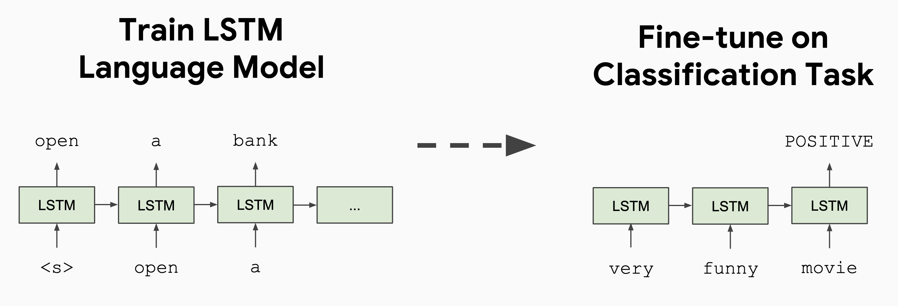
  

</section>

---

<!-- page 4 -->
<section class="ppt">
  
Contextual representations: ELMo

  

  

    <!-- left 40% -->
    

      
<b>ELMo: Deep Contextual Word Embeddings</b>

      
AI2 & University of Washington, 2017

      
<a href="https://arxiv.org/pdf/1802.05365" target="_blank" style="font-size:20px;">arxiv:1802.05365</a>

      
<a href="https://allenai.org/allennlp/software/elmo" target="_blank" style="font-size:20px;">allenai.org/allennlp/software/elmo</a>

    

    <!-- right 60% -->
    

      
Word vectors are learned functions of the internal states of a <b>deep bidirectional language model (biLM)</b>, which is pretrained on a large text corpus.

      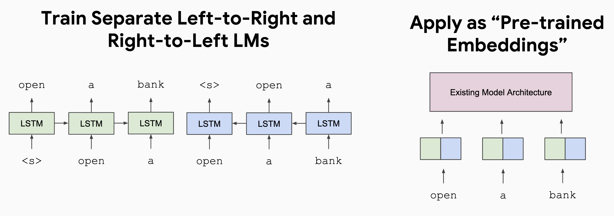
    

  

</section>

---

<!-- page 5 -->
<section class="ppt">
  
Outline

  

  <ul class="outline-bullets med">
    <li class="muted">History of pre-training</li>
    <li class="active">Transformers as pretrained LMs</li>
    <li class="muted">Autoregressive generation</li>
    <li class="muted">Pretrained Decoders (GPT series)</li>
    <li class="muted">Datasets, Scaling laws, KV Cache, LoRA</li>
    <li class="muted">Pretrained Encoders (BERT series)</li>
  </ul>
</section>

---

<!-- page 6 -->
<section class="ppt">
  
Transformers as LMs

  

  

    
Given a training corpus of plain text we'll train the model <b>autoregressively</b> to predict the next token in a sequence, using cross-entropy loss.

    
<b>Teacher forcing:</b> We always give the model the correct history sequence to predict the next word (rather than feeding the model its best guess from the previous time step).

  

  

    
Training a transformer as a language model

    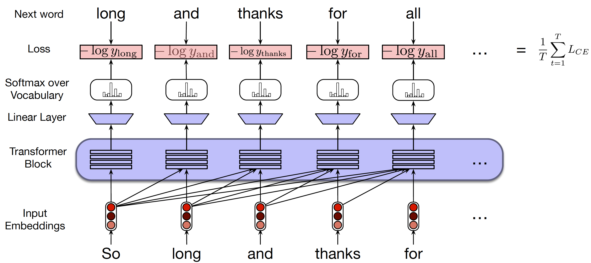
  

</section>

---

<!-- page 7 -->
<section class="ppt">
  
Where we were: pretrained word embeddings

  

  

    

      
<b>Before 2017</b>

      <ul style="font-size:28px; margin-top:10px;">
        <li>Start with pretrained word embeddings (no context!)</li>
        <li>Learn how to incorporate context in an LSTM or Transformer while training on the task.</li>
      </ul>
      
<b>Some issues:</b>

      <ul style="font-size:26px; margin-top:8px;">
        <li>The training data we have for our downstream task must be sufficient to teach all contextual aspects of language</li>
        <li>Most of the parameters in our network are randomly initialized!</li>
      </ul>
    

    

      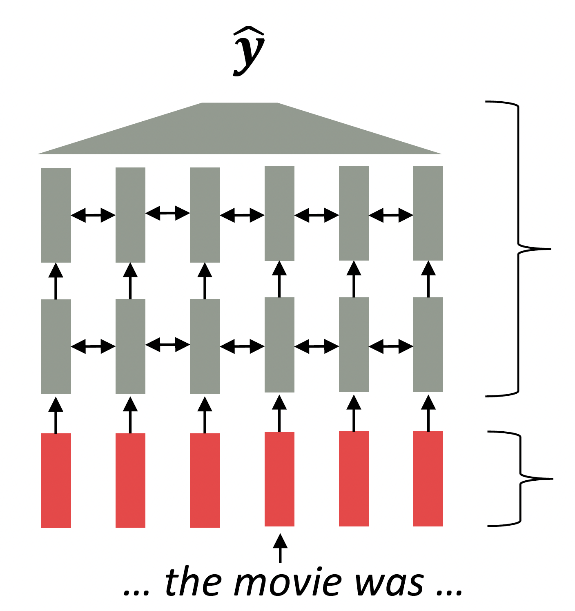
    

  

</section>

---

<!-- page 8 -->
<section class="ppt">
  
Where we were: Modern NLP

  

  

    

      
All (or almost all) parameters in NLP networks are initialized via <b>pretraining</b>

      <ul style="font-size:28px; margin-top:10px;">
        <li class="fragment">Pretraining methods hide parts of the input from the model, and train the model to reconstruct those parts.</li>
        <li class="fragment" style="margin-top:10px;">This has been exceptionally effective</li>
        <li class="fragment" style="margin-top:10px;">Representations of language → <b>parameter initializations</b> for strong NLP models</li>
        <li class="fragment" style="margin-top:10px;">Probability distributions over language that we can <b>sample from</b></li>
      </ul>
    

    

      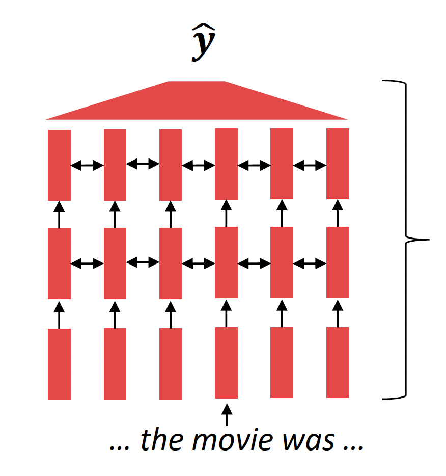
    

  

</section>

---

<!-- page 9 -->
<section class="ppt">
  
The Transformer Encoder-Decoder

  

  

    

      
Looking back at the whole model, zooming in on an <b>Encoder block</b>

      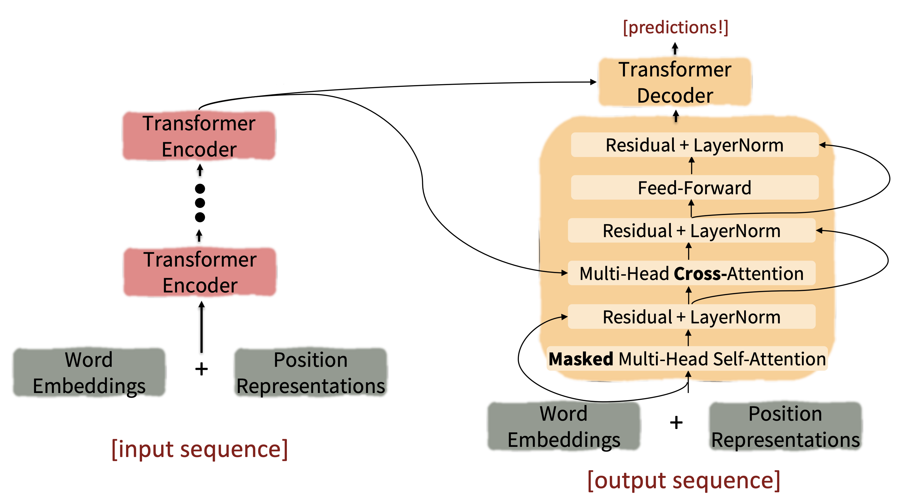
    

    

      
Looking back at the whole model, zooming in on a <b>Decoder block</b>

      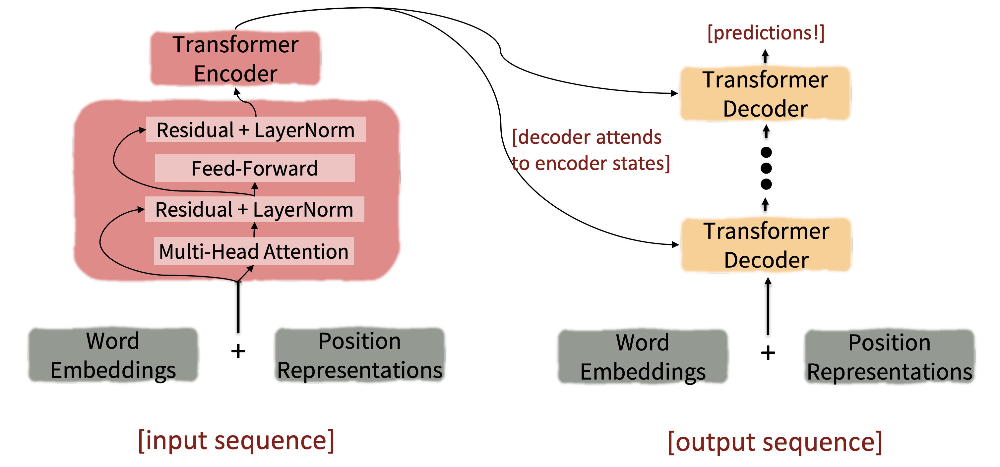
    

  

</section>

---

<!-- page 10 -->
<section class="ppt">
  
The Pretraining / Finetuning Paradigm

  

  
Pretraining improves NLP tasks by serving as parameter initialization

  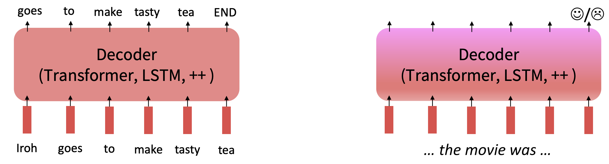
  

    
<b>Step 1:</b> Pretrain (on language modeling) — lots of text; learn general things!

    
<b>Step 2:</b> Finetune (on your task) — not many labels; adapt to the task!

  

</section>

---

<!-- page 11 -->
<section class="ppt">
  
Why it works: SGD and pretrain/finetune

  

  

    <!-- left: SGD explanation -->
    

      
Consider, provides parameters \(\hat\theta_{\text{PT}}\) by approximating:

      $$\min_\theta \mathcal{L}_{\text{PT}}(\theta)$$
      
(The pretraining loss.)

      
Then, finetuning approximates \(\min_\theta \mathcal{L}_{\text{FT}}(\theta)\), starting at \(\hat\theta_{\text{PT}}\).

      
SGD sticks (relatively) close to \(\hat\theta_{\text{PT}}\) during finetuning, so local minima nearby tend to <b>generalize well</b>!

    

    <!-- right: three pretraining types -->
    

      
Three pretraining architectures

      

        

          
Decoders

          
GPT series

        

        

          
Encoders

          
BERT

        

        

          
Encoder-Decoders

          
T5

        

      

    

  

</section>

---

<!-- page 12 -->
<section class="ppt">
  
Outline

  

  <ul class="outline-bullets med">
    <li class="muted">History of pre-training</li>
    <li class="muted">Transformers as pretrained LMs</li>
    <li class="active">Autoregressive generation</li>
    <li class="muted">Pretrained Decoders (GPT series)</li>
    <li class="muted">Datasets, Scaling laws, KV Cache, LoRA</li>
    <li class="muted">Pretrained Encoders (BERT series)</li>
  </ul>
</section>

---

<!-- page 13 -->
<section class="ppt">
  
LMs generation: Autoregressive generation

  

  

    
<b>Autoregressive generation</b> (or <b>causal LM generation</b>):

    <ol style="margin-top:14px;">
      <li class="fragment">Sample a word from the softmax distribution using the beginning-of-sentence marker <code>&lt;s&gt;</code> as the first input.</li>
      <li class="fragment" style="margin-top:10px;">Use the word embedding for that first word as the input at the next time step, then sample the next word in the same fashion.</li>
      <li class="fragment" style="margin-top:10px;">Continue generating until the end-of-sentence marker <code>&lt;/s&gt;</code> is sampled or a fixed length limit is reached.</li>
    </ol>
    

      $$p_\theta(w_1, \ldots, w_n) = \prod_{t=1}^n p_\theta(w_t \mid w_1, \ldots, w_{t-1})$$
    

  

</section>

---

<!-- page 14 -->
<section class="ppt">
  
LMs generation: greedy

  

  

    

      
Vocabulary: <code>{ &lt;s&gt;, &lt;/s&gt;, Hello, world, ., I, am, a, model, , }</code>

      
Initialize with <code>&lt;s&gt;</code>, sample from softmax distribution:

      <ul style="font-size:24px; margin-top:8px;">
        <li>Hello (0.2), world (0.1), . (0.05)</li>
        <li>I (0.4), am (0.05), a (0.05)</li>
        <li>model (0.05), , (0.05), &lt;/s&gt; (0.05)</li>
      </ul>
      
We draw a sample and get <b>I</b>: <code>&lt;s&gt; I</code>

      
Continue until <code>&lt;/s&gt;</code> is sampled…

    

    

      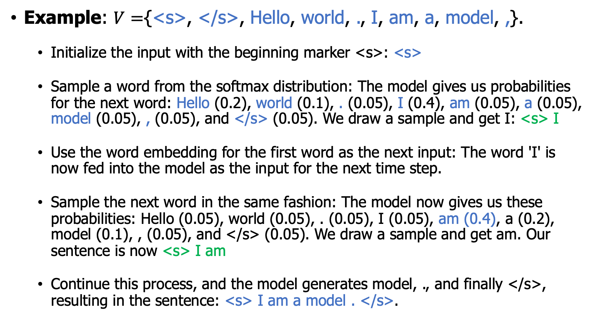
    

  

</section>

---

<!-- page 15 -->
<section class="ppt">
  
LMs generation: greedy search

  

  

    

      
<b>Greedy decoding:</b> At time \(t\), the output is chosen by computing a softmax over the set of possible outputs and then choosing the highest probability token.

      
Greedy decoding is <b>locally optimal</b> — a choice that seems best based on the current information.

    

    

      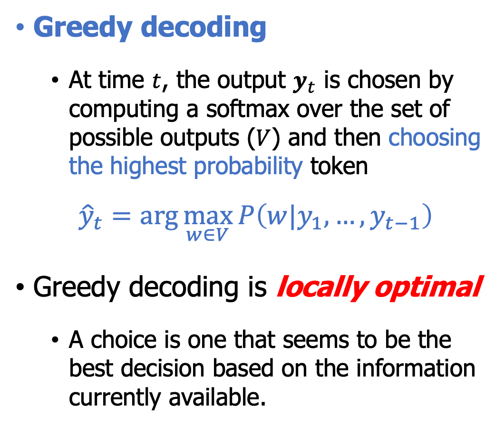
    

  

</section>

---

<!-- page 16 -->
<section class="ppt">
  
LMs generation: test greedy search on GPT-2

  

  

    

      
Generate word sequences using GPT-2 on the context:

      
"I enjoy walking with my cute dog"

      
<b>Greedy search gives:</b> "I enjoy walking with my cute dog, but I'm not sure if I'll ever be able to walk with my dog. I'm not sure if I'll ever be able to walk with my dog. I'm not sure if I'll…"

      
The model quickly starts repeating itself!

    

    

      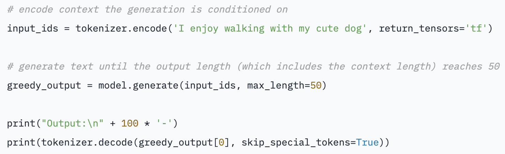
      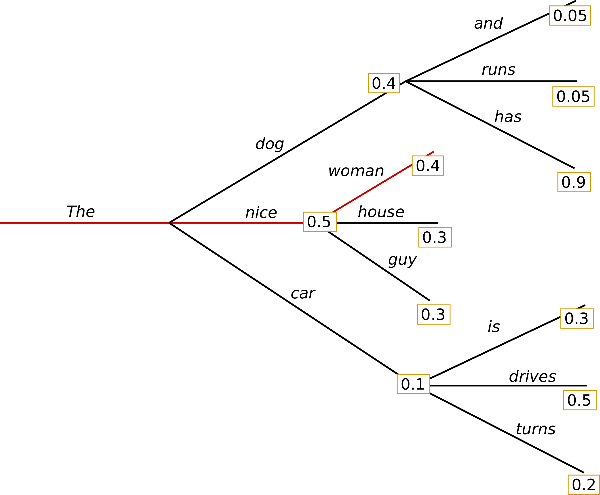
    

  

</section>

---

<!-- page 17 -->
<section class="ppt">
  
LMs generation: greedy search (search tree)

  

  

    

      
A search tree for generating a target string. Greedy search would choose <b>"yes yes"</b>, instead of the most probable sequence <b>"ok ok"</b>.

      
Recall that HMM model computes the likelihood using dynamic programming. Can we apply dynamic programming to find the optimal sequence?

      
Unfortunately, dynamic programming is not applicable to generation problems with <b>long-distance dependencies</b>.

    

    

      
      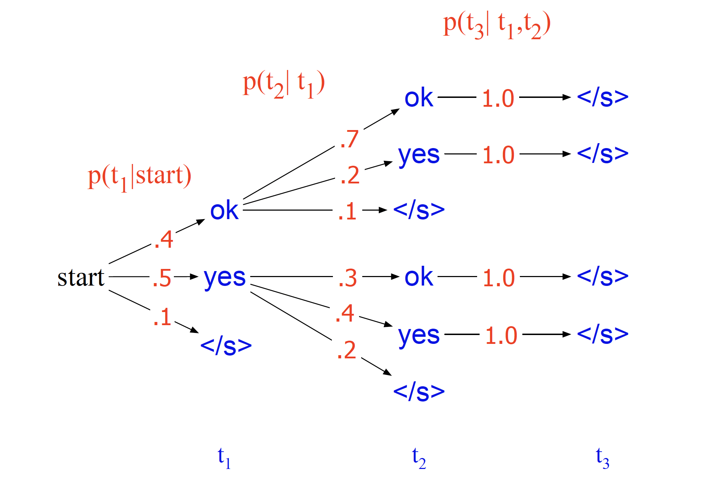
    

  

</section>

---

<!-- page 18 -->
<section class="ppt">
  
LMs generation: beam search

  

  

    

      
Reduces the risk of missing hidden high probability word sequences by keeping the most likely <b>#beams</b> hypotheses at each step.

      <ul style="margin-top:12px;">
        <li>Instead of choosing <em>only</em> the best token, keep <b>k</b> possible tokens at each step</li>
        <li><b>k</b> is called the beam width</li>
        <li>Beam search will always find an output sequence with higher probability than greedy search, but is not guaranteed to find the globally optimal sequence</li>
      </ul>
    

    

      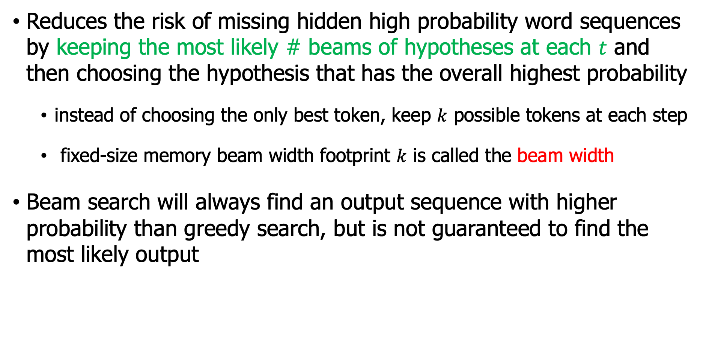
    

  

</section>

---

<!-- page 19 -->
<section class="ppt">
  
LMs generation: beam search

  

  
The completed hypotheses may have different lengths

  

    
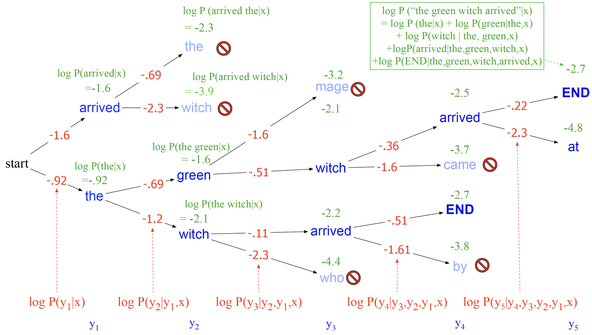

    

  

</section>

---

<!-- page 20 -->
<section class="ppt">
  
LMs generation: beam search on GPT-2

  

  

    

      
<b>Output:</b>

      
"I enjoy walking with my cute dog, but I'm not sure if I'll ever be able to walk with him again. I'm not sure if I'll ever be able to walk with him again. I'm not sure if I'll…"

      
While the result is arguably more fluent, the output still includes repetitions of the same word sequences.

      
How to fix?

    

    

      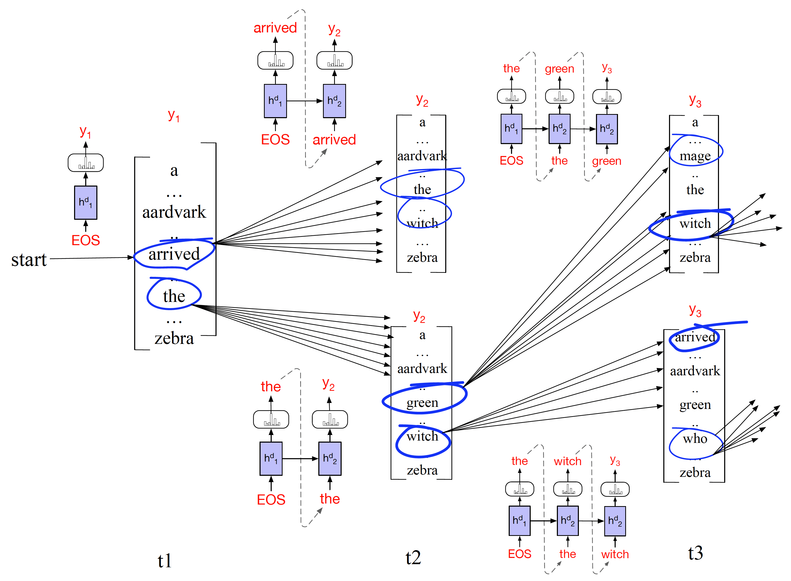
      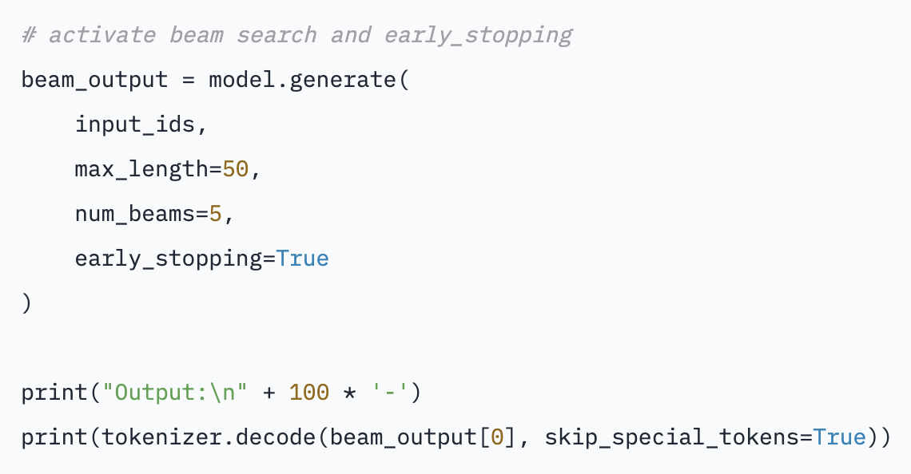
    

  

</section>

---

<!-- page 21 -->
<section class="ppt">
  
LMs generation: beam search — n-gram penalties

  

  

    

      
Quick fix: introduce <b>n-gram penalties</b> (Paulus et al. 2017, Klein et al. 2017)

      
Makes sure that no n-gram appears twice by manually setting the probability of next words that could create an already seen n-gram to 0.

      
<b>Output:</b> "I enjoy walking with my cute dog, but I'm not sure if I'll ever be able to walk with him again. I've been thinking about this for a while now, and I think it's time for me to take a break…"

    

    

      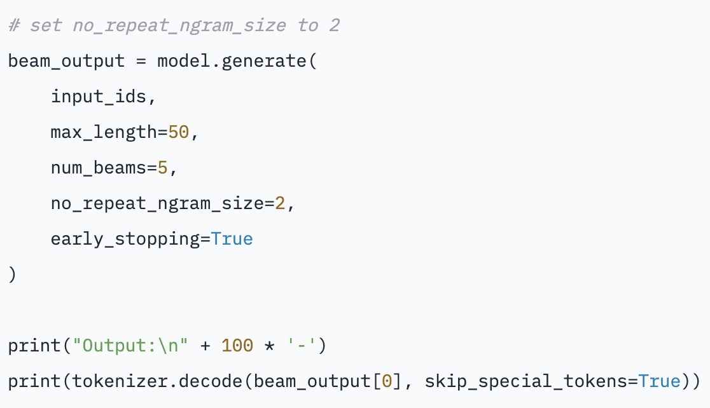
      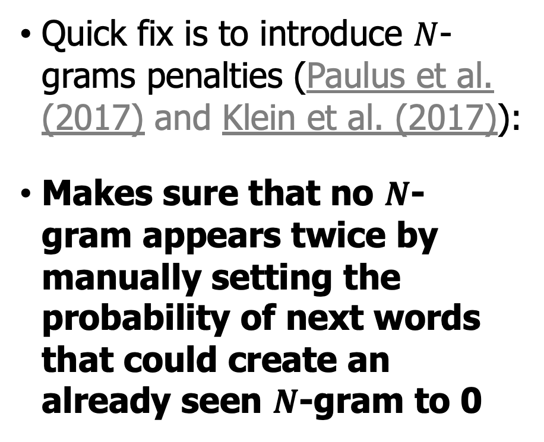
    

  

</section>

---

<!-- page 22 -->
<section class="ppt">
  
LMs generation: beam search — multiple outputs

  

  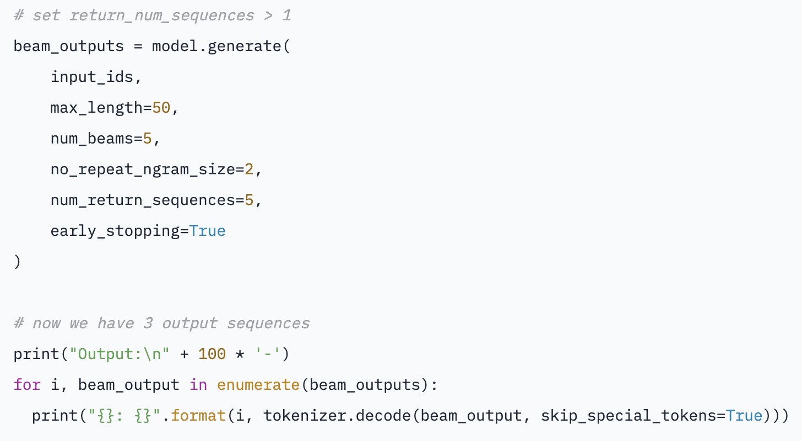
</section>

---

<!-- page 23 -->
<section class="ppt">
  
LMs generation: beam search — quick recap

  

  <ul style="font-size:30px; line-height:1.5; font-weight:600; margin-top:10px;">
    <li class="fragment">Beam search works very well in tasks where the length of the desired generation is more or less predictable — as in MT or summarization.</li>
    <li class="fragment" style="margin-top:14px;">But not the case for open-ended generation where the desired output length can vary greatly (e.g., dialog and story generation).</li>
    <li class="fragment" style="margin-top:14px;">Beam search heavily suffers from <b>repetitive generation</b>. This is especially hard to control with n-gram penalties.</li>
    <li class="fragment" style="margin-top:14px;"><b>Does high probability mean good quality?</b></li>
  </ul>
</section>

---

<!-- page 24 -->
<section class="ppt">
  
LMs generation: beam search — high probability ≠ high quality

  

  

    

      
High quality human language does <b>not</b> follow a distribution of high probability next words.

      
As humans, we want generated text to surprise us and not to be boring/predictable.

    

    

      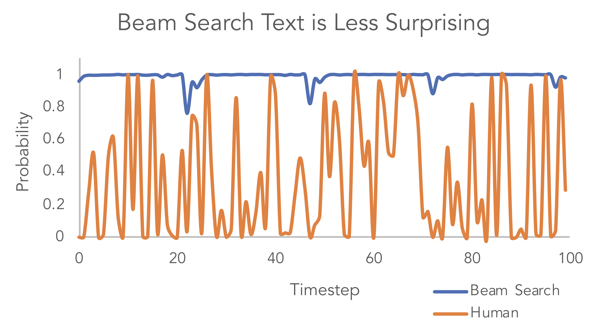
    

  

</section>

---

<!-- page 25 -->
<section class="ppt">
  
LMs generation: top-k sampling

  

  

    
A simple, but very powerful sampling scheme — <b>Top-k sampling</b>.

    
The most likely next words are filtered and the probability mass is redistributed among only those <b>k</b> next words.

    
Having set k=6, it eliminates the rather weird candidates ("not", "the", "small", "told") in the second sampling step.

  

  

    
    
  

</section>

---

<!-- page 26 -->
<section class="ppt">
  
LMs generation: top-k sampling — output

  

  

    

      
<b>Output:</b>

      
"I enjoy walking with my cute dog. It's so good to have an environment where your dog is available to share with you and we'll be taking care of you. We hope you'll find this story interesting! I am from…"

      
The text is arguably quite human-sounding!

    

    

      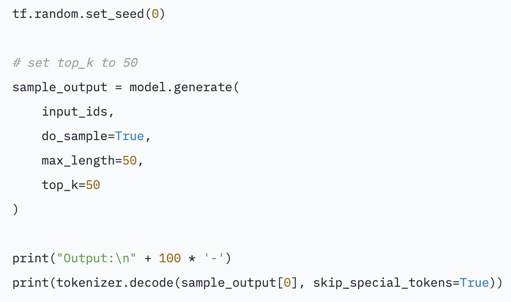
    

  

</section>

---

<!-- page 27 -->
<section class="ppt">
  
LMs generation: top-k sampling — limitation

  

  

    

      
It does <b>not</b> dynamically adapt the number of words that are filtered from the next word probability distribution.

      
This can be problematic as some words might be sampled from a very sharp distribution, whereas others from a much more flat distribution.

      

        
T=1 → distribution is <b>flat</b>

        
T=2 → distribution is <b>sharp</b>

        
How to handle this?

      

    

    

      
    

  

</section>

---

<!-- page 28 -->
<section class="ppt">
  
LMs generation: Top-p / nucleus sampling

  

  

    

      
Instead of sampling only from the most likely k words, <b>Top-p sampling</b> chooses from the smallest possible set of words whose cumulative probability exceeds the probability p.

      <ul style="margin-top:12px;">
        <li>The probability mass is then redistributed among this set of words</li>
        <li>The size of the word set can <b>dynamically</b> increase and decrease according to the next word's probability distribution</li>
      </ul>
      
Holtzman, et. al. ICLR, 2020.

    

    

      
      
    

  

</section>

---

<!-- page 29 -->
<section class="ppt">
  
LMs generation: Top-p / nucleus sampling

  

  

    

      
Set p=0.92. Top-p sampling picks the minimum number of words to exceed p=92%, defined as \(V^{(p)}\).

      
In T=1, this included the 9 most likely words, whereas it only has to pick the top 3 words in T=3 to exceed 92%.

    

    

      
      
    

  

</section>

---

<!-- page 30 -->
<section class="ppt">
  
LMs generation: Top-p / nucleus sampling — output

  

  

    

      
<b>Output:</b>

      
"I enjoy walking with my cute dog. He will never be the same. I watch him play. Guys, my dog needs a name. Especially if he is found with wings. What was that? I had a lot…"

    

    

      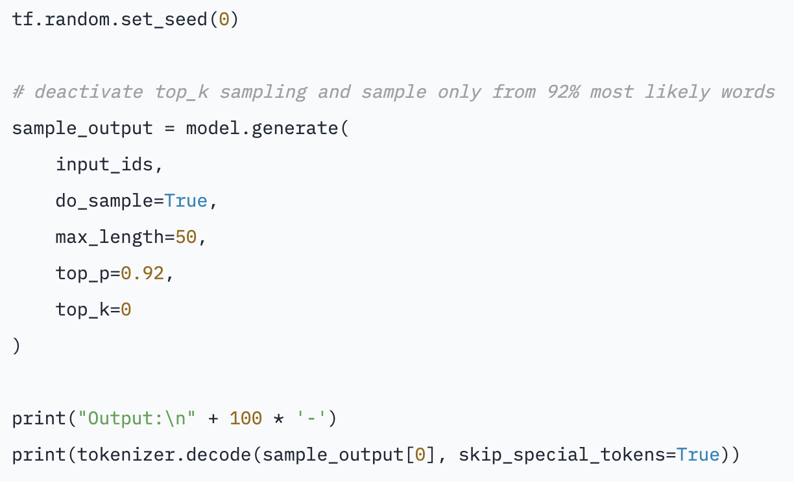
    

  

</section>

---

<!-- page 31 -->
<section class="ppt">
  
LMs generation: comparison of sampling methods

  

  
Maximization and top-k truncation methods lead to copious repetition (highlighted in blue), while sampling with and without temperature tends to lead to incoherence (highlighted in red). Nucleus Sampling largely avoids both issues.

  
</section>

---

<!-- page 32 -->
<section class="ppt">
  
LMs generation: quick summary

  

  

    

      <ul style="font-size:28px; line-height:1.5; font-weight:600;">
        <li class="fragment">Top-k and top-p sampling seem to produce more fluent text than traditional greedy and beam search</li>
        <li class="fragment" style="margin-top:12px;">The drawback of greedy and beam search — mainly generating repetitive word sequences — are caused by <b>the model</b>, rather than the decoding method (Welleck et al. 2019)</li>
        <li class="fragment" style="margin-top:12px;">It looks as though top-k and top-p sampling also suffer from generating repetitive word sequences (Welleck et al. 2020)</li>
        <li class="fragment" style="margin-top:12px;"><a href="https://huggingface.co/blog/how-to-generate" target="_blank" style="font-size:22px;">https://huggingface.co/blog/how-to-generate</a></li>
      </ul>
    

    

      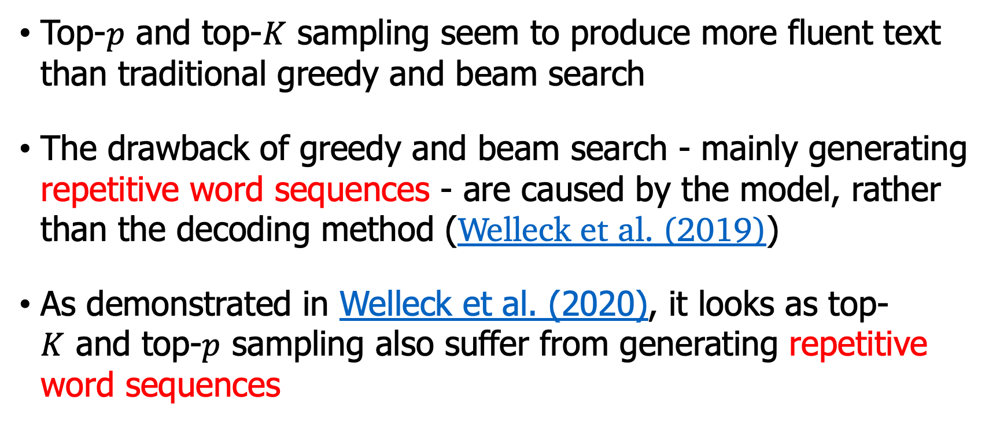
    

  

</section>

---

<!-- page 33 -->
<section class="ppt">
  
Outline

  

  <ul class="outline-bullets med">
    <li class="muted">History of pre-training</li>
    <li class="muted">Transformers as pretrained LMs</li>
    <li class="muted">Autoregressive generation</li>
    <li class="active">Pretrained Decoders (GPT series)</li>
    <li class="muted">Datasets, Scaling laws, KV Cache, LoRA</li>
    <li class="muted">Pretrained Encoders (BERT series)</li>
  </ul>
</section>

---

<!-- page 34 -->
<section class="ppt">
  
Three pretraining architectures

  

  
The neural architecture influences the type of pretraining, and natural use cases.

  

    

      
Decoders

      
Language models! What we've seen so far. Nice to generate from; can't condition on future words.

    

    

      
Encoders

      
Gets bidirectional context – can condition on future! But how do we pretrain them?

    

    

      
Encoder-Decoders

      
Good parts of decoders and encoders? What's the best way to pretrain them?

    

  

</section>

---

<!-- page 35 -->
<section class="ppt">
  
Pretraining decoders

  

  

    

      
When using language model pretrained decoders, we can ignore that they were trained to model \(p(w_t \mid w_{1:t-1})\).

      
We can finetune them by training a classifier on the last word's hidden state:

      
$$y = \text{softmax}(W \cdot h_T + b)$$

      
where \(W\) and \(b\) are randomly initialized and specified by the downstream task.

      
Gradients backpropagate through the whole network.

    

    

      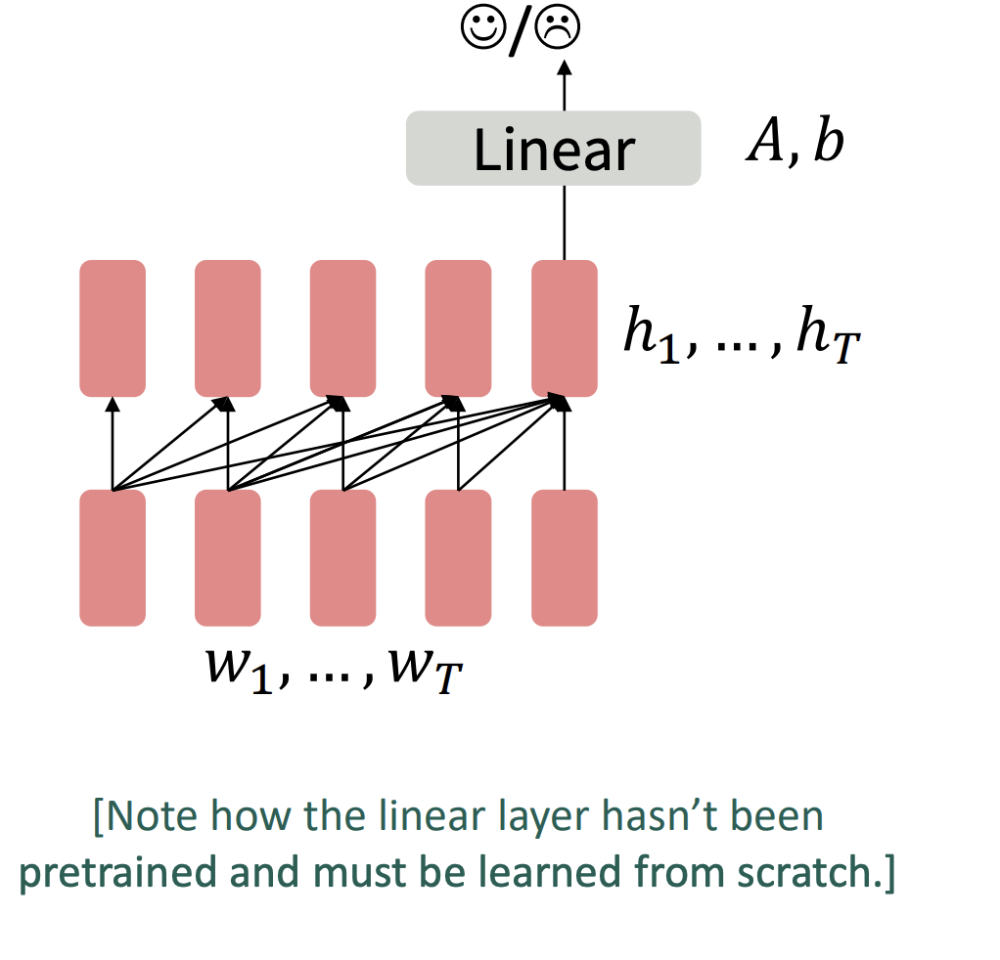
      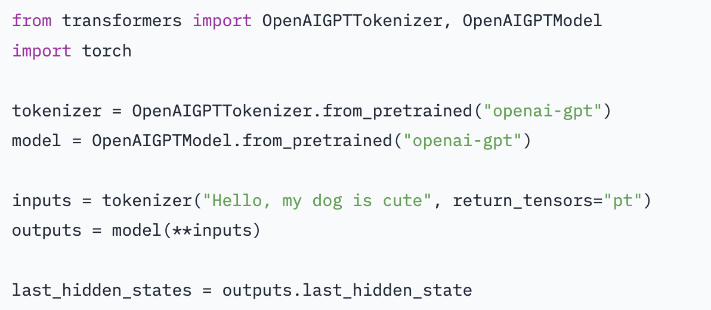
    

  

</section>
