<!-- page 0 | slides: 1, 2 -->

Slide 1

Lecture 07 Benchmarks

Baojian Zhou 
DATA130030.01 (自然语言处理) 
School of Data Science, Fudan University 
10/29/2025

Largely adopted from Anoop Sarkar

Slide 2

Outline

<ul class="outline-list">
<li>GLUE / SuperGLUE</li>
<li>SWAG / HellaSWAG</li>
<li>Lambada</li>
<li>Other Datasets</li>
<li>Datasets by Task Types</li>
</ul>

---

<!-- page 1 | slides: 3, 4 -->

GLUE Benchmark

Slide 3

GLUE — General Language Understanding Evaluation

A collection of NLU tasks including QA, sentiment analysis, and textual entailment, together with an online platform for model evaluation, comparison, and analysis.

<em>Wang et al., "GLUE: A multi-task benchmark and analysis platform for natural language understanding", 2018</em>

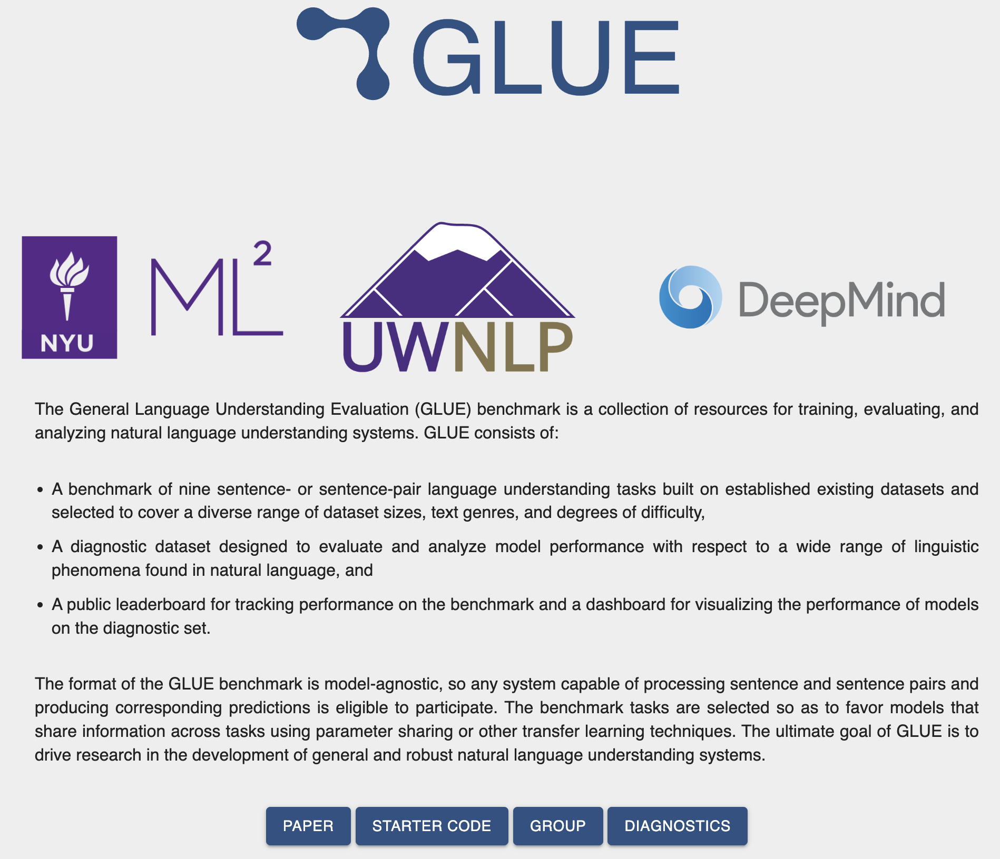

https://gluebenchmark.com/ · https://huggingface.co/datasets/nyu-mll/glue

Slide 4

GLUE on HuggingFace

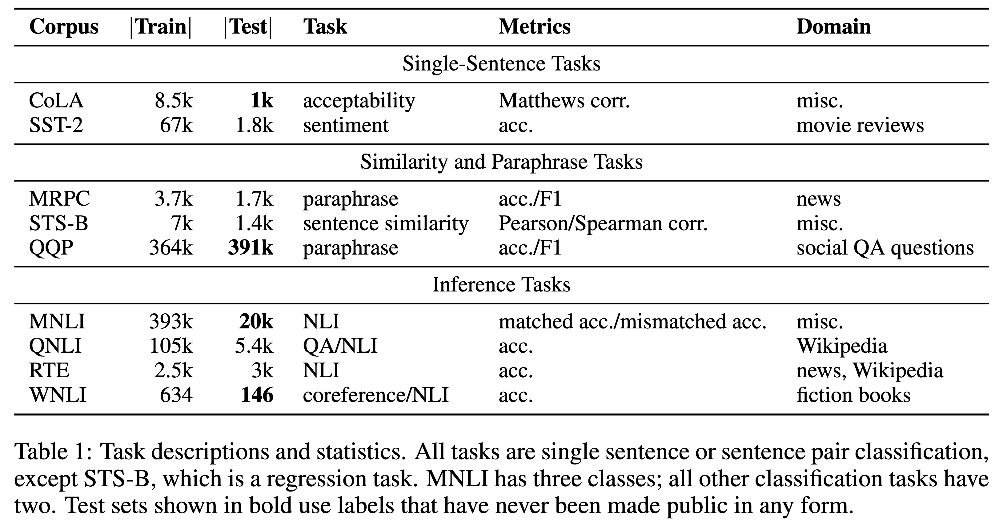

https://huggingface.co/datasets/nyu-mll/glue

---

<!-- page 2 | slides: 5, 6 -->

GLUE — Single-Sentence Tasks

Slide 5

CoLA — Corpus of Linguistic Acceptability

English acceptability judgments drawn from books and journal articles on linguistic theory.

Each example is a sequence of words annotated with whether it is a grammatical English sentence. Score is in [−1, 1].

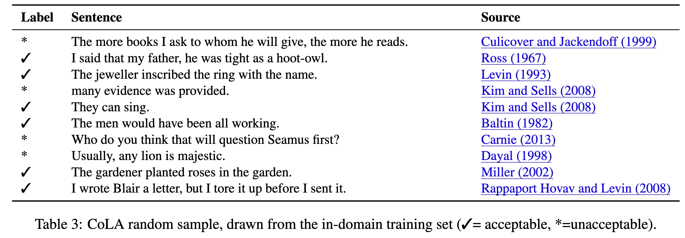

https://huggingface.co/datasets/nyu-mll/glue

Slide 6

SST-2 — Stanford Sentiment Treebank

Sentences from movie reviews with human sentiment annotations. Task: predict positive/negative sentiment at sentence level.

<ul>
<li><em>"uneasy mishmash of styles and genres"</em></li>
<li><em>"it's also heavy-handed and devotes too much time to bigoted views"</em></li>
<li><em>"waydowntown boasts a huge charm factor and smacks of originality"</em></li>
<li><em>"a remarkable 179-minute meditation on the nature of revolution"</em></li>
<li><em>"starts off with a bang, but then fizzles like a wet stick of dynamite"</em></li>
</ul>

https://huggingface.co/datasets/nyu-mll/glue

---

<!-- page 3 | slides: 7, 8 -->

GLUE — Similarity &amp; Paraphrase Tasks

Slide 7

MRPC — Microsoft Research Paraphrase Corpus

Sentence pairs with human annotations of semantic equivalence. Classes are imbalanced (68% positive).

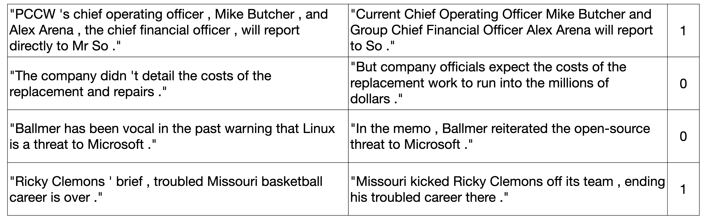

https://huggingface.co/datasets/nyu-mll/glue

Slide 8

STS-B — Semantic Textual Similarity Benchmark

Sentence pairs from various sources, human-annotated with similarity scores from 1 to 5.

Task: predict [1, 5]. Report Pearson and Spearman correlation coefficients.

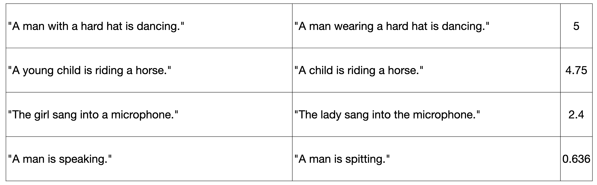

---

<!-- page 4 | slides: 9, 10 -->

GLUE — Similarity &amp; Inference Tasks

Slide 9

QQP — Quora Question Pairs

Question pairs from Quora. Classes are imbalanced (63% negative) so accuracy and F1 score are both reported.

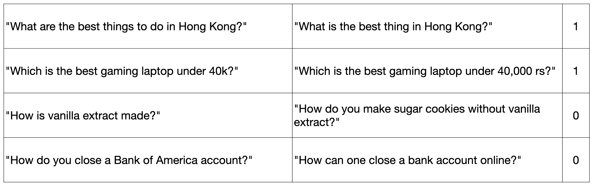

Slide 10

MNLI — Multi-Genre Natural Language Inference

Crowd-sourced sentence pairs with entailment annotations: entailment (0), contradiction (2), neutral (1).

Task: predict these three labels.

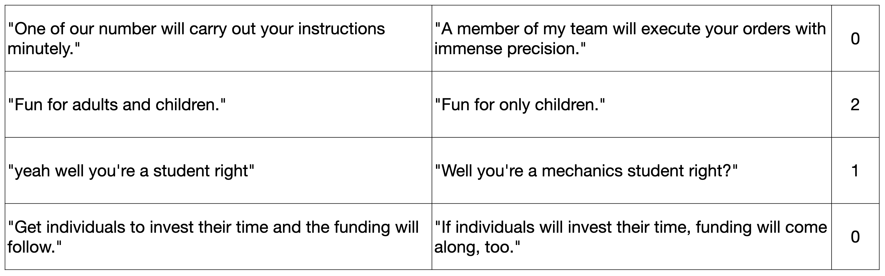

---

<!-- page 5 | slides: 11, 12 -->

GLUE — Inference Tasks

Slide 11

QNLI — Stanford Question Answering Dataset

Converted to sentence-pair classification: form a pair between each question and each sentence in the context, filter pairs with low lexical overlap.

Task: predict yes (0) or no (1) — does the context sentence contain the answer?

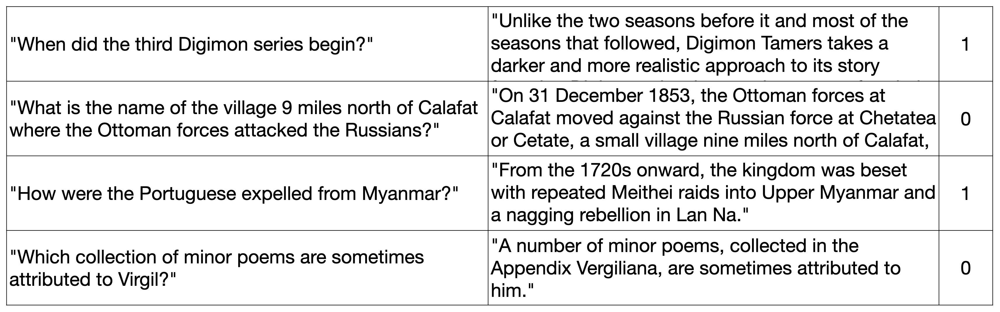

Slide 12

RTE — Recognizing Textual Entailment

Task: predict entailment (0) or not-entailment (1) between pairs of sentences.

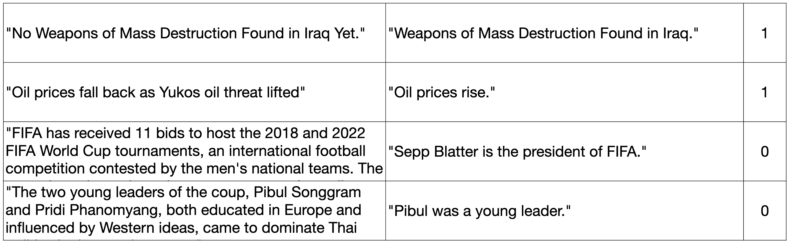

---

<!-- page 6 | slides: 13, 14 -->

GLUE — Inference Tasks &amp; Performance

Slide 13

WNLI — Winograd Schema Challenge

Reading comprehension task: identify the referent of a pronoun using entailment between two sentences (one with the pronoun reference made explicit).

Predict 1 (entailment) or 0 (not entailment). Designed to fool simple statistical techniques. Test set is imbalanced (65% not-entailment); dev set is adversarial.

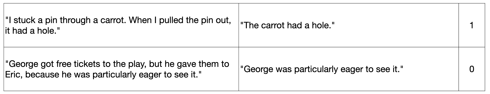

Slide 14

GLUE Benchmark Performance

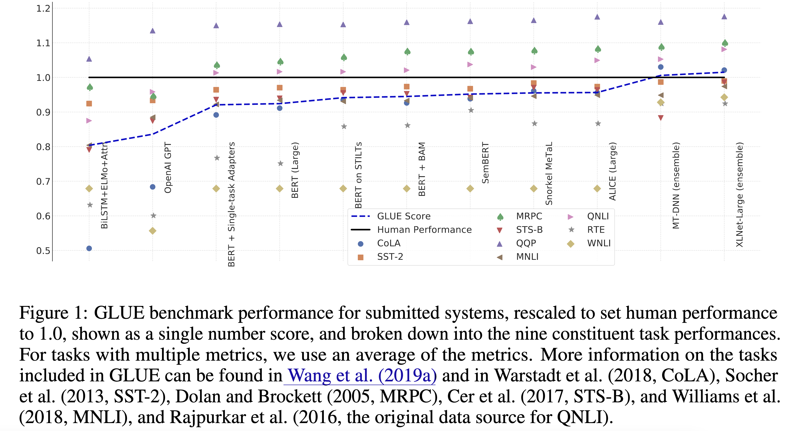

---

<!-- page 7 | slides: 15, 16 -->

SuperGLUE

Slide 15

SuperGLUE — A More Rigorous NLU Test

GLUE was too easy for LLMs after July 2019. SuperGLUE is a harder benchmark with more challenging tasks.

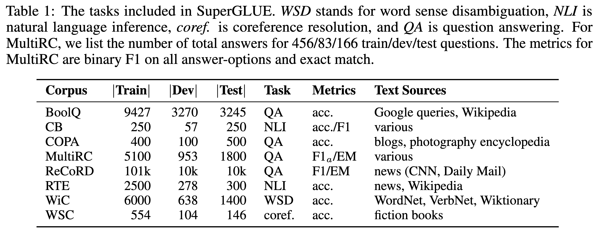

https://super.gluebenchmark.com/ · https://huggingface.co/datasets/aps/super_glue

Slide 16

SuperGLUE 1. BoolQ — Boolean Questions

QA task with yes/no answers. Kinds of reasoning required:

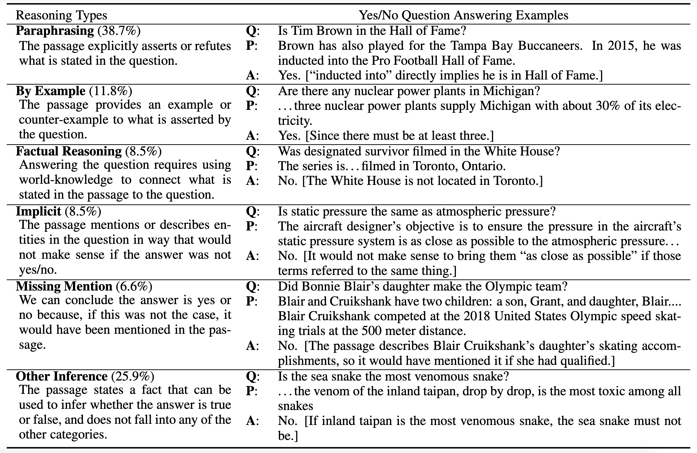

https://huggingface.co/datasets/aps/super_glue

---

<!-- page 8 | slides: 17, 18 -->

SuperGLUE

Slide 17

SuperGLUE 2. CB — CommitmentBank

Is the author committed to the truth of the embedded clause? Each example consists of a premise with an embedded clause; the hypothesis is the extraction of that clause.

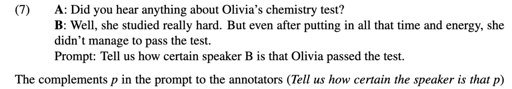

Slide 18

SuperGLUE 3. COPA — Choice of Plausible Alternatives

Causal reasoning task: choose the most plausible cause or effect for a given premise.

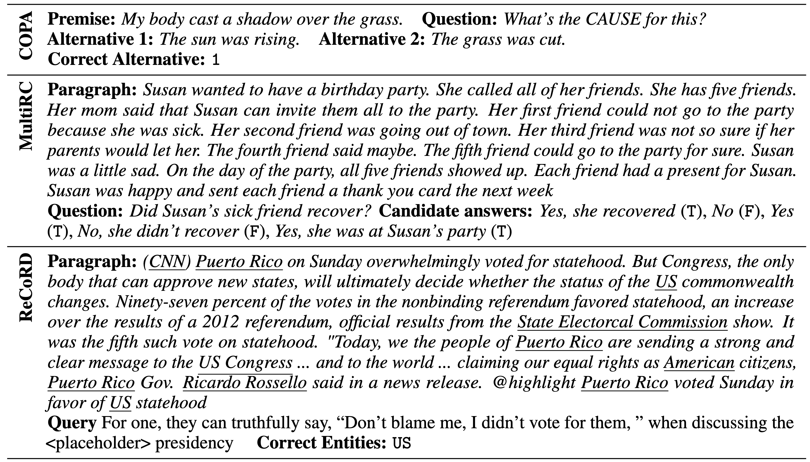

---

<!-- page 9 | slides: 19, 20 -->

SuperGLUE

Slide 19

SuperGLUE 4. MultiRC — Multi-Sentence Reading Comprehension

Reading comprehension task requiring reasoning over multiple sentences in a passage to answer questions.

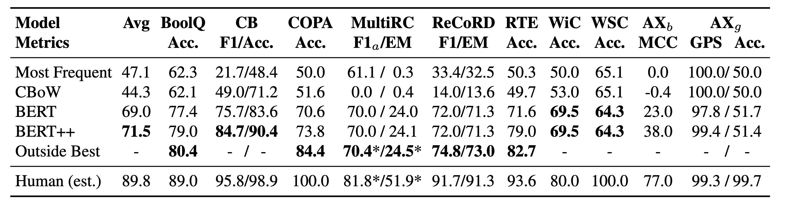

Slide 20

SuperGLUE 5. ReCoRD — Reading Comprehension with Commonsense Reasoning

Reading comprehension dataset requiring commonsense reasoning over news articles.

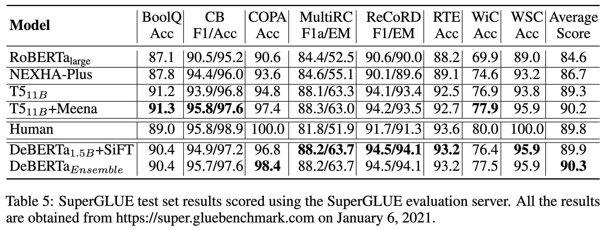

---

<!-- page 10 | slides: 21, 22 -->

SuperGLUE

Slide 21

SuperGLUE 6. RTE — Recognizing Textual Entailment

Combines data from RTE1, RTE3, and RTE5 shared tasks.

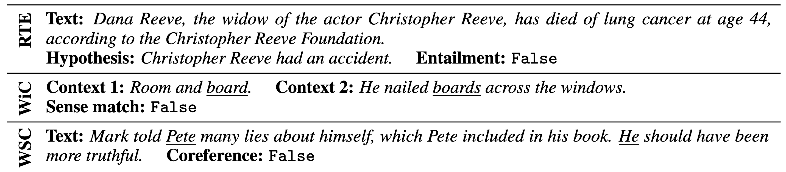

Slide 22

SuperGLUE 7. WiC — Word-in-Context

Word sense disambiguation cast as binary classification of sentence pairs: does the target word carry the same sense in both sentences?

---

<!-- page 11 | slides: 23, 24 -->

SuperGLUE &amp; Section Break

Slide 23

SuperGLUE 8. WSC — Winograd Schema Challenge

Coreference resolution task: each example has a sentence with a pronoun and a list of noun phrases. Task: identify which noun phrase the pronoun refers to.

Slide 24

Outline

<ul class="outline-list">
<li>GLUE / SuperGLUE</li>
<li class="active">SWAG / HellaSWAG</li>
<li>Lambada</li>
<li>Other Datasets</li>
<li>Datasets by Task Types</li>
</ul>

---

<!-- page 12 | slides: 25, 26 -->

SWAG

Slide 25

SWAG — Situations With Adversarial Generations

Large-scale adversarial dataset for grounded commonsense inference. 113k multiple-choice questions about grounded situations.

<ul>
<li>Given: <em>"she opened the hood of the car"</em></li>
<li>Humans reason: <em>"then, she examined the engine"</em></li>
<li>Built using Adversarial Filtering to identify meaning-based answers rather than vocabulary-overlap answers</li>
</ul>

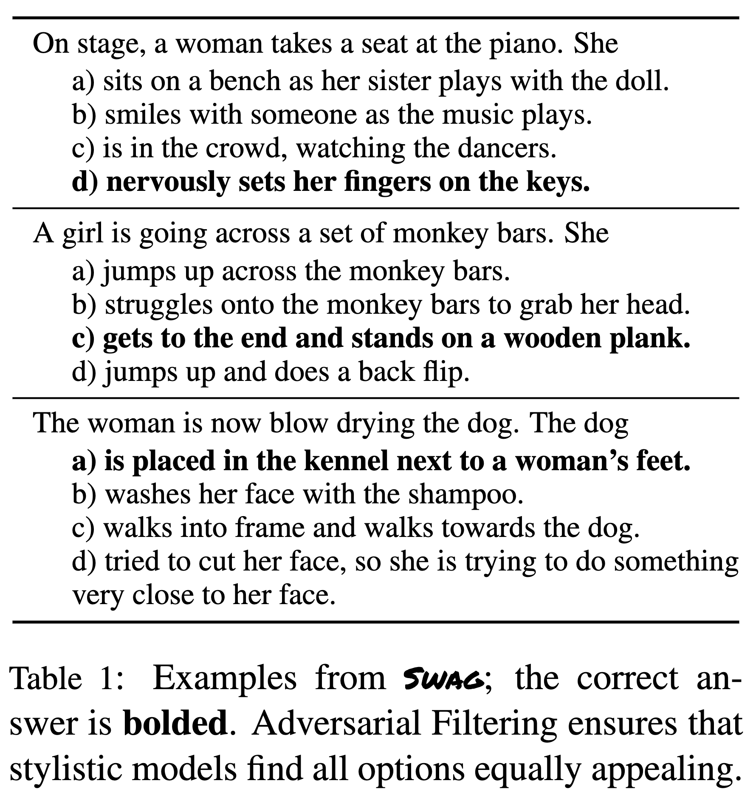

https://huggingface.co/datasets/allenai/swag

Slide 26

SWAG Dataset Construction

113k multiple-choice questions (73k train / 20k val / 20k test), derived from pairs of consecutive video captions from ActivityNet Captions and LSMDC.

Each question has one human-verified gold ending and 3 distractors.

<strong>BERT fine-tuned on SWAG → 86% accuracy. DeBERTa-large → 94.12%.</strong>

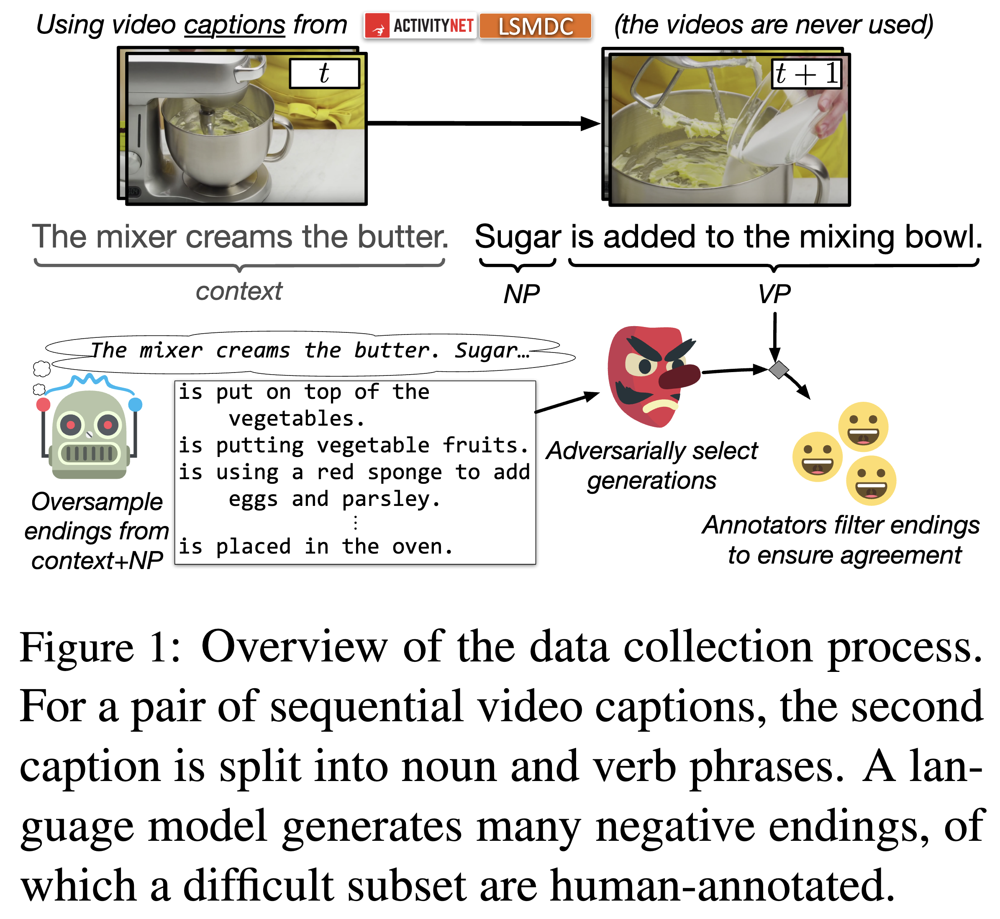

https://rowanzellers.com/swag/

---

<!-- page 13 | slides: 27, 28 -->

SWAG &amp; HellaSWAG

Slide 27

SWAG — Examples

Answering <em>"An old man rides …"</em> requires knowledge about bumper cars — they are tiny, don't drive on roads, and don't work in parking lots.

Answering <em>"He pours the raw egg …"</em> requires intuitive physical reasoning about what happens next in making an omelet.

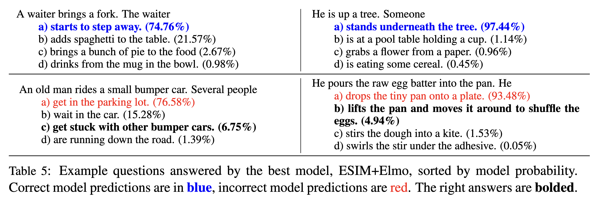

Slide 28

HellaSWAG — Can a Machine Really Finish Your Sentence?

Pick the best ending to the context.

<em>"How to catch dragonflies. Use a long-handled aerial net with a wide opening. Select an aerial net that is 18 inches (46 cm) in diameter or larger. Look for one with a nice long handle. …"</em>

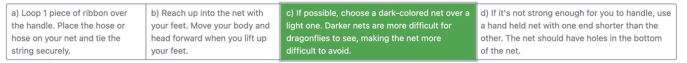

https://rowanzellers.com/hellaswag/

---

<!-- page 14 | slides: 29, 30 -->

HellaSWAG

Slide 29

HellaSWAG — Examples

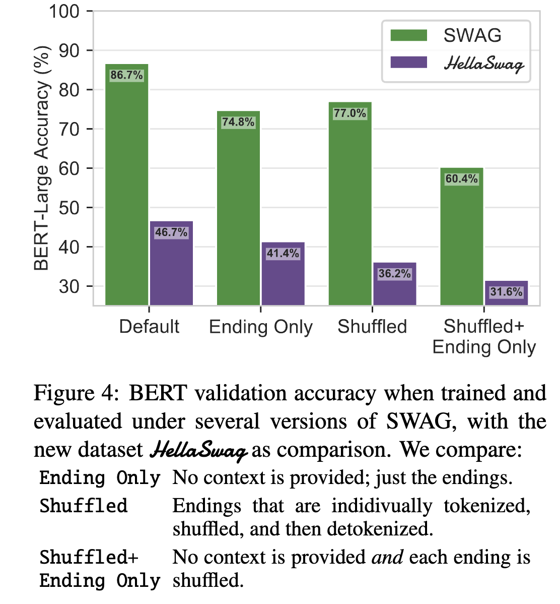

https://huggingface.co/datasets/Rowan/hellaswag

Slide 30

HellaSWAG — Model Performance

<strong>GPT-3:</strong> 85.5% accuracy (10-shot learning)

<strong>GPT-4:</strong> 95.3% accuracy (10-shot learning)

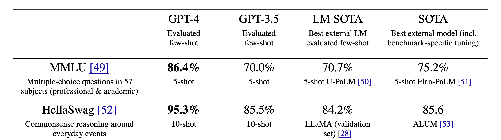

https://huggingface.co/datasets/Rowan/hellaswag

---

<!-- page 15 | slides: 31, 32 -->

HellaSWAG &amp; Section Break

Slide 31

HellaSWAG — Overview Chart

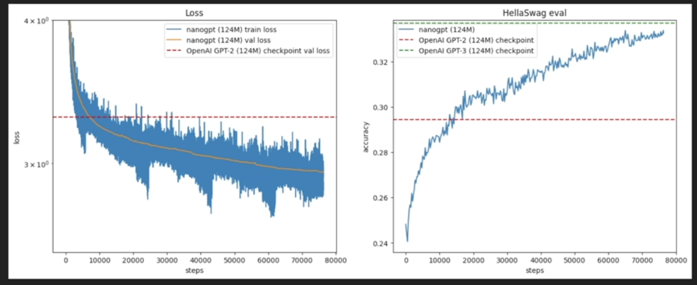

https://huggingface.co/datasets/Rowan/hellaswag

Slide 32

Outline

<ul class="outline-list">
<li>GLUE / SuperGLUE</li>
<li>SWAG / HellaSWAG</li>
<li class="active">Other Datasets</li>
<li>Datasets by Task Types</li>
</ul>

---

<!-- page 16 | slides: 33, 34 -->

Other Datasets

Slide 33

Other Datasets — Overview

<ul class="dataset-list">
<li><strong>MMLU</strong> Multiple choice in 57 subjects (professional &amp; academic)</li>
<li><strong>ARC</strong> AI2 Reasoning Challenge — grade school multiple-choice science</li>
<li><strong>WinoGrande</strong> Bigger Winograd Schema Challenge</li>
<li><strong>DROP</strong> Reading comprehension &amp; arithmetic</li>
<li><strong>GSM-8K</strong> Grade school math word problems</li>
<li><strong>BLiMP</strong> Benchmark of minimal linguistic pairs (new CoLA)</li>
<li><strong>HumanEval</strong> Evaluating LLMs trained on code</li>
</ul>

Slide 34

Lambada Dataset

Tests the ability of LMs to predict the final word of a passage based on broad context.

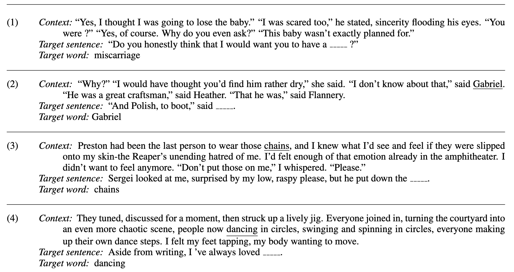

https://huggingface.co/datasets/cimec/lambada · https://zenodo.org/records/2630551

---

<!-- page 17 | slides: 35, 36 -->

Other Datasets — MMLU

Slide 35

MMLU — Measuring Massive Multitask Language Understanding

Multiple-choice questions in 57 subjects spanning professional and academic domains.

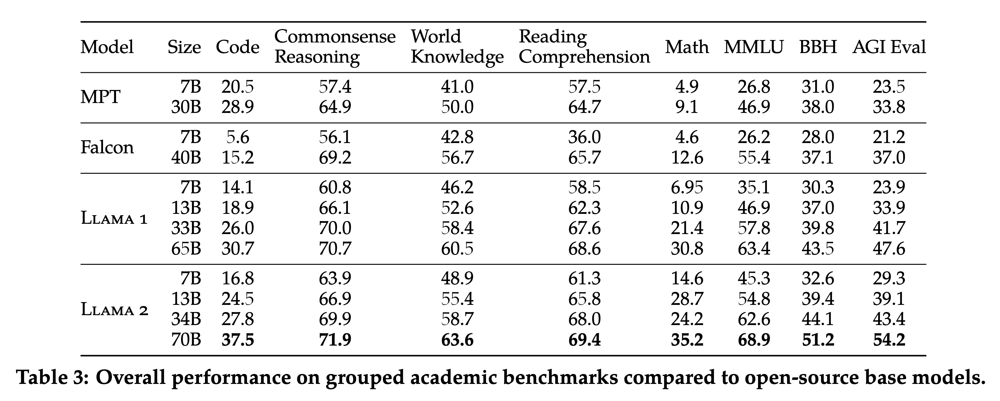

Slide 36

MMLU — Results

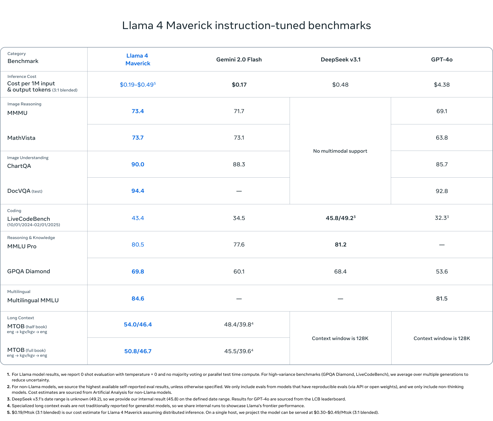

---

<!-- page 18 | slides: 37, 38 -->

Other Datasets — ARC &amp; WinoGrande

Slide 37

ARC — AI2 Reasoning Challenge

Grade school multiple-choice science quiz. Partitioned into Easy and Challenge sets.

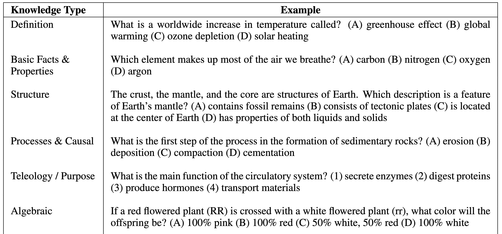

https://huggingface.co/datasets/allenai/ai2_arc

Slide 38

WinoGrande — Commonsense Pronoun Resolution

A larger and harder version of the Winograd Schema Challenge, with 44k problems.

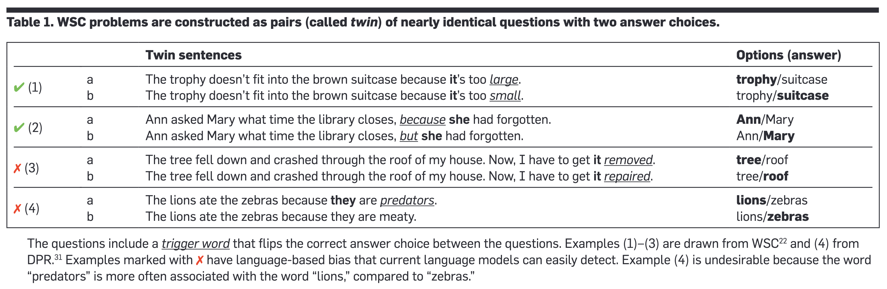

https://huggingface.co/datasets/allenai/winogrande

---

<!-- page 19 | slides: 39, 40 -->

Other Datasets — DROP &amp; GSM-8K

Slide 39

DROP — Discrete Reasoning Over Paragraphs

Reading comprehension requiring arithmetic and discrete reasoning over passage content. Reference model: BiDAF.

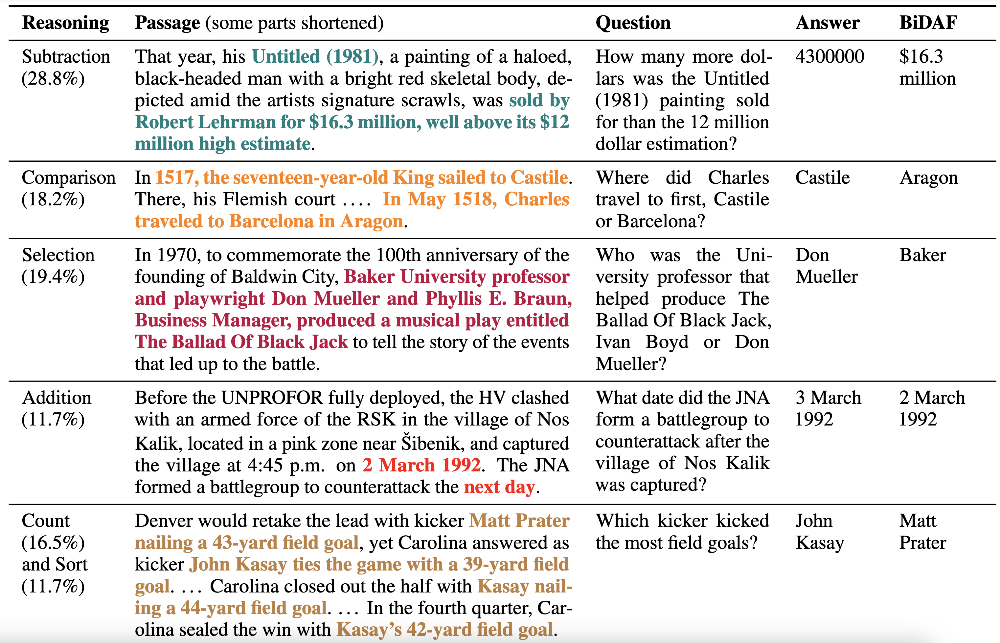

https://huggingface.co/datasets/ucinlp/drop

Slide 40

GSM-8K — Grade School Math Word Problems

8,500 grade school math word problems requiring multi-step reasoning.

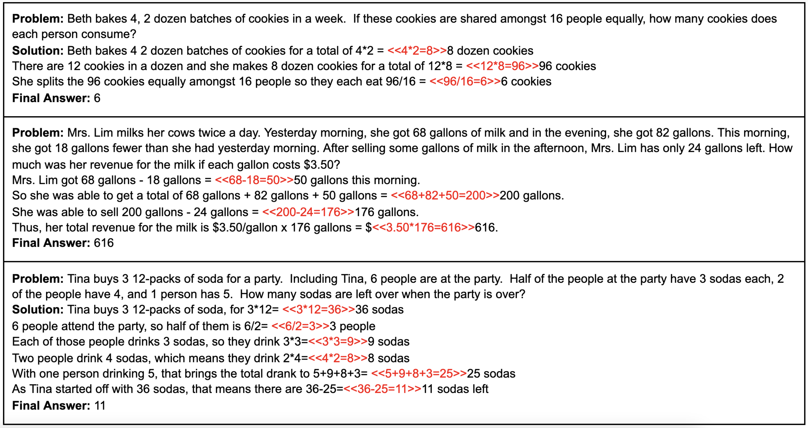

https://huggingface.co/datasets/openai/gsm8k

---

<!-- page 20 | slides: 41, 42 -->

Other Datasets — BLiMP &amp; HumanEval

Slide 41

BLiMP — Benchmark of Linguistic Minimal Pairs

A challenge set evaluating linguistic knowledge of LMs on major grammatical phenomena in English.

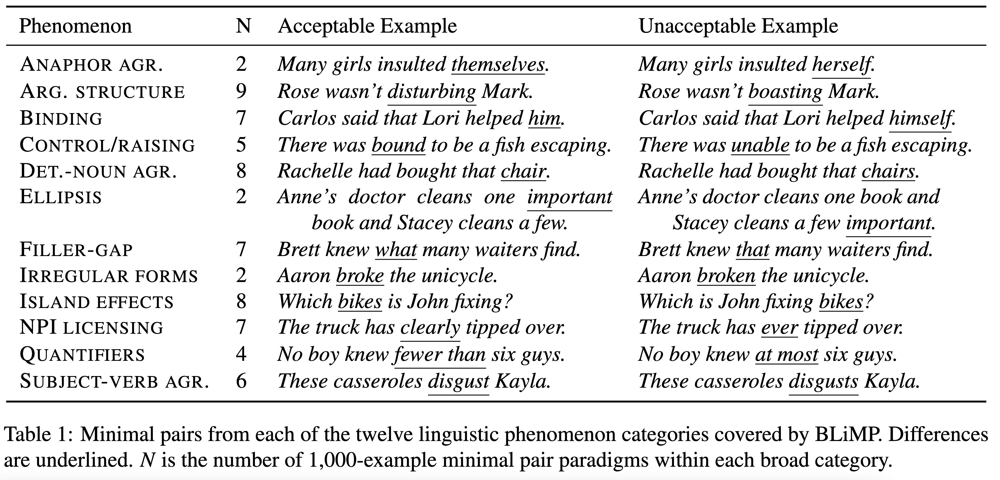

Slide 42

HumanEval — Code Generation

Generate standalone Python functions from docstrings; evaluate correctness automatically via unit tests.

164 original programming problems assessing language comprehension, algorithms, and simple mathematics.

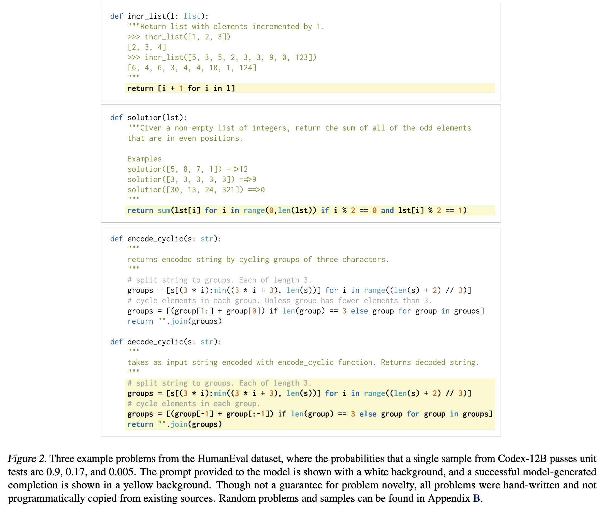

---

<!-- page 21 | slides: 43, 44 -->

Datasets by Task Type

Slide 43

Outline

<ul class="outline-list">
<li>GLUE / SuperGLUE</li>
<li>SWAG / HellaSWAG</li>
<li>Lambada</li>
<li>Other Datasets</li>
<li class="active">Datasets by Task Types</li>
</ul>

Slide 44

Question Answering Datasets

<ul class="dataset-list">
<li><strong>Natural Questions</strong> Questions from Google search; answers from Wikipedia</li>
<li><strong>WebQuestions</strong> Questions answerable using Freebase</li>
<li><strong>TriviaQA</strong> Large-scale dataset for reading comprehension and QA</li>
<li><strong>CoQA</strong> Conversational Question Answering Challenge</li>
</ul>

---

<!-- page 22 | slides: 45, 46 -->

Datasets by Task Type

Slide 45

Summarization &amp; Natural Language Generation

<strong>Summarization</strong>

<ul class="dataset-list">
<li><strong>CNN-Daily Mail</strong> News article summarization</li>
<li><strong>BookSum</strong> Long-form book summarization</li>
<li><strong>NYT Dataset</strong> New York Times articles</li>
<li><strong>DUC Dataset</strong> Document Understanding Conference (NIST)</li>
</ul>

<strong>Natural Language Generation</strong>

<ul class="dataset-list">
<li><strong>E2E</strong> Restaurant domain NLG from meaning representations</li>
<li><strong>WebNLG</strong> Triples to text generation</li>
<li><strong>DART</strong> Open-domain structured data to text</li>
</ul>

Slide 46

Translation Datasets

<ul class="dataset-list">
<li><strong>FLORES-200</strong> 200-language evaluation benchmark</li>
<li><strong>WMT 2014</strong> Classic EN↔DE, EN↔FR machine translation</li>
<li><strong>OPUS-MT</strong> Large collection of open parallel corpora</li>
<li><strong>LORELEI</strong> Low-resource language evaluation</li>
</ul>

---

<!-- page 23 | slides: 47, 48 -->

Structured Prediction &amp; Benchmarking Issues

Slide 47

Structured Prediction Datasets

<ul class="dataset-list">
<li><strong>CoNLL 2000–2018</strong> Shared tasks for NER, chunking, parsing</li>
<li><strong>AIDA-CoNLL</strong> Entity linking to Wikipedia</li>
<li><strong>MedMentions</strong> Entity linking to UMLS (biomedical)</li>
<li><strong>Penn Treebank / PropBank</strong> Dependency &amp; phrase-structure parsing</li>
<li><strong>Morphophon</strong> Morphological analysis</li>
<li><strong>Wikipron</strong> Word pronunciation for 165 languages</li>
</ul>

Slide 48

Dynabench — Rethinking Benchmarking in NLP

Benchmark saturation over time for popular benchmarks, normalized with initial performance at −1 and human performance at 0.

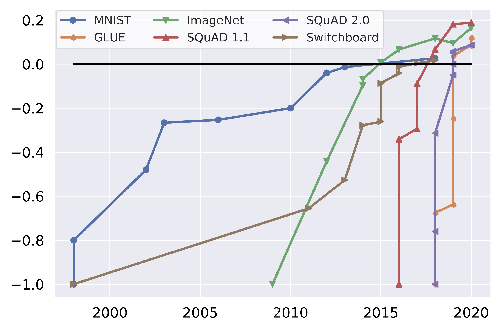

https://arxiv.org/pdf/2104.14337

---

<!-- page 24 | slides: 49, 50 -->

Benchmarking Progress

Slide 49

BIG-Bench Hard (BBH)

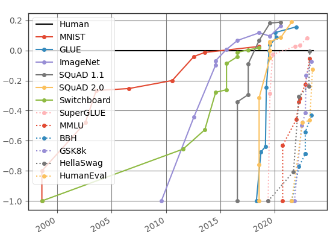

https://arxiv.org/pdf/2210.09261 · https://contextual.ai/plotting-progress-in-ai/

Slide 50

ARC Prize

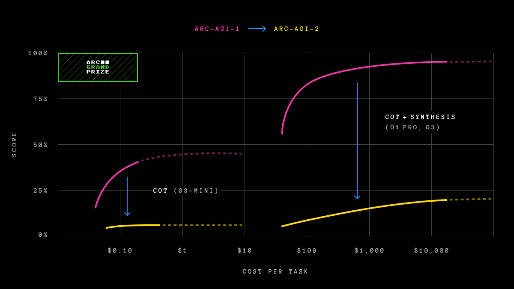

https://arcprize.org/

---

<!-- page 25 | slides: 51, 52 -->

Reasoning &amp; Humanity's Last Exam

Slide 51

Reasoning Benchmarks

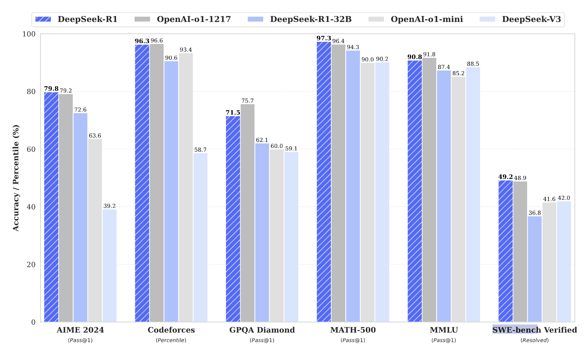

Slide 52

Humanity's Last Exam (HLE) — Motivation

SOTA LLMs now exceed <strong>90% on MMLU</strong>, saturating popular benchmarks and obscuring real frontier capabilities.

HLE is designed as the <em>final closed-ended academic benchmark</em> at the frontier of human knowledge — 2,500 expert-written questions across 100+ subjects, multi-modal, with unambiguous, verifiable answers.

<ul>
<li>Multiple-choice + exact-match → automated grading</li>
<li>Resistant to simple internet lookup / DB retrieval</li>
<li>Emphasis on world-class mathematics &amp; deep reasoning</li>
</ul>

<em>Phan, Gatti, Han, Li, et al., "Humanity's Last Exam", 2025</em>

https://lastexam.ai · https://arxiv.org/abs/2501.14249

---

<!-- page 26 | slides: 53, 54 -->

HLE — Dataset Collection

Slide 53

Global Expert Effort

HLE was crowd-sourced from <strong>~1,000 subject-matter experts</strong> at <strong>500+ institutions</strong> across <strong>50 countries</strong> — mostly professors, researchers, and graduate-degree holders.

<ul>
<li>Questions require graduate-level expertise or highly specific knowledge</li>
<li>Answers must be short, unambiguous, and accepted by domain experts</li>
<li>No open-ended / subjective / WMD content</li>
<li>Each question ships with a detailed solution</li>
</ul>

<strong>$500K prize pool</strong>: $5K for each top-50 question, $500 for each of the next 500, plus paper co-authorship.

Slide 54

Review Process — Quality Control

<strong>Stage 1 — LLM difficulty check.</strong> Questions first tested against frontier LLMs; only those the models <em>cannot</em> solve advance.

<ul>
<li>70,000+ attempts logged</li>
<li>~13,000 questions passed to expert review</li>
</ul>

<strong>Stage 2 — Two-round expert review</strong> (graduate-degree reviewers):

<ul>
<li>Round 1: 1–3 reviewers give iterative feedback</li>
<li>Round 2: organizers / expert reviewers approve final set</li>
</ul>

A <strong>private held-out set</strong> is maintained alongside the public release to detect overfitting / gaming.

---

<!-- page 27 | slides: 55, 56 -->

HLE Results &amp; References

Slide 55

HLE — Frontier Model Results

All frontier models show <strong>low accuracy</strong> and <strong>high calibration error</strong> (hallucination):

<table style="font-size:0.78em; border-collapse:collapse; margin-top:4px">
<thead><tr><th style="text-align:left;padding:2px 8px">Model</th><th style="padding:2px 8px">Acc ↑</th><th style="padding:2px 8px">Calib. err ↓</th></tr></thead>
<tbody>
<tr><td style="padding:2px 8px">GPT-4o</td><td style="text-align:center">2.7%</td><td style="text-align:center">89%</td></tr>
<tr><td style="padding:2px 8px">Grok 2</td><td style="text-align:center">3.0%</td><td style="text-align:center">87%</td></tr>
<tr><td style="padding:2px 8px">Claude 3.5 Sonnet</td><td style="text-align:center">4.1%</td><td style="text-align:center">84%</td></tr>
<tr><td style="padding:2px 8px">Gemini 1.5 Pro</td><td style="text-align:center">4.6%</td><td style="text-align:center">88%</td></tr>
<tr><td style="padding:2px 8px">Gemini 2.0 Flash Thinking</td><td style="text-align:center">6.6%</td><td style="text-align:center">82%</td></tr>
<tr><td style="padding:2px 8px">o1</td><td style="text-align:center">8.0%</td><td style="text-align:center">83%</td></tr>
<tr><td style="padding:2px 8px">DeepSeek-R1*</td><td style="text-align:center">8.5%</td><td style="text-align:center">73%</td></tr>
<tr><td style="padding:2px 8px">o3-mini (high)*</td><td style="text-align:center">13.4%</td><td style="text-align:center">80%</td></tr>
</tbody>
</table>

* text-only subset. Reasoning models use 8K+ completion tokens on average. Authors project models may exceed <strong>50% accuracy by end of 2025</strong>.

Slide 56

References

<ul>
<li>[1] Slides from Anoop Sarkar</li>
<li>[2] A Survey on Evaluation of Large Language Models</li>
<li>[3] https://decanlp.com/</li>
<li>[4] GPT-4 — https://arxiv.org/pdf/2303.08774</li>
<li>[5] https://rowanzellers.com/hellaswag/</li>
<li>[6] https://rowanzellers.com/swag/</li>
<li>[7] https://allenai.org/data/arc</li>
<li>[8] https://winogrande.allenai.org/</li>
<li>[9] https://allenai.org/data/drop</li>
<li>[10] https://crfm.stanford.edu/helm/mmlu/latest/#/leaderboard</li>
<li>[11] Humanity's Last Exam — https://arxiv.org/abs/2501.14249 · https://lastexam.ai</li>
</ul>

Next topic: LLMs

